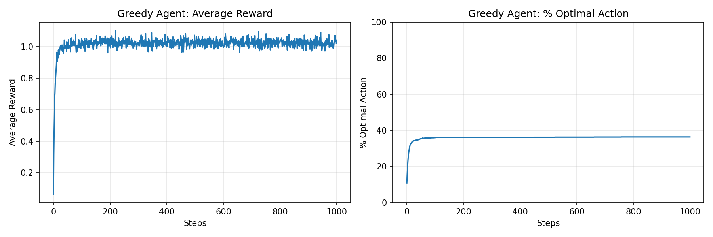
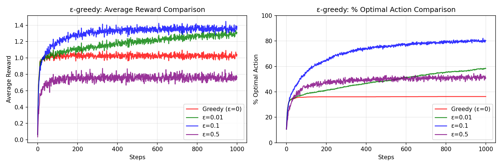
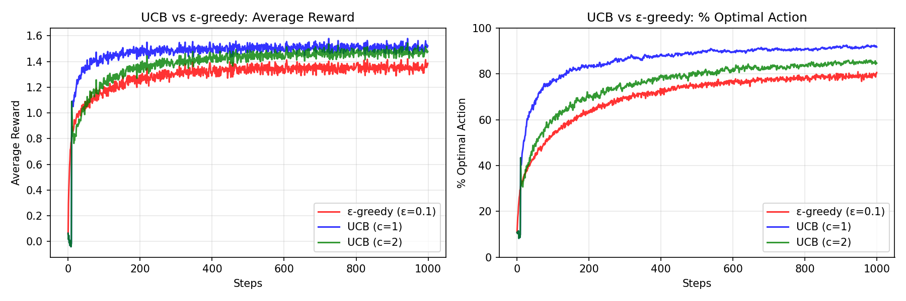
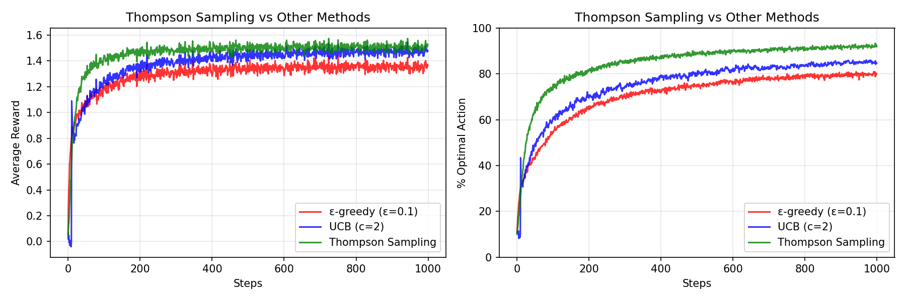
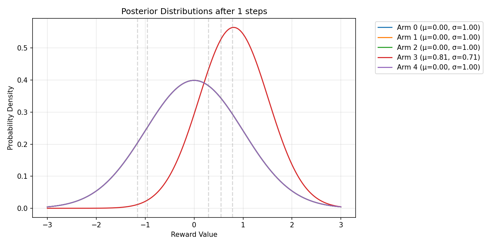
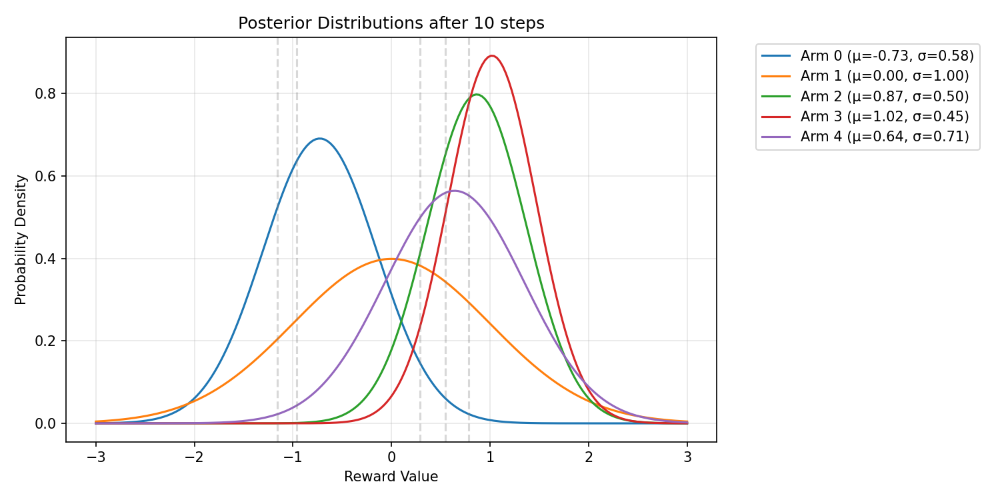
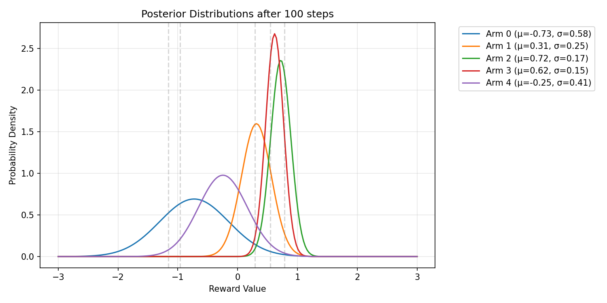

# 多臂老虎机（Multi-Armed Bandit）：强化学习的 Hello World

## 什么是多臂老虎机？

多臂老虎机是强化学习最简单的问题设置：

- **没有状态**：只有动作和奖励
- **目标**：最大化累计奖励
- **困境**：探索（尝试未知）vs 利用（选择已知最优）

## 问题形式化

假设有 K 个臂（动作），每个臂 $i$ 对应一个未知的奖励分布 $R_i$。

在每个时间步 $t$：
1. 智能体选择一个臂 $a_t$
2. 环境返回奖励 $r_t \sim R_{a_t}$
3. 智能体更新对臂 $a_t$ 的估计

目标是最大化累计奖励: $\sum r_t$ 

## 核心概念

### 1. 探索与利用的困境

- **利用（Exploitation）**：选择当前认为最好的臂
  - 优点：获得即时高奖励
  - 缺点：可能错过真正最优的臂
  
- **探索（Exploration）**：尝试未知的臂
  - 优点：可能发现更好的臂
  - 缺点：可能获得低奖励

### 2. 遗憾（Regret）

遗憾衡量策略的好坏：

$$
\text{Regret} = \text{最优臂的累计奖励} - \text{实际获得的累计奖励}
$$

好的策略应该使遗憾增长尽可能慢（理想情况是 $O(\log T)$）。

### 3. 增量式均值更新

如何估计每个臂的真实价值？

朴素方法：存储所有历史奖励，计算均值
问题：内存消耗大

更好的方法：增量式更新

$$
Q_{n+1} = Q_n + \frac{R_n - Q_n}{n+1}
$$

只需存储当前估计和计数，节省内存。

## 四种策略对比

| 策略 | 探索方式 | 优点 | 缺点 |
|------|---------|------|------|
| 贪婪 | 不探索 | 简单 | 可能陷入次优 |
| ε-greedy | 随机探索 | 简单有效 | 探索效率低 |
| UCB | 智能探索 | 理论最优 | 需要调参 |
| Thompson Sampling | 贝叶斯采样 | 无参数、最优 | 需要分布假设 |

---

## 实验结果

### 贪婪策略

贪婪策略从不探索，容易陷入次优选择：



可以看到，选择最优臂的比例始终较低（约 36%），因为一旦某个次优臂初始运气好，贪婪策略就会一直选择它。

### ε-greedy 策略对比

不同 ε 值的效果对比：



关键发现：
- ε=0（贪婪）效果最差：探索不足
- ε=0.1 效果最好：平衡了探索与利用
- ε=0.5 效果下降：探索过多，浪费时间

---

## UCB 公式详解

$$
\text{UCB}(a) = Q(a) + c \sqrt{\frac{\ln t}{N(a)}}
$$

- $Q(a)$：利用项，选择当前估计最好的
- $c \sqrt{\frac{\ln t}{N(a)}}$：探索项
  - $N(a)$ 小 → 不确定性大 → 探索项大
  - $N(a)$ 大 → 不确定性小 → 探索项小
  - $\ln t$ 随时间缓慢增长，保证持续探索

**直觉**：乐观面对不确定性。如果一个臂还没被充分探索，我们假设它可能是好的。

### UCB vs ε-greedy

UCB 与 ε-greedy 的对比：



UCB 通常比 ε-greedy 更快找到最优臂，因为它基于不确定性智能探索，而非随机探索。

---

## Thompson Sampling（扩展）

Thompson Sampling 与其他方法的对比：



Thompson Sampling 是一种贝叶斯方法，通过从后验分布采样实现探索。

### Thompson Sampling 详解

$$
\text{选择臂 } a = \arg\max_a \theta_a, \quad \theta_a \sim \text{Posterior}_a
$$

核心思想：
1. **维护后验分布**：每个臂的奖励均值服从一个分布（而非点估计）
2. **采样选择**：从每个臂的后验分布中采样，选择采样值最大的臂
3. **自然探索**：不确定性大的臂，后验分布方差大，采样波动大，有更高概率被选中

**优势**：
- 无需调节参数（UCB 需要调探索系数 c）
- 理论上达到最优遗憾界
- 容易扩展到其他奖励分布（伯努利、高斯等）

后验分布演变过程：







可以看到，随着采样次数增加，后验分布逐渐收窄（不确定性降低），均值趋近真实值。

## 为什么从多臂老虎机开始？

1. **概念最小化**：只有动作和奖励，没有状态的复杂性
2. **容易理解**：探索与利用的权衡直观
3. **可验证**：可以快速实验和对比不同策略
4. **基础概念**：估计、更新、探索、遗憾等概念贯穿整个 RL

## 下一步

多臂老虎机没有状态，是最简单的情况。下一节我们将引入：

- **状态（State）**：智能体所处的环境
- **转移（Transition）**：动作如何改变状态
- **MDP（马尔可夫决策过程）**：完整的形式化框架

---

## 代码运行

```bash
cd phase1_bandit

# 运行贪婪策略
python bandit.py

# 运行 ε-greedy 策略对比
python bandit_epsilon_greedy.py

# 运行 UCB 策略对比
python bandit_ucb.py

# 运行 Thompson Sampling 策略（扩展）
python bandit_thompson.py
```

## 参考资料

- [Reinforcement Learning: An Introduction](http://incompleteideas.net/book/the-book.html) - Sutton & Barto, Chapter 2
- [UCB算法论文](https://link.springer.com/article/10.1023/A:1013689704352) - Auer et al., 2002
