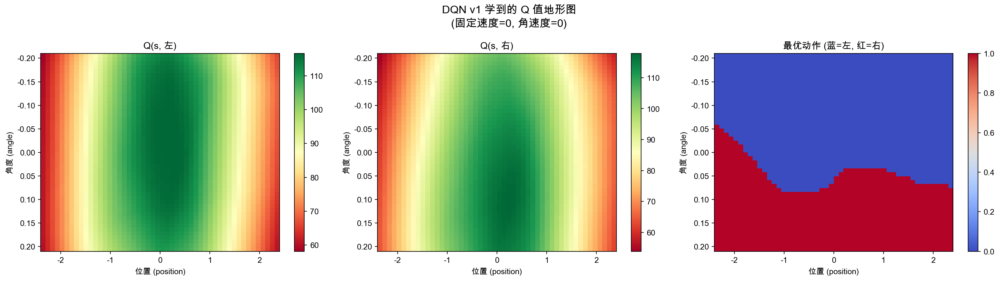
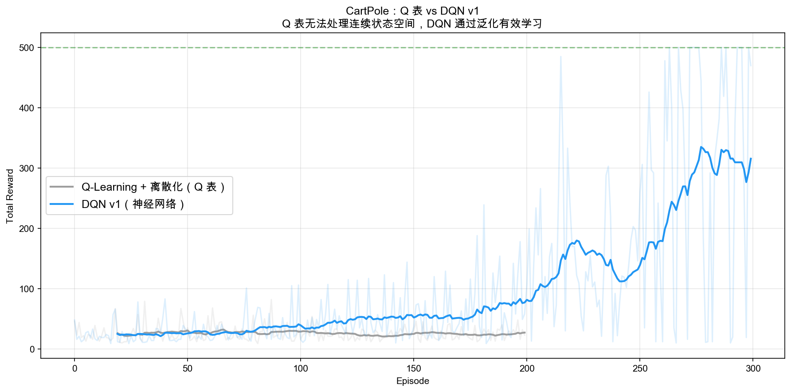
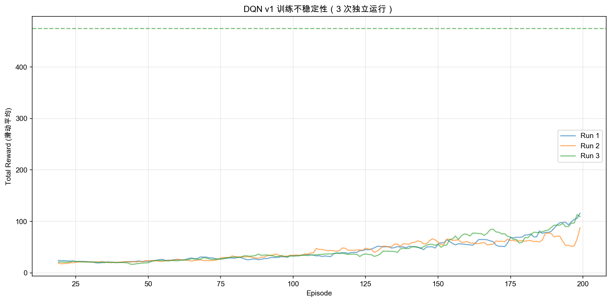
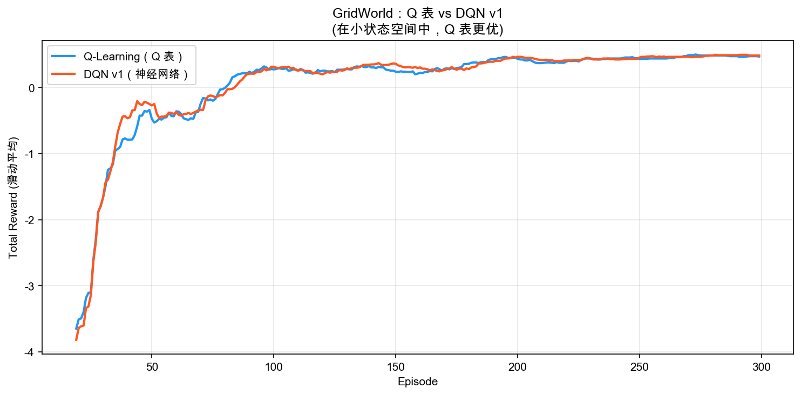

# DQN v1 学习笔记：从 Q 表到神经网络

## 目录
1. [为什么需要 DQN](#为什么需要-dqn)
2. [核心思想：神经网络近似 Q 函数](#核心思想神经网络近似-q-函数)
3. [网络架构与更新规则](#网络架构与更新规则)
4. [与 Q-Learning 的逐行对比](#与-q-learning-的逐行对比)
5. [泛化：DQN 的真正优势](#泛化dqn-的真正优势)
6. [v1 的两个致命问题](#v1-的两个致命问题)
7. [实验结果分析](#实验结果分析)
8. [关键洞察](#关键洞察)

---

## 为什么需要 DQN

### Q 表的天花板

到 SARSA 为止，我们学到的所有方法都基于 **Q 表**——一个 |S| × |A| 的二维数组。这在小状态空间中工作得很好：

```
GridWorld 4×4：16 个状态 × 4 个动作 = 64 个 Q 值 → Q 表轻松搞定 ✅
```

但现实世界的问题远比 GridWorld 复杂：

```
CartPole：状态 = [位置, 速度, 角度, 角速度]（4 维连续向量）
  → 状态数量无穷大，无法建表 ❌

Atari 游戏：状态 = 210×160×3 像素
  → 状态数量 ≈ 256^(100800)，比宇宙原子数还多 ❌
```

### 离散化的窘境

一种直觉的补救方案是"离散化"——把连续值切成若干个桶。但桶的数量选多少？

```
粗糙离散化（每维 8 个桶）：
  总状态数 = 8^4 = 4,096
  → 桶太大，同一个桶里的状态差异很大，Q 值无法准确区分
  → 且 4096 个状态中大部分永远不会被访问到（状态空间稀疏）

中等离散化（每维 50 个桶）：
  总状态数 = 50^4 = 6,250,000（六百万）
  → 每个桶精度更高了，但几乎不可能训练充分

精细离散化（每维 100 个桶）：
  总状态数 = 100^4 = 100,000,000（一亿）
  → Q 表需要 1 亿 × 2 = 2 亿个值，存储和训练都不现实
```

**根本矛盾**：桶太粗则精度不够（同一个桶里的状态本该有不同的 Q 值），桶太细则状态爆炸（大量状态从未被访问，Q 值始终为 0）。而且即使某个状态被访问过，Q 表也无法把这个经验"分享"给相邻的状态——每个格子都是独立的。

### 我们需要泛化

在 Q 表中，`Q[(位置=1.0, 角度=0.05)]` 和 `Q[(位置=1.001, 角度=0.05)]` 是完全不同的两个格子，互不相关。但直觉告诉我们，这两个状态几乎一样，Q 值也应该几乎一样。

**神经网络天然能做到这一点**——相似的输入产生相似的输出。这就是 DQN 的动机。

---

## 核心思想：神经网络近似 Q 函数

### 从查表到函数近似

```
Q-Learning（表格）：Q 表 → Q[state_idx, action_idx] → 一个数
DQN（神经网络）：  Q_θ(state_vector) → [Q(s,a0), Q(s,a1), ..., Q(s,an)]
                   ─── 输入状态向量，输出所有动作的 Q 值
```

**关键设计**：网络输入是状态 s，输出是**所有动作**的 Q 值。为什么不输入 (s, a) 输出一个 Q(s,a)？

```
方案 A（不好）：输入 (s, a)，输出 Q(s,a)
  → 选动作时需要对每个 a 分别前向传播 → 慢
  → 对 CartPole（2 个动作）还行，对 Atari（18 个动作）太慢

方案 B（采用）：输入 s，输出所有 Q(s, ·)
  → 一次前向传播得到所有动作的 Q 值 → 快
  → 选动作只需 argmax → O(1)
```

### 一句话总结

> **DQN = Q-Learning + 用神经网络替代 Q 表。** 其他一切（ε-greedy、TD target、off-policy）完全不变。

---

## 网络架构与更新规则

### 网络结构

DQN v1 用最简单的全连接网络（MLP）：

```
输入层：state_dim 维（CartPole = 4）
   ↓
隐藏层 1：128 个神经元，ReLU 激活
   ↓
隐藏层 2：128 个神经元，ReLU 激活
   ↓
输出层：action_dim 维（CartPole = 2），无激活函数
```

**注意**：输出层没有激活函数！因为 Q 值可以是任意实数（正、负、零都有可能），不能用 ReLU 或 Sigmoid 限制范围。

### 代码实现

```python
class QNetwork(nn.Module):
    def __init__(self, state_dim, action_dim, hidden_dim=128):
        super().__init__()
        self.network = nn.Sequential(
            nn.Linear(state_dim, hidden_dim),
            nn.ReLU(),
            nn.Linear(hidden_dim, hidden_dim),
            nn.ReLU(),
            nn.Linear(hidden_dim, action_dim),  # 无激活函数
        )

    def forward(self, state):
        return self.network(state)
```

### 更新规则（损失函数）

Q-Learning 的更新规则直接翻译成损失函数：

```
Q-Learning:
  Q[s,a] += α * (r + γ max Q[s',·] - Q[s,a])
            ─── 步长   ─────────────────────── TD error

DQN:
  loss = (Q_θ(s)[a] - (r + γ max Q_θ(s',·)))²
         ──────────   ─────────────────────────
          当前预测         TD target（不参与梯度）
  θ ← θ - lr * ∇_θ loss
```

**本质完全相同**：都是让 Q(s,a) 逼近 TD target = r + γ max Q(s', ·)。区别只在于：

- Q-Learning 直接修改 Q 表的一个值
- DQN 通过梯度下降修改整个网络的权重 → 修改一个 (s,a) 的 Q 值，会同时影响其他相似状态的 Q 值（**泛化**！）

### 代码实现

```python
def update(self, state, action, reward, next_state, done):
    state_tensor = torch.FloatTensor(state).unsqueeze(0)
    next_state_tensor = torch.FloatTensor(next_state).unsqueeze(0)

    # 1. 当前 Q 值
    q_values = self.q_network(state_tensor)
    current_q = q_values[0, action]

    # 2. TD target（不参与梯度！）
    with torch.no_grad():
        next_q_values = self.q_network(next_state_tensor)
        max_next_q = next_q_values.max(dim=1).values
        td_target = reward + (1 - done) * self.gamma * max_next_q

    # 3. 损失 = MSE(当前Q, TD target)
    loss = F.mse_loss(current_q.unsqueeze(0), td_target)

    # 4. 梯度下降
    self.optimizer.zero_grad()
    loss.backward()
    self.optimizer.step()
```

**`torch.no_grad()` 的作用**：TD target 虽然也用了 Q 网络计算，但它应该被当作"固定的标签"，不参与梯度计算。否则梯度会同时穿过 current_q 和 td_target 两条路径，导致更新方向混乱。

---

## 与 Q-Learning 的逐行对比

| 步骤 | Q-Learning（表格） | DQN v1（神经网络） |
|------|-------------------|-------------------|
| **初始化** | `Q = np.zeros((n_states, n_actions))` | `network = QNetwork(state_dim, action_dim)` |
| **选动作** | `action = argmax(Q[state_idx])` | `action = argmax(network(state_tensor))` |
| **计算当前 Q** | `Q[s, a]`（查表） | `network(s)[a]`（前向传播） |
| **计算 TD target** | `r + γ * max(Q[s'])` | `r + γ * max(network(s'))` |
| **更新** | `Q[s,a] += α * td_error` | `loss = MSE(current_q, target); loss.backward()` |
| **存储** | numpy 数组 | 网络权重 θ |
| **状态表示** | 整数索引 | 浮点向量 |
| **泛化** | 无（每个格子独立） | 有（相似状态共享权重） |

**核心洞察**：从 Q-Learning 到 DQN，算法的"骨架"完全没变，只是把"查表"替换成了"神经网络前向传播"，把"直接改值"替换成了"梯度下降"。

---

## 泛化：DQN 的真正优势

### Q 表 vs 神经网络的本质区别

```
Q 表：每个 (s, a) 完全独立
  Q[(位置=1.0, 角度=0.05), 向右] = 10.5
  Q[(位置=1.001, 角度=0.05), 向右] = 0.0  ← 从未访问过，Q=0

神经网络：相似输入 → 相似输出
  Q_θ([1.0, 0, 0.05, 0])[向右] = 10.5
  Q_θ([1.001, 0, 0.05, 0])[向右] ≈ 10.5  ← 虽然没见过，但能泛化！
```

这就是为什么 DQN 能处理连续状态空间——它不需要"见过"每一个状态，只要见过"类似的"状态就够了。

### Q 值地形图



图中展示了 Q 网络在位置-角度平面上的输出。关键观察：

- **Q 值是平滑的**：这正是神经网络泛化能力的体现
- **左右动作有明确的分界线**：角度 > 0 时向右推，角度 < 0 时向左推
- 这个分界线符合物理直觉——杆子往哪边倒就往哪边推

### 但泛化是双刃剑

在 Q 表中，修改 Q[(位置=1.0), 向右] 不会影响其他任何状态。但在 DQN 中，修改一个状态的 Q 值会通过网络权重影响所有状态——这可能导致**灾难性遗忘**：

```
学会状态 A → 训练状态 B → 状态 A 的 Q 值被"覆盖"了
→ 之前学好的行为突然变差
→ 这就是 v1 训练不稳定的原因之一
```

---

## v1 的两个致命问题

DQN v1 有意不解决两个问题，让它们充分暴露，为 v2 和 v3 铺垫。

### 问题 1：数据相关性（Correlated Data）

**现象**：连续的训练样本 (s, a, r, s') 来自同一条轨迹，高度相关。

```
步骤 1: (杆子微微右倾, 向右推, +1, 杆子更右倾)
步骤 2: (杆子更右倾, 向右推, +1, 杆子严重右倾)
步骤 3: (杆子严重右倾, 向右推, +1, 杆子倒了)
→ 连续 3 步的状态几乎一样，梯度方向高度相关
→ 网络过度拟合"杆子右倾时怎么办"，忘记其他情况
```

**类比**：考试复习只看第三章 → 第三章学得特别好，其他章节全忘。

**解决方案（v2）**：**经验回放**——把所有经历存到一个大池子里，每次随机抽一批来训练。随机采样打破了时间相关性，让网络同时学到各种情况。

### 问题 2：移动目标（Moving Target）

**现象**：TD target = r + γ max Q_θ(s', ·) 用的是**同一个网络** Q_θ。每次更新网络权重 θ，不仅当前 Q 值变了，TD target 也跟着变了。

```
第 1 步：target = r + γ * max Q_θ(s') = 10.0
  → 更新 θ，让 Q_θ(s,a) 逼近 10.0
  → 但 θ 变了以后，Q_θ(s') 也变了！
第 2 步：target = r + γ * max Q_θ_new(s') = 12.0  ← target 变了！
  → 又要逼近 12.0
  → 但 θ 又变了，target 又变了...
→ "自己追自己"，永远追不上
```

**类比**：射箭但靶子在动——你越瞄准，靶子越跑。

**解决方案（v3）**：**目标网络**——用一个旧版的网络 Q_θ⁻ 计算 TD target，每隔一段时间才同步一次。相当于"把靶子固定住一会儿"。

### 两个问题的相互作用

这两个问题会相互放大：
- 相关数据让梯度偏向某个方向 → Q 值在某些状态上剧变
- Q 值剧变 → TD target 剧变 → 更新方向更不稳定
- 不稳定的更新 → 策略突然变差 → 收集到更差的数据
- 更差的数据 → 更偏的梯度 → **恶性循环**

---

## 实验结果分析

### 实验一 & 二：Q 表 vs DQN 在 CartPole 上的对比



上图直观地展示了 Q 表和 DQN 在 CartPole 上的差距。Q 表（离散化后）在整个训练过程中几乎没有提升，而 DQN 在 200 轮左右开始明显学到有效策略。

Q 表失败的核心原因不是"训练不够久"，而是**结构性缺陷**：
- 离散化后的状态空间极度稀疏，绝大多数 (s, a) 对从未被访问
- 即使某个状态被充分训练，相邻的连续状态也无法利用这个经验
- 增加桶的数量只会让稀疏问题更严重（见上文"离散化的窘境"分析）

DQN 通过神经网络解决了这两个问题：相似状态共享权重，一次更新惠及所有相似状态。但曲线波动明显——这正是 v1 不稳定性的体现。

### 实验三：不稳定性分析



3 次独立运行的最后 50 轮平均奖励：107.9、70.5、88.6。相同配置、不同随机种子，结果差异巨大。这在 Q 表方法中几乎不会发生——说明神经网络引入了新的不稳定性。

### 实验四：GridWorld 中 Q 表 vs DQN



在 4×4 GridWorld（16 个状态）中，Q 表和 DQN 表现相当。DQN 的泛化能力在小状态空间中没有用武之地，反而引入了不必要的复杂性。

**结论**：DQN 不是"Q 表的上位替代"，而是"大状态空间的解决方案"。

---

## 关键洞察

### 1. DQN 的本质：Q-Learning 的灵魂 + 神经网络的躯壳

从 Q-Learning 到 DQN，核心算法没有任何改变：

```
选动作：ε-greedy           → 不变
TD target：r + γ max Q(s') → 不变
更新目标：Q(s,a) → target  → 不变
Off-policy                 → 不变

唯一改变的是：Q 函数的存储方式
  Q 表 → 神经网络
  直接改值 → 梯度下降
```

### 2. 函数近似的代价

用神经网络替代 Q 表带来了泛化能力，但也付出了代价：

| | Q 表 | 神经网络 |
|---|---|---|
| **精度** | 精确（每个值独立） | 近似（受网络容量限制） |
| **泛化** | 无 | 有（相似状态共享） |
| **稳定性** | 高（改一个值不影响其他） | 低（改一个值影响所有） |
| **适用场景** | 小离散状态空间 | 大/连续状态空间 |

这是一个**精度-泛化**的权衡。当状态空间小到 Q 表能覆盖时，Q 表更好；当状态空间大到 Q 表无法覆盖时，只能用神经网络。

### 3. 两个问题不是 bug，是结构性缺陷

数据相关性和移动目标不是代码写错了，而是"在线学习 + 神经网络"这个组合的结构性缺陷：

```
在线学习 → 数据按时间顺序到来 → 高度相关 → 需要经验回放打乱
同一网络既当学生又当老师 → 目标不稳定 → 需要目标网络固定
```

这两个解决方案（经验回放 + 目标网络）加在一起，就是 2015 年 DeepMind 发表在 Nature 上的完整 DQN。

### 4. 从表格到深度学习的里程碑

```
阶段一（bandit）：无状态，只有动作和奖励
阶段二（MDP）：  有状态，但用表格存储 Q 值
阶段三（DQN）：  有状态，用神经网络近似 Q 值  ← 你在这里
阶段四（PG）：   直接优化策略参数，不经过 Q 值
阶段五（PPO/SAC）：现代算法，大规模应用
```

DQN 是从"玩具问题"走向"真实问题"的关键一步。后续的所有深度 RL 方法，都建立在"用神经网络近似价值/策略函数"这个基础之上。

### 5. 下一步的路线图

```
DQN v1（当前）：神经网络替代 Q 表
  ❌ 数据相关性 → v2 引入经验回放
  ❌ 移动目标 → v3 引入目标网络
     ↓
DQN v2：+ 经验回放（打破数据相关性）
     ↓
DQN v3：+ 目标网络（稳定 TD target）
     ↓
完整 DQN = v1 + v2 + v3（这就是 2015 Nature 论文）
```

---

- **最后更新**：2026-04-22
- **关联代码**：`phase3_dqn/dqn_v1.py`
- **前置知识**：`notes/q_learning.md`、`notes/sarsa.md`
- **后续内容**：DQN v2（经验回放）、DQN v3（目标网络）
- **难度等级**：⭐⭐⭐⭐ (中高)
