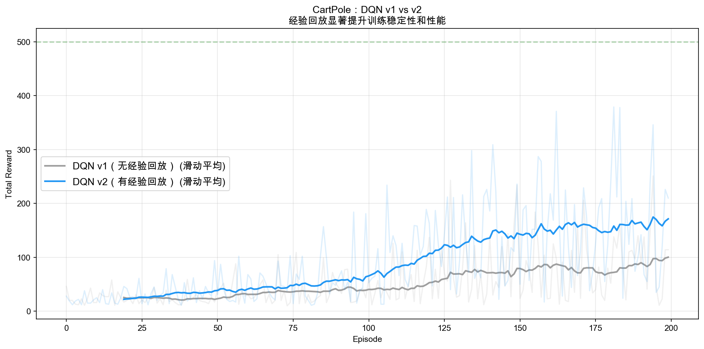
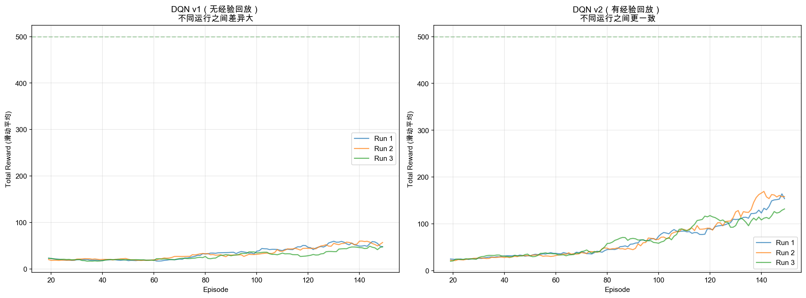
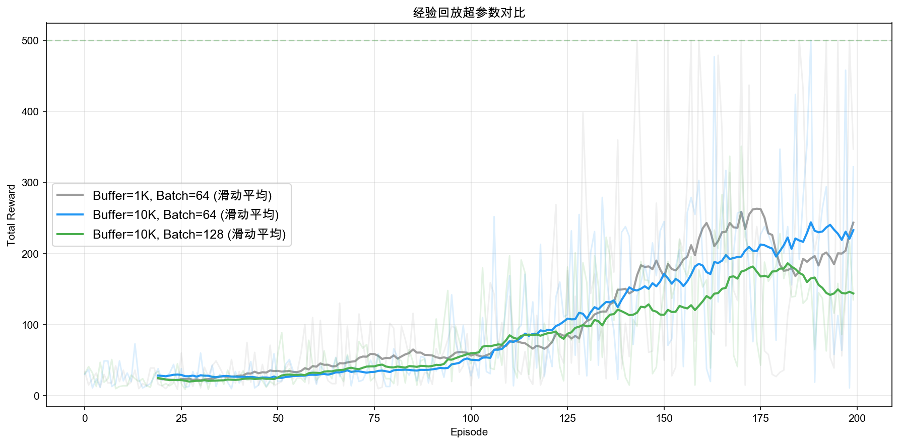

# DQN v2 学习笔记：经验回放

## 目录
1. [为什么需要经验回放](#为什么需要经验回放)
2. [经验回放的设计](#经验回放的设计)
3. [从单样本到 mini-batch](#从单样本到-mini-batch)
4. [与 v1 的代码差异](#与-v1-的代码差异)
5. [与 SARSA 经验回放禁忌的联系](#与-sarsa-经验回放禁忌的联系)
6. [实验结果分析](#实验结果分析)
7. [关键洞察](#关键洞察)

---

## 为什么需要经验回放

### v1 的问题回顾

DQN v1 采用**在线学习**：每步与环境交互产生一个样本 (s, a, r, s')，立即用来更新网络，然后丢弃。这导致了严重的**数据相关性**问题：

```
步骤 1: (杆子微右倾, →, +1, 杆子更右倾)
步骤 2: (杆子更右倾, →, +1, 杆子严重右倾)
步骤 3: (杆子严重右倾, →, +1, 杆子倒了)

连续 3 步的状态几乎一样
→ 连续 3 次梯度下降方向几乎一样
→ 网络过度拟合"杆子右倾时怎么办"
→ 忘记之前学过的其他情况（灾难性遗忘）
```

### 类比

```
v1 = 考试复习只看最近做过的几道题
  → 刚做的题记得特别清楚，之前做的全忘了
  → 考试时只会做最后复习的那几类题

v2 = 把所有做过的题存入题库，每次随机抽一批复习
  → 各类题目均匀复习
  → 考试时各类题目都会做
```

### 核心思路

```
v1（在线学习）：
  产生样本 → 立即使用 → 丢弃
  [s1,a1,r1,s1'] → 更新 → 扔掉
  [s2,a2,r2,s2'] → 更新 → 扔掉
  ...

v2（经验回放）：
  产生样本 → 存入缓冲区 → 随机采样一批来更新
  [s1,...] → 存入 buffer ─┐
  [s2,...] → 存入 buffer  │ buffer: [s87, s3, s156, s42, ...]
  [s3,...] → 存入 buffer  │        随机采样 batch_size 个
  ...                     └→ 更新网络
```

---

## 经验回放的设计

### ReplayBuffer：环形缓冲区

经验回放缓冲区是一个固定大小的队列，存储与环境交互产生的经验：

```python
class ReplayBuffer:
    def __init__(self, capacity=10000):
        self.buffer = deque(maxlen=capacity)  # 满了自动丢弃最旧的

    def push(self, state, action, reward, next_state, done):
        self.buffer.append((state, action, reward, next_state, done))

    def sample(self, batch_size):
        # 随机采样！这是打破数据相关性的关键操作
        indices = np.random.choice(len(self.buffer), batch_size, replace=False)
        batch = [self.buffer[i] for i in indices]
        return states, actions, rewards, next_states, dones
```

### 为什么用环形缓冲区？

- **为什么不无限存？** 太旧的经验对应的策略太差（训练早期的随机策略），用处不大，还可能引入偏差
- **为什么不用栈（LIFO）？** 栈只用最新的数据，跟在线学习没区别，失去了打破相关性的意义
- **为什么不每次都用全部数据？** 计算量太大，而且旧数据占比太高会拖慢学习新策略

环形缓冲区是一个很好的折中：**保留最近的 N 条经验**，既有足够的多样性，又不会太旧。

### 关键超参数

| 超参数 | 含义 | 太小的后果 | 太大的后果 | 典型值 |
|--------|------|-----------|-----------|--------|
| **buffer_capacity** | 缓冲区容量 | 多样性不够 | 旧数据太多 | 10,000 - 100,000 |
| **batch_size** | 每次采样数量 | 梯度方差大 | 每步计算量大 | 32 - 128 |

---

## 从单样本到 mini-batch

### v1 的单样本更新

```python
# v1：用当前这一步的数据立即更新
def update(self, state, action, reward, next_state, done):
    state_tensor = torch.FloatTensor(state).unsqueeze(0)      # (1, state_dim)
    q_values = self.q_network(state_tensor)                     # (1, action_dim)
    current_q = q_values[0, action]                             # 标量

    with torch.no_grad():
        next_q = self.q_network(next_state_tensor).max()
        td_target = reward + gamma * next_q

    loss = F.mse_loss(current_q, td_target)
    loss.backward()
    self.optimizer.step()
```

### v2 的 mini-batch 更新

```python
# v2：从 buffer 随机采样一批来更新
def update(self):
    if len(self.replay_buffer) < self.batch_size:
        return  # buffer 不够大时不更新

    # 1. 随机采样（核心操作！打破数据相关性）
    states, actions, rewards, next_states, dones = self.replay_buffer.sample(
        self.batch_size
    )

    # 2. 批量计算 Q 值
    states_tensor = torch.FloatTensor(states)           # (batch, state_dim)
    q_values = self.q_network(states_tensor)             # (batch, action_dim)
    current_q = q_values.gather(1, actions.unsqueeze(1)) # (batch, 1)

    # 3. 批量计算 TD target
    with torch.no_grad():
        next_q = self.q_network(next_states_tensor).max(dim=1).values
        td_targets = rewards + (1 - dones) * gamma * next_q

    # 4. 批量 loss（多个样本的平均）
    loss = F.mse_loss(current_q.squeeze(), td_targets)
    loss.backward()
    self.optimizer.step()
```

### `.gather()` 详解

v2 中最不直观的一行代码是 `.gather()`，它的作用是**从每行中选出指定列的值**：

```
q_values = [[Q(s1,左), Q(s1,右)],     actions = [右, 左, 右]
             [Q(s2,左), Q(s2,右)],     即        [1,   0,   1]
             [Q(s3,左), Q(s3,右)]]

q_values.gather(1, actions.unsqueeze(1))
= [[Q(s1,右)],    ← 第 0 行取第 1 列
   [Q(s2,左)],    ← 第 1 行取第 0 列
   [Q(s3,右)]]    ← 第 2 行取第 1 列
```

相当于对每个样本 i，取出 `Q(s_i, a_i)`——即实际执行的动作对应的 Q 值。

---

## 与 v1 的代码差异

v2 相对 v1 的代码改动非常小，只有三处：

### 1. 新增 ReplayBuffer

```python
self.replay_buffer = ReplayBuffer(capacity=buffer_capacity)
```

### 2. 新增 store_transition 方法

```python
def store_transition(self, state, action, reward, next_state, done):
    self.replay_buffer.push(state, action, reward, next_state, done)
```

### 3. update() 从单样本改为 batch

```python
# v1 的训练循环
agent.update(state, action, reward, next_state, done)  # 立即更新

# v2 的训练循环
agent.store_transition(state, action, reward, next_state, done)  # 先存
agent.update()  # 从 buffer 采样更新
```

**网络结构、ε-greedy、TD target 计算方式完全不变。** 经验回放是一个"即插即用"的组件。

---

## 与 SARSA 经验回放禁忌的联系

在学习 SARSA 时，我们讨论过"为什么 SARSA 不能用经验回放"（详见 `notes/sarsa.md`）。DQN v2 正是这个讨论的正面案例——**Q-Learning/DQN 是 off-policy，所以可以用经验回放**。

```
SARSA 的 TD target：r + γ Q(s', a')      ← a' 是当前策略选的
  → 经验回放中的 a' 是旧策略选的 → 不代表当前策略 → 不能用

DQN 的 TD target：  r + γ max Q(s', ·)    ← 只看 max，不需要 a'
  → 完全不依赖"是谁选的动作" → 旧数据照样能用 → 可以用经验回放
```

这也解释了为什么经验回放在强化学习历史上出现的时间节点恰好与 off-policy 方法的成熟同步——它本质上是 off-policy 特性的一个"福利"。

---

## 实验结果分析

### 实验一：v1 vs v2 直接对比



| 指标 | DQN v1（无回放） | DQN v2（有回放） |
|------|----------------|----------------|
| 策略评估平均奖励 | 122.0 ± 6.3 | **386.1 ± 59.5** |
| 学习速度 | 慢（200 轮才到 ~83） | 快（150 轮已到 ~124） |

v2 在相同训练轮数下达到了远超 v1 的性能。

### 实验二：训练稳定性的"反直觉"真相



3 次独立运行（不同随机种子）的真实数据：

| 指标 | DQN v1 | DQN v2 |
|------|--------|--------|
| 3 次运行最终平均（最后 50 轮） | [41.4, 53.2, 41.0] | [116.7, 122.4, 109.6] |
| **运行间标准差** | 5.6 | **5.2** |
| **单次运行内 reward 标准差**（最后 50 轮） | ~32 | **~74** |

这里有两个**容易踩坑**的认知陷阱：

#### 陷阱 1：经验回放 ≠ 降低运行间方差

很多人（包括早期的我）会想当然地认为"经验回放让训练更稳定"就等于"不同 seed 跑出来的结果更接近"。**真实数据表明二者几乎一样**（5.6 vs 5.2，差异在噪声范围内）。

为什么？运行间方差主要由**网络初始化、ε-greedy 探索的随机性**决定，经验回放对此无能为力。它真正降低的是**单步梯度的方差**（mini-batch 平均比单样本更稳）。

#### 陷阱 2：用绝对方差比较不同水平的策略不公平

v2 的"单次运行内 reward 标准差"反而比 v1 大（74 vs 32），这看起来像 v2"更不稳定"，其实是个**幸存者偏差**：

```
v1 困在 ~45 分附近 → 在低分区间小幅震荡 → 标准差小
v2 学到 ~116 分    → 处于"快速上升 + 偶尔崩溃"阶段 → 标准差大
```

要公平比较稳定性，应该用**变异系数**（CV = std / mean）：
- v1: 32/45 ≈ 0.71
- v2: 74/116 ≈ 0.64

变异系数 v2 略小，但优势并不显著。

#### 真正的结论

经验回放的核心收益是**学习速度和最终性能的飞跃**（v1 ~45 → v2 ~116，提升 2.6 倍），**而不是"训练曲线更平滑"**。后者是在 v3 引入目标网络后才会显著体现的效果。

### 实验三：超参数影响



- Buffer 容量 1K vs 10K：10K 整体表现更稳定
- Batch 大小 64 vs 128：64 通常更快收敛

### 一个值得注意的现象：loss 值非常大

在 v2 的训练中，loss 值出现了几十万甚至更高的峰值。这不是经验回放的问题，而是 v1 遗留的**移动目标**问题：

```
TD target = r + γ max Q_θ(s', ·)
                       ^^^ 同一个网络！

经验回放让训练更频繁 → 网络更新更快
→ TD target 变化更剧烈 → loss 波动更大
```

经验回放**解决了数据相关性**，但**加剧了移动目标**——因为更频繁的更新让目标更不稳定。这正是为什么 v3 需要引入目标网络。

---

## 关键洞察

### 1. 经验回放 = 数据的"去相关化"

```
时间轴上的原始数据：
  [t=1] [t=2] [t=3] [t=4] [t=5] ...   ← 高度相关
         ↓ 存入 buffer ↓
  buffer: [t=87, t=3, t=156, t=42, t=201, ...]
         ↓ 随机采样 ↓
  batch: [t=156, t=3, t=201, t=87]     ← 不相关
```

这和监督学习中"打乱数据集"的道理完全一样——SGD 要求数据 i.i.d.（独立同分布），经验回放通过随机采样近似实现了这个条件。

### 2. 经验回放带来的三重好处

| 好处 | 原因 |
|------|------|
| **打破相关性** | 随机采样让 batch 中的样本来自不同时间和轨迹 |
| **提高样本效率** | 同一条经验可以被采样多次，重复利用 |
| **稳定梯度方向** | batch 中包含多种状态，梯度是多个方向的平均，方差更小 |

### 3. 经验回放是 off-policy 的"福利"

经验回放本质上要求算法能从"旧策略产生的数据"中学习——这正是 off-policy 的定义。这也是为什么：

```
Off-policy 方法（Q-Learning, DQN, SAC）→ 可以用经验回放 ✅
On-policy 方法（SARSA, PPO, A3C）      → 不能用经验回放 ❌
                                          → 用"收集-训练-丢弃"的模式
```

### 4. v2 暴露了新问题

经验回放解决了数据相关性，但更频繁的训练加剧了移动目标问题（loss 波动巨大）。这为 v3 提供了清晰的动机。

### 5. DQN 的进化路径

```
v1：神经网络替代 Q 表
  ❌ 数据相关性     → v2 引入经验回放 ✅ (当前)
  ❌ 移动目标       → v3 引入目标网络（下一步）

v2：+ 经验回放
  ✅ 数据相关性解决
  ❌ 移动目标仍在（而且更明显了）

v3（下一步）：+ 目标网络
  ✅ 数据相关性解决
  ✅ 移动目标解决
  = 完整的 DQN（2015 Nature 论文）
```

---

- **最后更新**：2026-04-24
- **关联代码**：`phase3_dqn/dqn_v2_replay_buffer.py`
- **前置知识**：`notes/dqn_v1.md`、`notes/sarsa.md`（经验回放与 on-policy 的关系）
- **后续内容**：DQN v3（目标网络）
- **难度等级**：⭐⭐⭐⭐ (中高)
