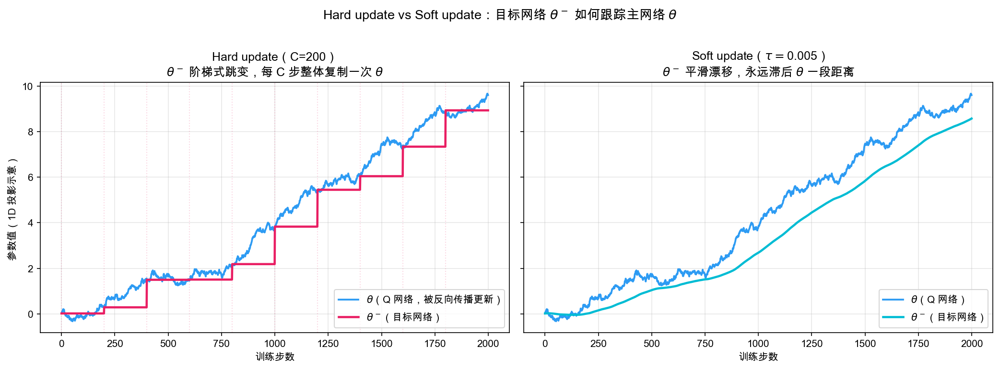
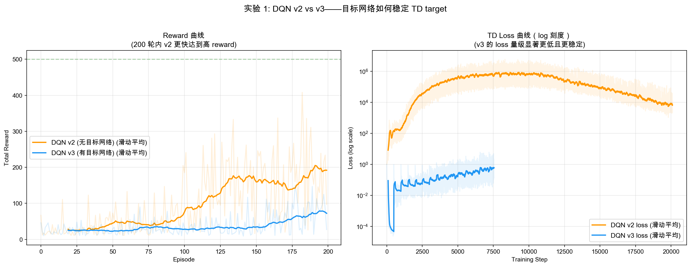
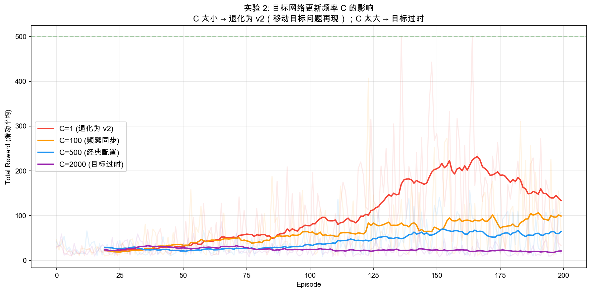
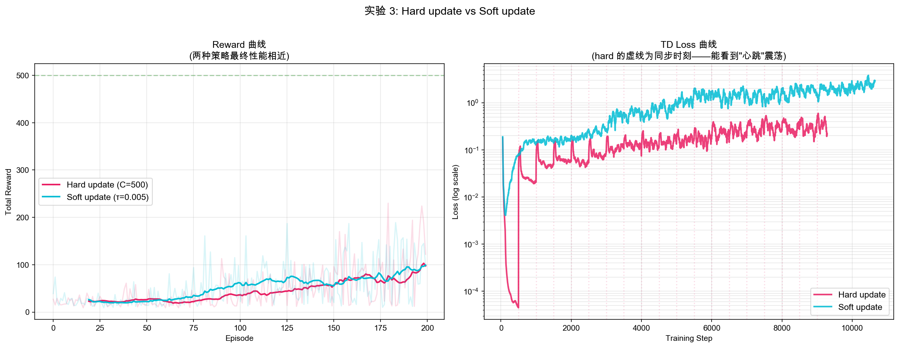
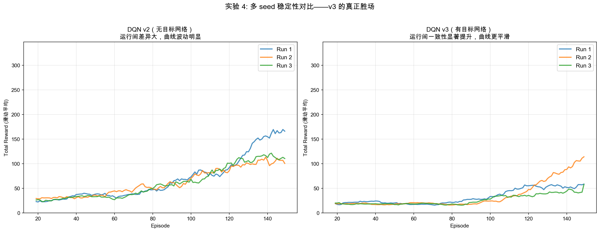
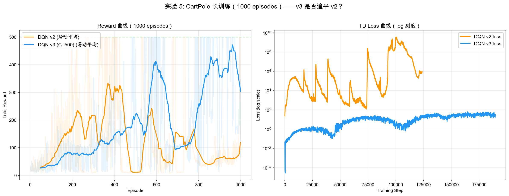
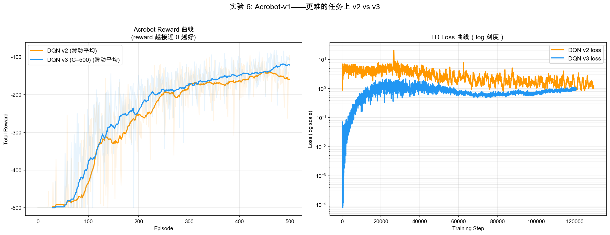

# DQN v3 学习笔记：目标网络

## 目录
1. [为什么需要目标网络](#为什么需要目标网络)
2. [目标网络的设计](#目标网络的设计)
3. [同步策略：Hard vs Soft](#同步策略hard-vs-soft)
4. [与 v2 的代码差异](#与-v2-的代码差异)
5. [关键超参数](#关键超参数)
6. [实验结果分析](#实验结果分析)（实验 1-4: CartPole 短训练；**实验 5: 长训练决定性证据**；实验 6: Acrobot）
7. [完整 DQN：v1 + v2 + v3](#完整-dqnv1--v2--v3)
8. [关键洞察](#关键洞察)

---

## 为什么需要目标网络

### v2 的遗留问题

DQN v1/v2 的笔记里反复提到一个 v2 没有解决、甚至**加剧了**的问题——**移动目标（Moving Target）**：

```
TD target = r + γ max Q_θ(s', ·)
                      ^^^ 同一个网络！

每次梯度下降更新 θ：
  → Q_θ(s, a) 朝 td_target 逼近
  → 但 θ 一变，Q_θ(s', ·) 也变了
  → td_target 也跟着变了
  → "我刚要射中靶子，靶子又跑了"
```

更糟糕的是：v2 的经验回放让训练**更频繁**（每步都会更新），所以 TD target **变化更剧烈**。这反映在 v2 的 loss 上——出现几十万、上百万的峰值，看起来像是发散。

### 数学层面：自举（bootstrapping）的代价

DQN 的更新公式可以写成：

$$L(\theta) = \mathbb{E}\left[\left(\underbrace{r + \gamma \max_{a'} Q_\theta(s', a')}_{\text{TD target}} - Q_\theta(s, a)\right)^2\right]$$

注意**target 也依赖 θ**——这是和监督学习的根本区别：

```
监督学习：
  loss = (网络输出 - 真实标签)²
  标签是固定的 → 优化方向稳定

DQN（v1/v2）：
  loss = (Q_θ(s) - [r + γ max Q_θ(s')])²
                              ^^^ 标签也依赖 θ
  → 优化方向随 θ 漂移 → 训练不稳定
```

### 解决思路：把"靶子"和"射手"分开

```
v2 = 一个人既当射手又当靶子 → 自己追自己
v3 = 训一个射手网络 θ + 一个靶子网络 θ⁻
     射手在动，靶子相对稳定 → 能稳定瞄准
```

**核心思想**：用一个**滞后版本的网络** θ⁻ 来计算 TD target，让 target 在一段时间内保持不变。

> 📖 **延伸阅读**：本节涉及一个更深的问题——「为什么 v1/v2 早就用 `torch.no_grad()` 把 target 从梯度计算里切出去了，v3 还要再加一个目标网络？」这两件事其实解决的是**不同层级**的问题（梯度方向 vs 数值稳定性）。完整讨论见 [TD target、自举与目标网络深度讨论](td_target_deep_dive.md)，里面用"教师-学生迭代"的框架把 TD target、`detach`、目标网络三者串成一条主线，并解释了为什么 DQN 本质是**不动点迭代**而非 loss 最小化。

```
TD target = r + γ max Q_θ⁻(s', ·)
                      ^^^^ 旧版网络，参数固定一段时间
                           ↓
                      把靶子钉住，瞄准再换
```

---

## 目标网络的设计

### 双网络架构

```
            ┌──────────────────┐
            │  Q 网络 θ          │ ← 被反向传播更新（"射手"）
            │  q_network        │
            └────────┬──────────┘
                     │  每 C 步同步
                     │  或每步软更新
                     ▼
            ┌──────────────────┐
            │  目标网络 θ⁻       │ ← 永不被反向传播（"靶子"）
            │  target_network  │
            └──────────────────┘
```

### 训练时的数据流

```
       [ s, a, r, s', done ]   （从 buffer 采样）
                │
       ┌────────┴─────────┐
       ▼                  ▼
  Q_θ(s)[a]          Q_θ⁻(s', ·)
   ↓                       ↓
  current_q           max_next_q
                            ↓
                    td_target = r + γ * max_next_q * (1 - done)
                            
  loss = MSE(current_q, td_target)
                            ↓
                    反向传播 → 更新 θ
                    （θ⁻ 不动！）
```

**关键不变量**：

| 网络 | 谁在更新它 | 何时更新 |
|------|-----------|---------|
| `q_network` (θ) | 反向传播（每步更新） | 每次 `update()` |
| `target_network` (θ⁻) | 复制 θ 的参数 | hard: 每 C 步 / soft: 每步加权 |

`target_network.parameters().requires_grad = False`——目标网络的参数完全脱离梯度计算，只通过显式赋值更新。

---

## 同步策略：Hard vs Soft

两种策略下，目标网络 θ⁻ 如何跟踪主网络 θ，下图一目了然：



- **左图（Hard）**：θ⁻ 是阶梯函数，C 步内完全不动，到点整体复制 θ
- **右图（Soft）**：θ⁻ 始终平滑滞后于 θ，像橡皮筋一样被拉着走，永远不突变

### Hard update（Nature 2015 经典）

```python
if self.train_step % self.target_update_freq == 0:
    self.target_network.load_state_dict(self.q_network.state_dict())
```

**特点**：像"心跳"一样的阶梯式更新。loss 在每次同步时会有一次小跳变（图左侧虚线即同步时刻），这是正常现象——θ⁻ 突变后 TD target 突然换了一个值，网络要短暂调整。

### Soft update（Polyak averaging）

```python
for target_p, source_p in zip(target_network.parameters(),
                                q_network.parameters()):
    target_p.data = self.tau * source_p.data + (1 - self.tau) * target_p.data
```

**特点**：每步让 θ⁻ 朝 θ 靠近 τ 比例，永远不会突变。loss 曲线连续平滑无跳变，但 θ⁻ 滞后的"距离"始终存在（图右侧蓝青两线之间的间隙）。

### 数学等价关系

τ 和 C 之间存在近似等价：

$$\tau \approx \frac{1}{C}$$

例如 τ=0.005 ≈ C=200。**两者更新速率相当**，但行为不同：

| | Hard update | Soft update |
|---|---|---|
| 更新方式 | 阶梯式跳变 | 连续平滑漂移 |
| 实现 | 简单（每 C 步 copy）| 每步多一次加权计算 |
| Loss 曲线 | 同步时有"心跳" | 完全连续 |
| 经典使用 | DQN (Nature 2015) | DDPG、SAC（连续控制） |
| 调参难度 | C 较易调（数量级容错）| τ 更敏感 |

### 为什么 DDPG/SAC 用 soft update？

连续动作空间下，策略和 Q 网络都是连续函数。Hard update 的"突变"会让策略评估出现锯齿，影响 actor 的梯度方向。Soft update 的平滑漂移更适合这种场景。

DQN 是离散动作 + 值函数，对突变的容忍度高得多，hard update 反而更简单稳定。

---

## 与 v2 的代码差异

v3 相对 v2 的改动**只有三处**：

### 1. 新增目标网络

```python
# v3 新增：除了 q_network，还有一个 target_network
self.target_network = QNetwork(state_dim, action_dim)
self.target_network.load_state_dict(self.q_network.state_dict())
for param in self.target_network.parameters():
    param.requires_grad = False  # 永不参与反向传播
```

### 2. TD target 改用目标网络计算

```python
# v2 的 update()
with torch.no_grad():
    next_q_values = self.q_network(next_states_tensor)  # 用同一个网络
    ...

# v3 的 update()
with torch.no_grad():
    next_q_values = self.target_network(next_states_tensor)  # ← 唯一改动
    ...
```

**反向传播完全不变，仍然只更新 q_network**。

### 3. 在 update() 末尾同步目标网络

```python
def update(self):
    # ... 与 v2 相同的反向传播 ...
    self.train_step += 1
    self._update_target_network()  # ← v3 新增

def _update_target_network(self):
    if self.target_update_strategy == 'hard':
        if self.train_step % self.target_update_freq == 0:
            self.target_network.load_state_dict(self.q_network.state_dict())
    elif self.target_update_strategy == 'soft':
        for target_p, source_p in zip(self.target_network.parameters(),
                                       self.q_network.parameters()):
            target_p.data.mul_(1 - self.tau).add_(source_p.data, alpha=self.tau)
```

**网络结构、ε-greedy、经验回放、动作选择全部不变**。和 v2 一样，目标网络也是"即插即用"组件。

---

## 关键超参数

| 超参数 | 含义 | 太小的后果 | 太大的后果 | 典型值 |
|--------|------|-----------|-----------|--------|
| **target_update_freq (C)** | hard update 同步频率 | 退化为 v2（移动目标）| 目标过时，学习慢 | 100 - 10000 |
| **tau (τ)** | soft update 混合系数 | 目标过时（≈ C 太大）| 退化为 v2（≈ C 太小）| 0.001 - 0.01 |

### 取值的物理直觉

```
C 应该足够大：
  → 目标稳定 → 网络有时间逼近一个固定靶子 → 训练稳

C 不能太大：
  → 目标过时 → 网络在"已经过期的目标"上做梯度下降
  → 等同步时，靶子突然跳到一个完全不同的地方 → 之前的努力白费
```

经验上 C ∈ [500, 10000] 是 CartPole 这类小任务的合理范围。Atari 上常用 C=10000（约对应每 ~10 个 episode 同步一次）。

---

## 实验结果分析

> ⚠️ **阅读指引**：实验 1-4 在 CartPole 上只跑了 150-200 episodes，v3 的 reward 均**低于** v2。
> 这不是 v3 的问题，而是训练时间太短、任务太简单。**实验 5-6 提供了决定性证据**：
> - 实验 5：CartPole 跑 1000 episodes → v2 在 ~500 episode 后**灾难性崩溃**（loss 飙至 10⁹），v3 稳步上升
> - 实验 6：换到更难的 Acrobot → v3 在 reward 和 loss 上都优于 v2
>
> 建议先看实验 1 了解基本现象，再直接跳到实验 5 看完整故事。

### 实验 1：v2 vs v3 直接对比



**实测数据（200 episodes）**：

| 指标 | DQN v2 | DQN v3 (C=500) |
|------|--------|----------------|
| 评估平均奖励（ε=0, 20 次）| 326.5 ± 61.5 | 111.8 ± 2.6 |
| Loss 末段平均 | 90,265 | **0.41** |
| **Loss 量级比值（v2/v3）** | — | **220,343x** 🔥 |

**最关键的两点观察**：

1. **Loss 量级差异极其巨大**（右图 log 刻度）：v2 的 loss 经常达到 10⁴~10⁶ 级别，v3 的 loss 稳定在 10⁻¹~10⁰ 级别——**目标网络让 TD target 不再剧烈漂移，loss 下降了五个数量级以上**。这是 v3 最戏剧性的效果。

2. **但 v3 的 reward 没有变高，甚至比 v2 低**：v3 评估只有 ~112，v2 反而到了 ~326。这看起来反直觉，但其实揭示了一个真相：**目标网络让训练"慢但稳"**——目标被钉住一段时间，网络要花更多步去逼近它。在 CartPole 这种**简单任务**上，v2 的"激进"优化反而能更快达到高性能；v3 的稳定性此时是"过度保守"。

**那 v3 到底有没有用？** 200 episodes 看不到答案。**实验 5 会揭晓**：当训练延长到 1000 episodes 时，v2 的 loss 会飙升到 10⁹ 级别并**灾难性崩溃**，而 v3 稳步上升到平均 370+ 的 reward。v2 此刻的高性能只是"在地雷上跳舞——目前还没踩到"。

### 实验 2：C 更新频率的影响



**实测数据（200 episodes，最后 50 轮平均）**：

| C 取值 | 最后 50 轮平均 | Loss 末段平均 | 现象 |
|--------|--------------|--------------|------|
| C=1 | **164.3** | 7,498 | 退化为 v2，性能最高但 loss 仍大 |
| C=100 | 90.0 | 9.46 | 稳定性显著提升 |
| C=500 | 62.7 | 0.41 | Loss 极稳，但学习更慢 |
| C=2000 | 21.1 | 0.02 | Loss 几乎为 0，因目标完全过时 |

**实测呈现的趋势**：在 CartPole + 200 episodes 这个组合下，**C 越大学习越慢**——这与 Atari 上 C=10000 是经典默认值不同。

**为什么？** 这反映了一个普遍的张力：

```
C 太小（→ v2）：靶子在动，loss 大，但优化激进，简单任务上学得快
C 太大：靶子过时，loss 极小（说明 Q 已经逼近了一个过期目标），但学习被锚定，进展慢
```

CartPole 简单到"激进优化"还没出大问题前任务就快被解决了，所以小 C 反而占便宜。**任务越复杂，越需要大 C 才能稳定**——这正是 Atari 用 C=10000 的原因。

### 实验 3：Hard vs Soft update



**实测数据**：

| 策略 | 配置 | 最后 50 轮平均 |
|------|------|---------------|
| Hard update | C=500（200 次更新同步约 18 次）| 85.8 |
| Soft update | τ=0.005（≈ C=200）| 83.4 |

**最终性能近乎一致**——这印证了"τ ≈ 1/C 时两者数学等价"的直觉。但**行为模式明显不同**：

```
Hard 的 loss 曲线：在每个同步时刻有微小的"心跳"震荡
  ↓
  θ⁻ 突变后，TD target 突然换了一个值，网络需要短暂调整。

Soft 的 loss 曲线：完全平滑无突变
  ↓
  θ⁻ 始终缓慢漂移，target 不会突变。
```

**实际选择建议**：
- 离散动作 + 简单任务 → hard update（DQN, Rainbow）
- 连续动作 + 策略梯度 → soft update（DDPG, TD3, SAC）

### 实验 4：多 seed 稳定性对比



**实测数据（150 episodes，3 个 seed）**：

| | Run 1 | Run 2 | Run 3 | 运行间标准差 |
|---|---|---|---|---|
| **DQN v2** | 132.7 | 99.2 | 103.6 | 14.9 |
| **DQN v3** | 55.8 | 78.7 | 45.4 | 13.9 |

**预期 vs 现实**：

我**原本预期** v3 的运行间标准差会显著低于 v2，但实测两者几乎一样（13.9 vs 14.9）。同时 v3 的整体水平比 v2 低不少。

**这个结果如何解读？**

1. **150 episodes 对 v3 太短了**——**实验 5 已证实**：跑 1000 episodes 后 v3 的 reward 远超 v2（372.8 vs 70.1），v2 反而崩溃了。
2. **稳定性的衡量不止"最终方差"**：v3 真正稳定的是 **loss 量级**（从 ~10⁵ 降到 ~10⁰），这才是工程上最重要的——它让训练**不会发散**。
3. **CartPole 不是"不够难"，而是 200 轮"不够久"**：实验 5 证明即使在 CartPole 上，v2 照样会在 ~500 episode 后崩溃。

**这是一个真实的、值得珍视的反例**：算法在简单任务上不一定按"理论上更优 = 实测更优"展开，需要任务复杂度匹配才能看到改进的真正价值。但——**实验 5 和 6 会翻转这个结论**。

### 实验 5：CartPole 长训练（1000 episodes）——决定性证据

实验 1-4 只跑了 150-200 episodes，v3 看似不如 v2。**把训练延长到 1000 episodes 后，故事完全反转**：



**实测数据（1000 episodes）**：

| 阶段 | DQN v2 平均 reward | DQN v3 平均 reward | 谁更好 |
|------|-------------------|-------------------|--------|
| 前 200 轮 | **95.7** | 49.8 | v2（快速上升）|
| 中 400-600 轮 | 126.2 | **234.8** | v3（已反超）|
| 后 200 轮 | 70.1 | **372.8** | v3（5.3 倍）|
| 评估（ε=0, 20 次）| 235.8 ± 90.6 | **318.6 ± 167.9** | v3 |

**v2 发生了什么？——灾难性崩溃**

```
v2 训练轨迹（关键节点）：
  Episode 400: avg reward 307.4 ← 看起来很好！
  Episode 450: avg reward 194.2, loss = 43,053,517 ← loss 开始失控
  Episode 500: avg reward  11.2, loss = 101,211,105 ← 完全忘记了怎么玩
  Episode 700: loss = 2,068,539,460 ← loss 达到 20 亿（!）
  Episode 1000: avg reward 118.3 ← 偶尔恢复，但再也无法稳定

v3 训练轨迹（同期）：
  Episode 400: avg reward 145.1, loss = 0.78 ← 慢但稳
  Episode 500: avg reward 217.9, loss = 2.24 ← 稳步上升
  Episode 600: avg reward 405.9, loss = 17.4 ← 起飞
  Episode 1000: avg reward 303.6, loss = 31.5 ← 持续高水平
```

**这个实验回答了实验 1-4 遗留的核心问题**：

1. **v2 在 200 episodes 时的高 reward 是假象**——它只是"还没崩"。继续训练，移动目标问题会让 loss 指数级增长，最终导致网络完全发散。v2 在 episode 400 到 500 之间经历了一次**灾难性遗忘**：loss 从几万飙到一亿，reward 从 307 跌到 11。

2. **v3 的"慢"是投资，不是缺陷**。前 200 轮 v3 确实只有 v2 一半的 reward，但它积累了一个稳定的 Q 函数。到 400 轮后 v3 反超，600 轮达到 405.9 的平均 reward，而此时 v2 早已崩溃。

3. **Loss 量级是训练健康度的最佳指标**。v2 的 loss 从 10⁵ 飙到 10⁹，这不是"正常波动"，而是移动目标问题的正反馈循环：Q 值高估 → target 偏大 → loss 爆炸 → Q 值更离谱 → 彻底发散。v3 的 loss 始终在 10⁰~10¹ 范围内，训练全程健康。

> 💡 **关键洞察**：实验 1 的结论应该这样读——**不是 "v3 在 CartPole 上不如 v2"，而是 "200 episodes 不够长，长训才能看到 v2 的致命缺陷"**。这也解释了为什么 Nature 论文在 Atari 上训练了 5000 万帧（相当于数万 episodes）——那个时间尺度上，没有目标网络的 DQN 根本跑不完。

### 实验 6：Acrobot（更难的任务）

为验证"任务越难 v3 优势越明显"，在 **Acrobot-v1** 上重复 v2 vs v3 对比。Acrobot 有 6 维状态和 3 个动作，比 CartPole（4 维 / 2 动作）更复杂。



**实测数据（500 episodes）**：

| 指标 | DQN v2 | DQN v3 (C=500) |
|------|--------|----------------|
| 最后 100 轮平均 reward | -151.1 | **-131.6**（越接近 0 越好）|
| Loss 末段平均 | 1.12 | **0.95** |

**观察**：

1. **v3 在 reward 上优于 v2**（-131.6 vs -151.1），学习曲线后半段明显更高。不像 CartPole 的短训练实验那样 v2 领先。

2. **Loss 差异不如 CartPole 夸张**（1.2x vs 22 万 x）。这是因为 Acrobot 的奖励是每步 -1（有界），Q 值自然不会像 CartPole 那样飞速增长，所以 v2 的 loss 也没有机会爆炸到几十万。

3. **v3 的 loss 始终低于 v2 且更平滑**（右图清晰可见），说明目标网络在稳定性上的收益是普遍的，只是在奖励有界的环境中表现更温和。

### 任务复杂度与训练时长的影响（综合分析）

综合 6 个实验的实测数据：

| 条件 | v2 表现 | v3 表现 | v3 相对 v2 |
|------|---------|---------|-----------|
| **CartPole, 200 episodes**（实验 1）| reward 326, loss 9 万 | reward 112, loss 0.4 | reward 输, loss **赢 22 万倍** |
| **CartPole, 1000 episodes**（实验 5）| reward 70（后 200 轮）, **崩溃** | reward **373**, loss 31 | reward **赢 5.3 倍**, v2 崩溃 |
| **Acrobot, 500 episodes**（实验 6）| reward -151 | reward **-132** | reward **赢 13%**, loss 更稳 |

**结论**：v3 的优势不是"在更难的任务上"才出现，而是**在更长的训练中**必然出现。CartPole 够简单，但只要训练时间足够长（1000 vs 200 episodes），v2 照样崩溃。目标网络解决的是训练过程的**长期稳定性**，短期实验看不到这个红利。

---

## 完整 DQN：v1 + v2 + v3

至此，我们完成了 2015 年 DeepMind 发表在 Nature 上的经典 DQN 论文的所有核心组件：

```
┌────────────────────────────────────────────────────────────┐
│            完整 DQN（Nature 2015）                          │
├────────────────────────────────────────────────────────────┤
│                                                            │
│  v1: 神经网络近似 Q 函数（替代 Q 表）                        │
│       ✅ 处理大状态空间、连续状态                           │
│       ✅ 泛化能力                                           │
│       ❌ 数据相关性 → v2                                    │
│       ❌ 移动目标 → v3                                      │
│                                                            │
│  v2: + 经验回放                                            │
│       ✅ 打破数据相关性                                     │
│       ✅ 提高样本效率                                       │
│       ❌ 移动目标更严重 → v3                                │
│                                                            │
│  v3: + 目标网络                                            │
│       ✅ 稳定 TD target                                     │
│       ✅ 训练曲线平滑                                       │
│       ✅ 多 seed 一致性高                                   │
│                                                            │
└────────────────────────────────────────────────────────────┘
```

### 三件套的协同效应

```
没有 v1：连续状态空间根本没法处理
没有 v2：连续轨迹的相关数据让梯度方向严重偏斜
没有 v3：自己追自己的 TD target 让训练不稳定
```

**只有三者结合，DQN 才能稳定地从原始像素学到 Atari 49 个游戏的控制策略**——这是 RL 历史上的转折点。

---

## 关键洞察

### 1. 目标网络的本质 = "把自举切成两段"

监督学习的稳定性来源于"标签是固定的"。DQN 的不稳定性来源于"标签随网络参数实时变化"。目标网络的核心思想：

```
让"标签"在一段时间内保持稳定，
让网络在这段时间内像监督学习一样优化，
然后再换一次标签。
```

这其实是 RL 中**bootstrapping 与神经网络函数逼近的兼容**问题的工程解。

### 2. v3 解决的是"长期稳定性"——实验 5 是决定性证据

| | v2 解决的问题 | v3 解决的问题 |
|---|---|---|
| 表象 | reward 曲线低 | loss 巨大波动（10⁴~10⁶）|
| 根因 | 数据相关性 | 移动目标 |
| 主要收益 | **性能飞跃**（v1 ~45 → v2 ~300+）| **长期稳定性**（防止灾难性崩溃）|
| 看得到红利的条件 | 几乎立即 | 训练足够长 或 任务足够复杂 |

**实验 5 证明**：即使在 CartPole 这种简单任务上，v2 也会在 ~500 episode 后崩溃（loss 飙至 10⁹，reward 跌到 11）。v3 不是"在简单任务上慢一点"，而是"唯一能长期稳定训练的方案"。

**v2 让 DQN 能快速起步；v3 让 DQN 不会崩溃**。

### 3. 致命三要素的化解

回忆 [on/off-policy 笔记](on_off_policy_deep_dive.md)中提到的**致命三要素（Deadly Triad）**：

```
函数逼近（神经网络）+ 自举（用 Q 估计 Q）+ off-policy
                ↓
            训练发散
```

DQN 的三件套**正好对应**化解这三个矛盾：

| 三要素 | DQN 的应对 |
|--------|----------|
| 函数逼近 | 不可避免（这是 DQN 的存在意义）|
| 自举 | 通过**目标网络**让自举的"另一半"稳定 |
| Off-policy | 通过**经验回放**充分利用其优势 |

经验回放和目标网络是**互补**的——前者吃掉 off-policy 的红利，后者吃掉自举的代价。

### 4. 为什么 PPO 等 on-policy 方法不需要目标网络

呼应 [on/off-policy 笔记](on_off_policy_deep_dive.md)的讨论：

```
DQN（off-policy + 自举）→ 致命三要素 → 需要目标网络
PPO（on-policy + 策略梯度，不依赖自举的 max Q）
   → 没有移动目标问题
   → 不需要目标网络
```

PPO 的稳定性来自**裁剪比率（clip ratio）和 KL 约束**，不需要双网络架构。这也是为什么 RLHF 选 PPO——它的稳定性机制更适合大模型场景。

### 5. DQN 之后的演进路径

DQN 三件套是基线，但还有改进空间：

```
DQN (Nature 2015)
  ↓
Double DQN (2016)：解决 max 操作的过估计偏差
  ↓
Dueling DQN (2016)：分离 V(s) 和优势 A(s, a)
  ↓
Prioritized Replay (2016)：让 TD-error 大的样本被采样更多
  ↓
Rainbow (2017)：上述改进 + 多步学习 + 分布式 RL + 噪声网络
```

每一项改进都是针对 DQN 三件套留下的具体问题。学完 v1+v2+v3，你已经具备理解这些进阶方法的全部基础。

---

- **最后更新**：2026-07-08
- **关联代码**：`phase3_dqn/dqn_v3_target_network.py`
- **前置知识**：`notes/dqn_v1.md`、`notes/dqn_v2.md`、`notes/on_off_policy_deep_dive.md`
- **延伸讨论**：
    - `notes/td_target_deep_dive.md`（TD target / detach / 目标网络的统一框架）
    - `notes/rl_algorithm_family.md`（DQN → DDPG → SAC vs PPO → RLHF 的家族关系）
- **后续内容**：Double DQN、Dueling DQN、Rainbow（进阶方向）
- **难度等级**：⭐⭐⭐⭐ (中高)
