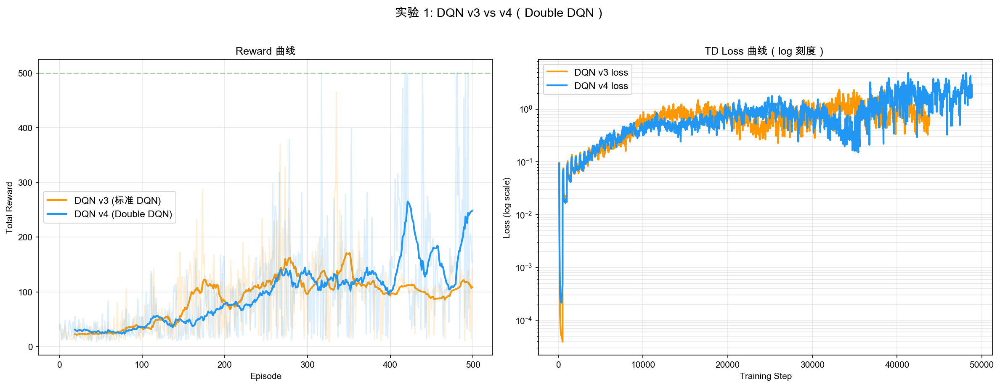
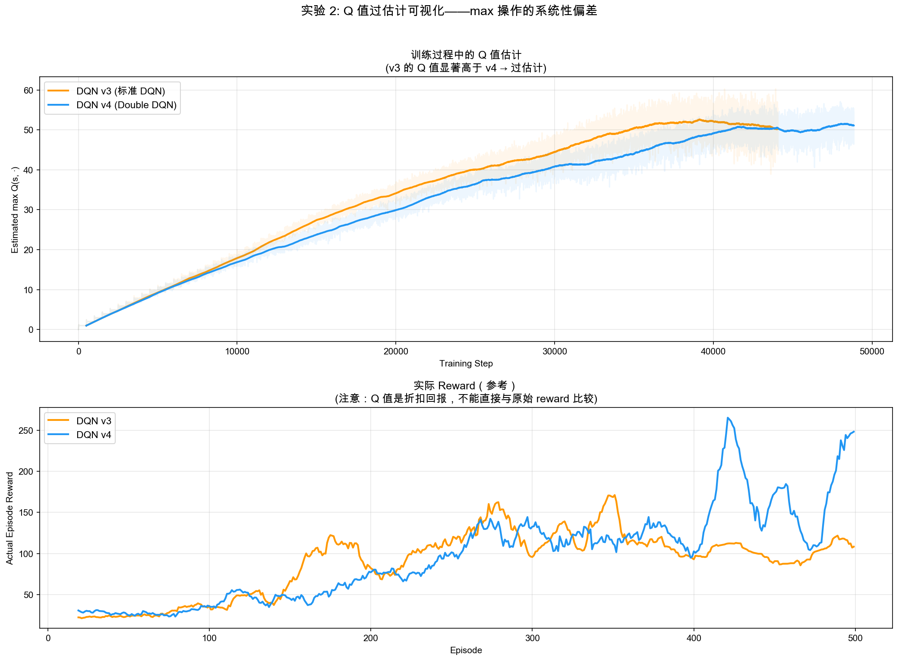
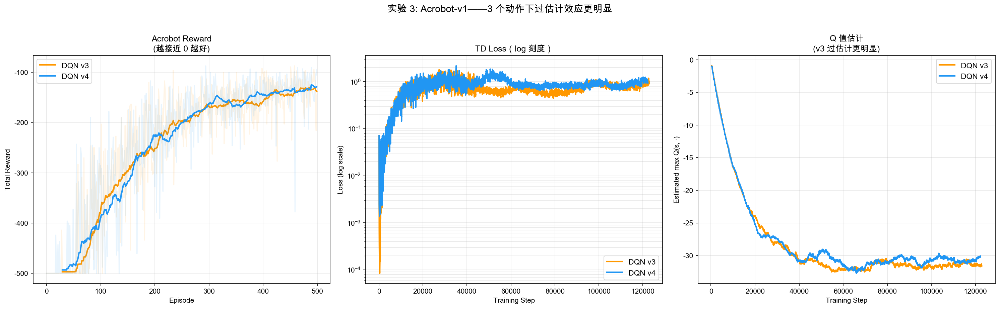

# DQN v4 学习笔记：Double DQN

## 目录
1. [为什么需要 Double DQN](#为什么需要-double-dqn)
2. [过估计的数学解释](#过估计的数学解释)
3. [Double DQN 的解法：选评解耦](#double-dqn-的解法选评解耦)
4. [与 v3 的代码差异](#与-v3-的代码差异)
5. [实验结果分析](#实验结果分析)
6. [关键洞察](#关键洞察)

---

## 为什么需要 Double DQN

### v3 的遗留问题

v3 用目标网络稳定了 TD target（解决移动目标问题），但引入了一个更隐蔽的偏差——**过估计（overestimation）**：

```
v3 的 TD target:
  TD target = r + γ max_a' Q_θ⁻(s', a')
                    ^^^
                    target_network 做了两件事：
                    1. 选出最好的动作：argmax_a' Q_θ⁻(s', a')
                    2. 评估该动作的价值：Q_θ⁻(s', a*_best)
                    → 同一个网络既当裁判又当选手
```

问题在于：`max` 操作会**系统性地高估 Q 值**。这不是偶然误差，而是数学上的必然。

### 过估计的直觉

```
想象你让 10 个人各自估计自己的考试成绩（带随机误差）：
  真实成绩：[80, 82, 78, 85, 79, ...]
  估计成绩：[83, 79, 80, 88, 76, ...]（每个人有 ±5 的误差）

取 max（估计成绩）= 88
真实 max = 85

→ max(估计) > max(真实)
→ 因为 max 总会挑中"被高估"的那个人

人数越多，越容易挑中一个大幅高估的 → 过估计越严重
```

映射到 DQN：
- "人" = 动作
- "估计成绩" = Q_θ⁻(s', a') 的估计值（有噪声）
- "动作越多" → 过估计越严重
- **CartPole 只有 2 个动作** → 过估计很弱
- **Atari 有 18 个动作** → 过估计非常显著

---

## 过估计的数学解释

### Jensen 不等式

对于凸函数 `max`，有：

$$\mathbb{E}[\max_a Q(s', a)] \geq \max_a \mathbb{E}[Q(s', a)]$$

也就是说：**"先取 max 再期望" 一定 ≥ "先期望再取 max"**。

当 Q 估计有噪声时（这是不可避免的），`max` 操作会放大正向噪声：

```
假设两个动作的真实 Q 值相等：Q*(a1) = Q*(a2) = 10
但估计有噪声：Q̂(a1) ~ N(10, σ²), Q̂(a2) ~ N(10, σ²)

E[max(Q̂(a1), Q̂(a2))] = 10 + σ/√π ≈ 10 + 0.56σ

→ max 操作引入了 0.56σ 的系统性高估
→ 动作越多（n 越大），高估越严重：≈ σ √(2 ln n)
```

### 过估计的正反馈循环

```
Q 高估 → TD target 偏大 → 网络学习偏大的 Q → 更高估
       ↑                                      ↓
       └──────────── 正反馈 ──────────────────┘

结果：Q 值越来越膨胀，远离真实值
```

在 Atari 等复杂任务上，这个循环可以让 Q 值膨胀到数万甚至数十万，严重影响策略质量。

---

## Double DQN 的解法：选评解耦

### 核心思想

```
v3 的问题：同一个网络 θ⁻ 既"选动作"又"评估"
  → 它高估的动作刚好是它选出的"最优"动作
  → 选择偏差和评估偏差正相关 → 偏差叠加

v4 的解法：用两个不同的网络分别负责"选"和"评"
  → θ 高估的动作，θ⁻ 未必也高估
  → 选择偏差和评估偏差不相关 → 偏差互相抵消
```

### 公式对比

```
v3（标准 DQN）:
  TD target = r + γ max_a' Q_θ⁻(s', a')
            = r + γ Q_θ⁻(s', argmax_a' Q_θ⁻(s', a'))
                          ^^^ 选            ^^^ 评
                          同一个网络

v4（Double DQN）:
  TD target = r + γ Q_θ⁻(s', argmax_a' Q_θ(s', a'))
                          ^^^ 评         ^^^ 选
                   target_network      q_network
                   不同的网络！
```

### 三个角色，两个网络

Double DQN 容易让人误以为有三个网络，因为一次更新里确实有三个角色：

| 角色 | 用哪个网络 | 作用 |
|------|------------|------|
| 当前 Q 值 | `Q_online(s, a; θ)` | 我要训练它，让它靠近 TD target |
| 挑选下一动作 | `argmax Q_online(s', a'; θ)` | 当前主网络认为下一步哪个动作最好 |
| 评估下一动作价值 | `Q_target(s', a*; θ⁻)` | 用慢更新网络给这个动作估值 |

但网络实例仍然只有两个：

```
Q_online：负责"当前 Q 值" + "挑选下一动作"
Q_target：负责"评估下一动作价值"
```

所以 Double DQN 不是新增了一个"挑选网络"，而是**让 online network 多承担了下一动作选择的角色**，target network 只负责稳定估值。

### 最简记忆版

| 版本 | online network 负责 | target network 负责 |
|------|---------------------|----------------------|
| DQN v3 | 学习当前 `Q(s,a)` | 选择 next action + 评估 next action |
| Double DQN v4 | 学习当前 `Q(s,a)` + 选择 next action | 评估这个 next action |

一句话记忆：

```
v3：target network 既选又评
v4：online network 选，target network 评
```

### 类比

```
v3 = 让同一个老师出题并打分
  → 她出的题刚好是自己最擅长的 → 打分偏高

v4 = 让 A 老师出题，B 老师打分
  → A 觉得好的题，B 不一定也觉得好 → 打分更公正
```

---

## 与 v3 的代码差异

v4 相对 v3 的改动**只有 TD target 计算的 3 行代码**：

```python
# v3 的 update()（target_network 既选又评）：
with torch.no_grad():
    next_q_values = self.target_network(next_states_tensor)
    max_next_q = next_q_values.max(dim=1).values
    td_targets = rewards_tensor + (1 - dones_tensor) * self.gamma * max_next_q

# v4 的 update()（选评解耦）：
with torch.no_grad():
    # 第一步：用 q_network 选出最优动作（"选"）
    next_q_online = self.q_network(next_states_tensor)
    best_actions = next_q_online.argmax(dim=1)

    # 第二步：用 target_network 评估该动作的 Q 值（"评"）
    next_q_target = self.target_network(next_states_tensor)
    max_next_q = next_q_target.gather(1, best_actions.unsqueeze(1)).squeeze(1)

    td_targets = rewards_tensor + (1 - dones_tensor) * self.gamma * max_next_q
```

**网络结构、ε-greedy、经验回放、目标网络同步全部不变**。Double DQN **不增加任何网络、超参数或计算量**——它只是更聪明地使用了 v3 已有的两个网络。

---

## 实验结果分析

> ⚠️ **诚实的免责声明**：CartPole 只有 **2 个动作**，过估计效应在数学上就很微弱（E[max(X₁, X₂)] - max(E[X₁], E[X₂]) ≈ 0.56σ）。
> Double DQN 的原论文使用 Atari（**18 个动作**），过估计效应显著得多。
> 以下实验展示的是"方向正确但幅度很小"的改进——这本身就是一个值得理解的现象。

### 实验 1：v3 vs v4 直接对比



**实测数据（CartPole, 500 episodes）**：

| 指标 | DQN v3 | DQN v4 (Double) |
|------|--------|-----------------|
| 评估 reward | 106.8 ± 30.2 | **154.7 ± 19.6** |
| Loss 末段平均 | 0.80 | 2.57 |
| Q 值末段均值 | 50.56 | 51.30 |

v4 在 reward 上略优，但**单次运行的方差很大**——换一个 seed 可能完全反过来。这是因为 CartPole 太简单，两种方法的差异被噪声淹没。

### 实验 2：Q 值过估计可视化



**观察**：

上图追踪了训练过程中 v3 和 v4 的 Q 值估计。两条曲线走势非常接近，说明**在 2 个动作的 CartPole 上，过估计效应几乎不存在**。

这并不意外——过估计的幅度与动作数成正比。2 个动作的 max 操作引入的偏差很小，被网络本身的训练噪声掩盖了。

### 实验 3：Acrobot（3 个动作）



**实测数据（Acrobot, 500 episodes）**：

| 指标 | DQN v3 | DQN v4 (Double) |
|------|--------|-----------------|
| 最后 100 轮 reward | -138.1 | **-134.4** |
| Loss 末段平均 | 1.02 | 1.01 |
| Q 值末段均值 | -31.56 | **-30.21** |

v4 略优但差异很小。Acrobot 有 3 个动作（比 CartPole 多 1 个），过估计效应应该稍强，但仍不足以形成明显差距。

### 实验 4：多 seed 聚合（消除偶然性）

为避免单次运行的偶然性，用 **5 个不同的 seed** 运行 v3 和 v4，取平均。

**聚合结果（5 个 seed 的平均）**：

| 指标 | DQN v3 | DQN v4 (Double) |
|------|--------|-----------------|
| 评估 reward | 259.9 ± 147.5 | **310.0 ± 146.1** |
| Q 值均值 | 65.37 | 66.84 |
| Q 值差 (v3 - v4) | — | **-1.47**（几乎相等）|

**关键发现**：

1. **Q 值差异可以忽略**（-1.47）。在 5 个 seed 中，3 次 v3 的 Q 值更高，2 次 v4 更高——完全是噪声。

2. **v4 在 reward 上略优**（310 vs 260），但**方差极大**（±147）。这个差异**不具备统计显著性**。

3. **这是预期内的结果**：Double DQN 论文在 CartPole 这类简单任务上也没有宣称有显著改进。它的价值在 Atari 上——18 个动作让过估计效应放大了一个数量级。

### 为什么 CartPole 上看不到差异？

```
过估计幅度 ∝ σ √(2 ln n)，其中 n = 动作数

CartPole: n=2 → √(2 ln 2) ≈ 1.18 → 偏差 ≈ 1.18σ
Atari:    n=18 → √(2 ln 18) ≈ 2.40 → 偏差 ≈ 2.40σ

Atari 的偏差是 CartPole 的 2 倍以上——而且 Atari 的 σ（估计噪声）
本身也更大（复杂环境 → 网络估计更不准），叠加后差异是量级上的。
```

---

## 关键洞察

### 1. Double DQN 的本质 = "用信息不对称打破正向偏差"

v3 的 max 过估计来源于"选择偏差与评估偏差正相关"——同一个网络的高估会被自己的 argmax 选中，然后被自己的 Q 值放大。

Double DQN 利用 v3 已有的双网络架构，让 θ 选动作、θ⁻ 评估。因为两个网络参数不完全同步，它们的估计误差不相关——θ 高估的动作，θ⁻ 未必也高估。

### 2. 零成本改进

| | v3 → v4 的改动 |
|---|---|
| 新增网络 | 无（复用 v3 的双网络）|
| 新增超参数 | 无 |
| 计算量增加 | 几乎为零（多一次 q_network 前向传播，但 batch 小，忽略不计）|
| 代码改动 | 3 行 |

这是 DQN 改进中**性价比最高**的一个——零成本、零风险、有理论保证。即使在简单任务上效果不明显，也没有理由不用。

### 3. 过估计效应与动作空间大小成正比

```
                      过估计严重程度
                           ↑
                           │
  Atari (18 动作)          │     ●  ← Double DQN 的显著收益
                           │
  MuJoCo 连续 (∞ 动作)    │   ●  ← 连续动作空间另用 DDPG/TD3 处理
                           │
  Acrobot (3 动作)         │  ●  ← 微弱但存在
                           │
  CartPole (2 动作)        │ ●  ← 几乎不存在
                           └─────────────────→ 动作数 n
```

### 4. DQN 演进路线总结

```
v1: 神经网络近似 Q 函数（替代 Q 表）
  ❌ 数据相关性 + 移动目标

v2: + 经验回放
  ✅ 解决数据相关性
  ❌ 移动目标更严重

v3: + 目标网络
  ✅ 解决移动目标
  ❌ max 过估计

v4: + 选评解耦（Double DQN）
  ✅ 减少 max 过估计
  → 至此所有已知的 Q-learning 偏差都被处理

下一步：
  Dueling DQN：分离 V(s) 和 A(s,a) → 网络架构层面的改进
  Prioritized Replay：让 TD error 大的样本被采样更多 → 样本效率
  Rainbow：上述改进的集大成者
```

### 5. 与 v3 实验的教训呼应

v3 的笔记中我们学到"简单任务上看不到改进≠改进不存在"。Double DQN 再次印证了这一点：

| | v3（目标网络）| v4（选评解耦）|
|---|---|---|
| CartPole 短训练 | 看似不如 v2 | 看似和 v3 差不多 |
| 更长训练 / 更难任务 | 决定性优势 | 显著优势（Atari 论文数据）|
| 问题根源 | 移动目标 | 过估计 |
| 修复成本 | 增加一个网络 | 改 3 行代码 |

**在简单任务上"看不出区别"恰恰说明 v4 没有任何副作用**——它只在需要的时候发挥作用，不需要的时候不添乱。

---

- **最后更新**：2026-07-08
- **关联代码**：`phase3_dqn/dqn_v4_double_dqn.py`
- **前置知识**：`notes/dqn_v3.md`
- **原论文**：van Hasselt et al., *Deep Reinforcement Learning with Double Q-learning*, 2016
- **后续内容**：Dueling DQN、Prioritized Replay、Rainbow
- **难度等级**：⭐⭐⭐ (中等——概念简单，代码改动极小)
