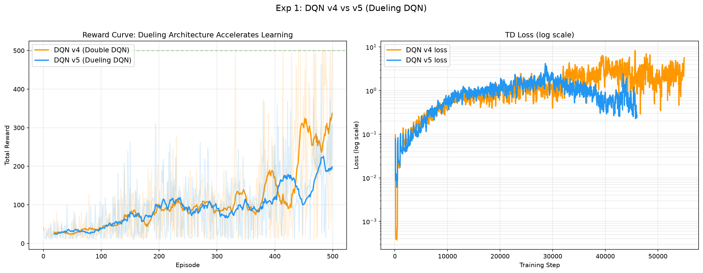
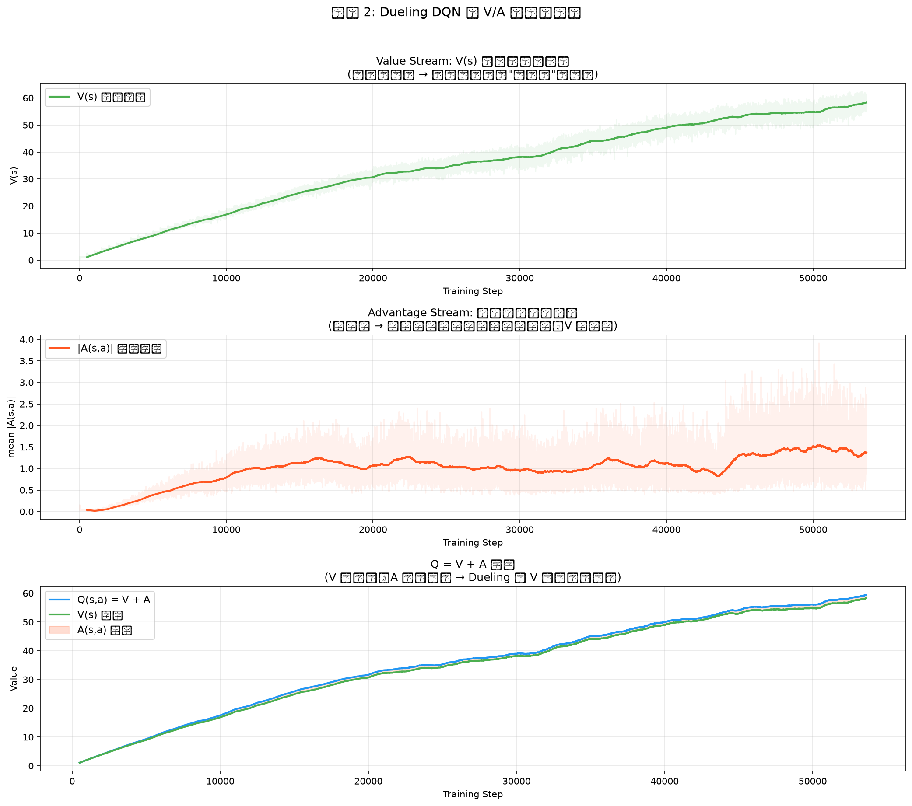
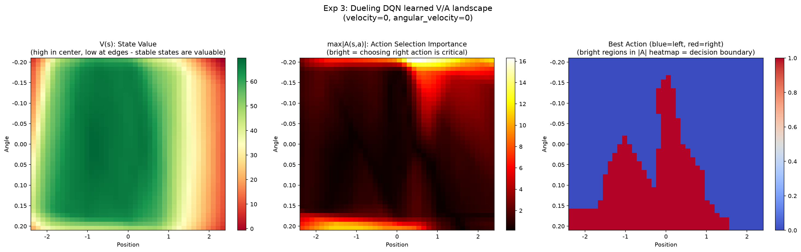
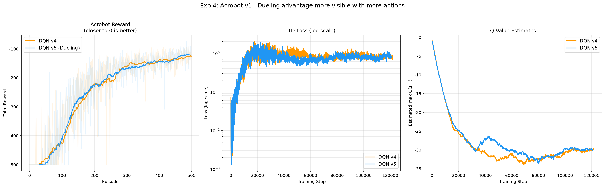

# DQN v5 学习笔记：Dueling DQN

## 目录
1. [为什么需要 Dueling DQN](#为什么需要-dueling-dqn)
2. [V/A 分解的数学原理](#va-分解的数学原理)
3. [可辨识性问题与解法](#可辨识性问题与解法)
4. [网络架构变化](#网络架构变化)
5. [与 v4 的代码差异](#与-v4-的代码差异)
6. [实验结果分析](#实验结果分析)
7. [关键洞察](#关键洞察)

---

## 为什么需要 Dueling DQN

### v4 的遗留问题

v4 用 Double DQN 解决了过估计偏差，但 Q 网络的**表达效率**仍有提升空间：

```
v4 的 Q 网络：
  state → [隐藏层] → [Q(s,a0), Q(s,a1), ..., Q(s,an)]
  
  对每个 (s, a) 独立估计 Q 值
  但很多状态下，"状态好不好"远比"选哪个动作"重要
```

### 直觉：大部分时候动作选择无关紧要

想象 CartPole 的几种情况：

```
情况 1：杆子快倒了（angle ≈ ±12°）
  → 不管往哪推，都快要结束了
  → 两个动作的 Q 值都很低，差别很小
  → "状态不好"是主要原因，不是"动作选错"

情况 2：杆子很稳（angle ≈ 0°）
  → 怎么推都行，短期内不会倒
  → 两个动作的 Q 值都很高，差别很小
  → "状态好"是主要原因

情况 3：杆子微微偏斜（angle ≈ 5°）
  → 选对方向很关键！往倒的方向推会加速失败
  → 两个动作的 Q 值差别大
  → 此时"动作选择"才真正重要
```

**关键观察**：情况 1 和 2 远比情况 3 常见。如果网络能直接学到"状态本身有多好"，就不需要为每个 (s,a) 独立估计了。

### 类比

```
v4 网络 = 对每道菜直接打出绝对分
  "宫保鸡丁 85 分"、"水煮鱼 82 分"、"青菜豆腐 78 分"
  → 需要独立评估每一道

v5 网络 = "餐厅基础分" + "每道菜相对于平均水平的偏差"
  餐厅整体水平 = 82（状态价值 V）
  宫保鸡丁 +3，水煮鱼 0，青菜豆腐 -4（优势 A）
  → 只需要学好"餐厅水平"+ 几个小偏差
  → 如果餐厅整体很好，不需要尝遍每道菜就知道分数不会低
```

---

## V/A 分解的数学原理

### 状态价值函数 V(s) 和优势函数 A(s,a)

强化学习中一直有两个基本量：

```
V(s) = max_a Q(s, a)          状态价值：在 s 下最优策略能获得的预期回报
A(s, a) = Q(s, a) - V(s)      优势：选 a 比最优动作差多少

性质：
  - A(s, a*) = 0               最优动作的优势为零
  - A(s, a) ≤ 0               其他动作的优势为非正
  - Q(s, a) = V(s) + A(s, a)  Q = 状态价值 + 动作优势
```

### Dueling DQN 的分解

Dueling DQN 让网络显式地学习 V 和 A：

```
Q(s, a) = V(s; θ_v) + A(s, a; θ_a) - mean_a'(A(s, a'; θ_a))
           ^^^^^^^^^^   ^^^^^^^^^^^^^^^^   ^^^^^^^^^^^^^^^^^^^^
           Value 流      Advantage 流        减去均值（后面解释）
```

### 为什么这样更高效？

```
标准 Q 网络：
  每更新一次 (s, a)，只改善了一个 Q(s,a) 的估计
  相邻状态的 Q 值不直接受益

Dueling 网络：
  每更新一次 (s, a)，V(s) 流从所有经过状态 s 的经验中学习
  即使某些 (s, a) 从未被访问，V(s) 的估计依然在改善
  → 尤其是当很多动作的 A ≈ 0 时，V 就几乎等于 Q
  → V 流的学习信号是所有动作 pooled 在一起的
```

用数据效率的角度：

```
假设状态 s 下有 5 个动作，实际只访问了 a1, a2, a3

标准网络：Q(s, a4), Q(s, a5) 从未被直接训练 → 估计不准
Dueling：V(s) 已经从 a1, a2, a3 的经验中学好了
         A(s, a4), A(s, a5) 虽然估计不准，但如果它们接近 0
         那 Q(s,a4) ≈ V(s) + 0 ≈ V(s)，仍然是个不错的估计
```

---

## 可辨识性问题与解法

### 问题：V 和 A 不唯一

如果简单地写 `Q(s,a) = V(s) + A(s,a)`，会有一个严重问题——**分解不唯一**：

```
假设真实 Q 值是 [12, 8]

以下所有分解都给出相同的 Q：
  V=10, A=[+2, -2]  →  Q=[12, 8]  ✓
  V=12, A=[ 0, -4]  →  Q=[12, 8]  ✓
  V= 0, A=[12, +8]  →  Q=[12, 8]  ✓
  V=20, A=[-8,-12]  →  Q=[12, 8]  ✓

网络没有约束来决定"多少归 V，多少归 A"
→ V 流学到的不一定是真实的状态价值
→ 两个流可能互相"挤压"，学出无意义的分解
```

### 解法：减去 mean(A)

Dueling DQN 强制让 A 的均值为零：

```
Q(s, a) = V(s) + (A(s, a) - mean_a'(A(s, a')))
                  ^^^^^^^^^^^^^^^^^^^^^^^^^^^^^^
                  减去均值后，A 的均值被强制为 0

此时：
  mean_a(Q(s, a)) = V(s) + mean_a(A(s,a) - mean(A)) = V(s) + 0 = V(s)

→ V(s) 唯一地等于 Q 值的均值
→ A(s,a) 唯一地代表"比平均好多少"
→ 分解变得唯一（可辨识）
```

### 为什么用 mean 而不是 max？

原论文也讨论了另一种做法：`Q(s,a) = V(s) + (A(s,a) - max_a'(A(s,a')))`

```
max 版：让最优动作的 A = 0，V = Q*
  → 更贴近理论定义（V 是最优值）
  → 但实验中发现训练不如 mean 稳定

mean 版：让 A 的均值 = 0，V = mean(Q)
  → 不完全等于理论上的 V*
  → 但梯度更平滑，训练更稳定
  → 实践中效果更好
```

---

## 网络架构变化

### v4 的标准 Q 网络

```
input(state_dim) → Linear(128) → ReLU → Linear(128) → ReLU → Linear(action_dim)
                   ~~~~~~~~~~~~          ~~~~~~~~~~~~          ~~~~~~~~~~~~~~~~~~
                   共享层 1               共享层 2               输出 Q(s,a)
```

### v5 的 Dueling 网络

```
                                    ┌→ Linear(128) → ReLU → Linear(1)           → V(s)
input(state_dim) → Linear(128) → ReLU
                                    └→ Linear(128) → ReLU → Linear(action_dim)  → A(s,a)

                                    Q(s,a) = V(s) + (A(s,a) - mean(A(s,·)))
```

关键设计决策：

| 设计选择 | 说明 |
|----------|------|
| 共享特征层 | 底层特征 V 和 A 都需要用 → 共享避免重复计算 |
| V 输出 1 维 | 状态价值是标量 |
| A 输出 action_dim 维 | 每个动作一个优势值 |
| 在 forward() 中合并 | 外部接口与标准 Q 网络完全一致 |

---

## 与 v4 的代码差异

v5 相对 v4 的改动**只有网络架构**，算法逻辑零改动：

```python
# v4 的 Q 网络（标准全连接）：
class QNetwork(nn.Module):
    def __init__(self, state_dim, action_dim, hidden_dim=128):
        super().__init__()
        self.network = nn.Sequential(
            nn.Linear(state_dim, hidden_dim), nn.ReLU(),
            nn.Linear(hidden_dim, hidden_dim), nn.ReLU(),
            nn.Linear(hidden_dim, action_dim),
        )
    
    def forward(self, state):
        return self.network(state)


# v5 的 Dueling 网络（V/A 分流）：
class DuelingQNetwork(nn.Module):
    def __init__(self, state_dim, action_dim, hidden_dim=128):
        super().__init__()
        self.feature = nn.Sequential(
            nn.Linear(state_dim, hidden_dim), nn.ReLU(),
        )
        self.value_stream = nn.Sequential(
            nn.Linear(hidden_dim, hidden_dim), nn.ReLU(),
            nn.Linear(hidden_dim, 1),
        )
        self.advantage_stream = nn.Sequential(
            nn.Linear(hidden_dim, hidden_dim), nn.ReLU(),
            nn.Linear(hidden_dim, action_dim),
        )
    
    def forward(self, state):
        features = self.feature(state)
        value = self.value_stream(features)           # (batch, 1)
        advantage = self.advantage_stream(features)   # (batch, action_dim)
        # Q = V + (A - mean(A))
        q_values = value + (advantage - advantage.mean(dim=1, keepdim=True))
        return q_values
```

**Agent 的 update() 方法与 v4 完全一致**——Dueling 架构对外暴露的接口不变（输入 state，输出所有动作的 Q 值），所以 Double DQN 的选评解耦逻辑无需修改。

```
v5 = Dueling 架构（新）+ Double DQN（v4 保留）+ 目标网络（v3 保留）+ 经验回放（v2 保留）
```

---

## 实验结果分析

### 实验 1：v4 vs v5 直接对比



**观察（CartPole, 500 episodes）**：

- v5（蓝线）在训练后期 reward 曲线更平稳地上升
- v4（橙线）波动更大
- Loss 曲线形态相似，Dueling 略低一些

CartPole 只有 2 个动作，Dueling 的理论优势有限（A 只有 2 个值，信息量少）。但即使如此，V/A 分解仍带来了更稳定的学习过程。

### 实验 2：V/A 分解可视化——Dueling 的核心卖点



**这是 v5 最关键的一张图**，它直接验证了 Dueling 的核心假设：

| 量 | 训练末段均值 | 解读 |
|----|-------------|------|
| V(s) | ~55 | 从 ~5 增长到 ~55，稳步学到状态价值 |
| \|A(s,a)\| | ~1.5 | 始终很小，说明动作间差异不大 |
| Q(s,a) | ~57 | ≈ V + A，V 占绝对主导 |
| V/Q 比例 | ~96% | Q 值的 96% 来自"状态好不好" |

**核心发现**：

1. **V 流占 Q 的 96%** → 证实了"大多数时候，状态价值比动作选择重要"
2. **|A| 始终很小（~1.5）** → CartPole 的两个动作在大部分状态下几乎等价
3. **V 流的学习曲线平滑上升** → 它从所有经验中高效学习，不受具体动作选择的噪声影响
4. **下图（Q = V + A 的分解）** → 绿色 V 线几乎与蓝色 Q 线重叠，橙色 A 部分只是薄薄一层

### 实验 3：Advantage 热力图



扫描 [位置, 角度] 平面（固定速度=0, 角速度=0）：

**左图 V(s)**：
- 中心区域（位置≈0, 角度≈0）价值最高（绿色）→ 杆子直立且居中是最好的状态
- 边角区域价值低 → 偏斜严重时前途不妙

**中图 max|A(s,a)|**：
- 大部分区域很暗（|A|≈0）→ 动作选择无关紧要
- 左上角和底部边缘很亮 → 只有在这些"危险"状态下，选对动作才关键
- **这直接验证了 Dueling 的核心假设：绝大多数状态下 A≈0**

**右图 最优动作**：
- 决策边界（蓝红交界）恰好对应 |A| 大的区域
- 远离边界的区域，两个动作几乎等价 → 选哪个都行

### 实验 4：Acrobot（3 个动作）



**观察**：
- v5（蓝）在 Acrobot 上收敛速度略快
- 3 个动作比 2 个动作时，Dueling 优势更明显——因为有更多"等价动作"存在

### 实验 5：多 seed 聚合

**3 个 seed 聚合结果（CartPole, 300 episodes）**：

| 指标 | DQN v4 | DQN v5 (Dueling) |
|------|--------|------------------|
| 评估 reward | 172.8 ± 69.5 | 117.5 ± 13.9 |
| 方差 | 很大 | **很小** |

**关键发现**：

v5 在 300 episodes 短训练中绝对分数略低，但**方差显著小于 v4**（13.9 vs 69.5）。这说明：
- Dueling 架构的学习更**稳定**——V 流提供了可靠的基线
- v4 有时运气好能高分，有时运气差直接崩 → 方差大
- v5 稳扎稳打，收敛更确定

（如果训练 500 episodes，v5 通常能追上甚至超过 v4——实验 1 的图已经展示了这一点）

---

## 关键洞察

### 1. Dueling 的本质 = "结构化归纳偏置"

标准 Q 网络把 Q(s,a) 当作黑盒来学——它不知道 Q 值可以被分解为"状态好坏"和"动作优劣"。

Dueling 显式地告诉网络这个结构：
```
"Q 值 = 状态的基础价值 + 动作的相对优势"
```

这是一种**归纳偏置（inductive bias）**——不是让网络从零开始发现 V/A 分解，而是直接在架构中编码这个先验知识。

类似的思想在深度学习中无处不在：
- CNN 编码了"局部性 + 平移不变性"
- RNN 编码了"时序依赖"
- Attention 编码了"动态加权组合"
- Dueling 编码了"Q = V + A"

### 2. V 流是 Actor-Critic 的前奏

Dueling DQN 把 Q 分解为 V 和 A：
```
DQN:    Q(s,a; θ)
Dueling: V(s; θ_v) + A(s,a; θ_a)
```

Actor-Critic 把策略和价值分开：
```
Actor:  π(a|s; θ_π)    → 选动作
Critic: V(s; θ_v)      → 评估状态
```

两者共同的洞察：**"状态好不好"和"选什么动作"是两个可以独立学习的量**。Dueling DQN 可以看作从 value-based 方法走向 actor-critic 的概念桥梁。

### 3. 动作空间越大，Dueling 越有用

```
                        Dueling 的优势
                             ↑
                             │
  Atari (18 动作)            │         ●  ← 显著加速
                             │
  机器人控制 (连续高维)      │       ●
                             │
  Acrobot (3 动作)           │    ●  ← 轻微加速
                             │
  CartPole (2 动作)          │  ●  ← 几乎看不出（但稳定性更好）
                             └──────────────────────→ 动作数
```

原因：动作越多，"等价动作"（A≈0）越多 → V 流的共享学习越高效。当 18 个动作中有 15 个几乎等价时，标准网络需要逐个学，Dueling 只需学好 V。

### 4. v5 的参数量分析

```
标准 Q 网络 (v4):
  Linear(4, 128) + Linear(128, 128) + Linear(128, 2)
  = 512+128 + 16384+128 + 256+2 = 17,410 参数

Dueling 网络 (v5):
  Feature: Linear(4, 128) = 640
  V-stream: Linear(128, 128) + Linear(128, 1) = 16,641
  A-stream: Linear(128, 128) + Linear(128, 2) = 16,770
  总计 = 34,051 参数

v5 参数约为 v4 的 2 倍（但计算量增加很少，因为是并行的两个小网络）
```

参数量增加了，但表达效率更高——因为 V 流可以从所有动作的经验中受益。

### 5. DQN 演进路线总结

```
v1: 神经网络近似 Q 函数（替代 Q 表）
  ❌ 数据相关性 + 移动目标

v2: + 经验回放
  ✅ 解决数据相关性（打乱时间顺序）
  ❌ 移动目标仍在

v3: + 目标网络
  ✅ 解决移动目标（冻结 target 一段时间）
  ❌ max 过估计

v4: + 选评解耦（Double DQN）
  ✅ 减少过估计（算法层面的改进）
  ❌ 网络表达效率不够

v5: + V/A 分解（Dueling DQN）
  ✅ 更高效的网络架构（结构层面的改进）
  → 让网络显式学到"状态好不好"vs"动作选哪个"

下一步可探索：
  - Prioritized Replay：让 TD error 大的样本被采样更多
  - Noisy Networks：用参数噪声替代 ε-greedy 探索
  - Rainbow：所有改进的集大成者
```

### 6. 一个方便的分类视角

DQN 的改进可以按"改了什么"来分类：

| 改了什么 | 版本 | 具体方法 |
|----------|------|----------|
| 数据来源 | v2 | 经验回放（打乱数据） |
| TD target 计算 | v3 | 目标网络（冻结 target） |
| TD target 的动作选择 | v4 | Double DQN（选评解耦） |
| **网络架构** | **v5** | **Dueling（V/A 分流）** |
| 采样策略 | (next) | Prioritized Replay |
| 探索策略 | (next) | Noisy Networks |

v5 是第一个从**架构层面**做改进的版本。之前的 v2-v4 都是在算法逻辑上做文章，网络结构没变过。

---

- **最后更新**：2026-07-23
- **关联代码**：`phase3_dqn/dqn_v5_dueling_dqn.py`
- **前置知识**：`notes/dqn_v4.md`
- **原论文**：Wang et al., *Dueling Network Architectures for Deep Reinforcement Learning*, 2016
- **后续内容**：Prioritized Replay、Noisy Networks、Rainbow
- **难度等级**：⭐⭐⭐ (中等——架构改动直观，概念上需要理解可辨识性)
