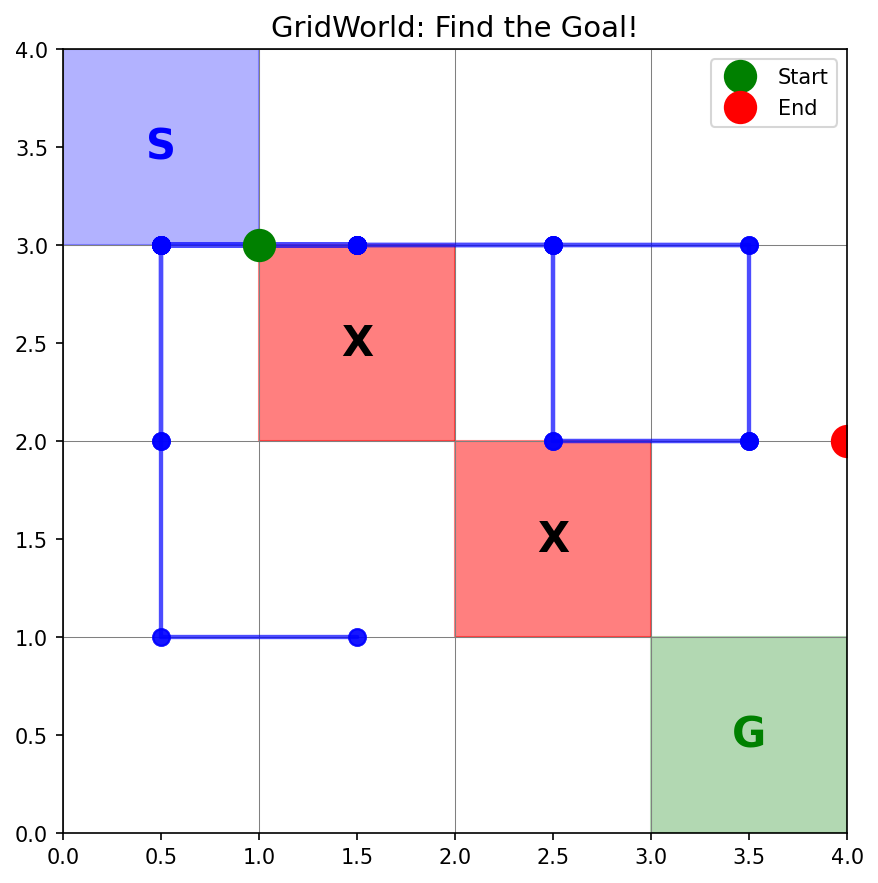

# 网格世界与马尔可夫决策过程（MDP）：从无状态到有状态

## 目录
1. [从老虎机到网格世界](#从老虎机到网格世界)
2. [MDP 的五个元素](#mdp-的五个元素)
3. [状态转移：确定性 vs 随机性](#状态转移确定性-vs-随机性)
4. [奖励函数设计](#奖励函数设计)
5. [折扣因子 γ 的理解](#折扣因子-γ-的理解)
6. [价值函数与 Bellman 方程](#价值函数与-bellman-方程)
7. [最优价值函数](#最优价值函数)
8. [代码实现分析](#代码实现分析)
9. [与多臂老虎机的对比](#与多臂老虎机的对比)

---

## 从老虎机到网格世界

### 关键跨越：引入"状态"

多臂老虎机是 RL 的最简模型，但它有一个重大限制：**没有状态**。

| | 多臂老虎机 | 网格世界（MDP） |
|---|---|---|
| **状态** | ❌ 无 | ✅ 智能体在网格中的位置 |
| **动作效果** | 只产生奖励 | 改变状态 + 产生奖励 |
| **决策依据** | 只看历史奖励 | 看当前状态 + 历史经验 |
| **问题复杂度** | 选哪台机器 | 走哪条路径 |

**直觉**：
- 多臂老虎机 = 站在原地选按钮
- 网格世界 = 在迷宫里找出路

```
多臂老虎机：                    网格世界：
                                S . . .
  [🎰] [🎰] [🎰]               . X . .
   ↓    ↓    ↓                  . . X .
  奖励  奖励  奖励               . . . G

  没有位置变化！                 位置在不断变化！
```

### 为什么需要状态？

在现实世界中，几乎所有决策都依赖于"你在哪"：
- 下棋：同一步棋在不同局面下效果完全不同
- 导航：同一个"向右转"在不同路口意义不同
- 游戏：同一个"攻击"在不同血量下策略不同

**状态让动作有了上下文**，这就是 MDP 的核心贡献。

---

## MDP 的五个元素

马尔可夫决策过程由五元组 $\langle S, A, P, R, \gamma \rangle$ 定义：

### 1. 状态空间 S

**定义**：所有可能状态的集合。

在 4×4 网格世界中：
- 状态 = 智能体的位置 $(row, col)$
- 状态空间大小 = $4 \times 4 = 16$
- 特殊状态：起点 $(0,0)$、终点 $(3,3)$、障碍物 $(1,1)$ 和 $(2,2)$

```
(0,0) (0,1) (0,2) (0,3)
(1,0) (1,1) (1,2) (1,3)
(2,0) (2,1) (2,2) (2,3)
(3,0) (3,1) (3,2) (3,3)

S = 起点    X = 障碍物    G = 终点

S  .  .  .
.  X  .  .
.  .  X  .
.  .  .  G
```

### 2. 动作空间 A

**定义**：在每个状态下可执行的动作集合。

```
A = {上(0), 下(1), 左(2), 右(3)}

      上(0)
       ↑
左(2) ← → 右(3)
       ↓
      下(1)
```

在本实现中，所有状态共享相同的动作空间（但撞墙或撞障碍物时会留在原地）。

### 3. 转移概率 P(s'|s, a)

**定义**：在状态 $s$ 执行动作 $a$ 后，转移到状态 $s'$ 的概率。

$$P(s' | s, a) = \Pr(S_{t+1} = s' | S_t = s, A_t = a)$$

这是 MDP 与老虎机的**核心区别**。老虎机没有状态转移，而 MDP 的每个动作都会改变状态。

**确定性转移**：
$$P(s'|s, a) = \begin{cases} 1 & \text{如果 } s' \text{ 是执行 } a \text{ 后的预期位置} \\ 0 & \text{否则} \end{cases}$$

**随机转移**（滑倒概率 $p_{slip} = 0.2$）：
$$P(s'|s, a) = \begin{cases} 1 - p_{slip} & \text{如果 } s' \text{ 是预期位置} \\ p_{slip}/3 & \text{如果 } s' \text{ 是其他三个方向的位置} \end{cases}$$

### 4. 奖励函数 R(s, s')

**定义**：从状态 $s$ 转移到 $s'$ 时获得的即时奖励。

$$R(s, a, s') = \text{在状态 } s \text{ 执行 } a \text{ 转移到 } s' \text{ 获得的奖励}$$

| 转移结果 | 奖励 | 设计意图 |
|---------|------|---------|
| 到达终点 $(3,3)$ | **+1.0** | 鼓励到达目标 |
| 撞到障碍物 | **-1.0** | 惩罚危险行为 |
| 普通移动 | **-0.1** | 鼓励高效（少走弯路） |

**为什么普通移动要给 -0.1？**

如果普通移动奖励为 0，智能体可能会"闲逛"--反正不扣分，走多少步都无所谓。加上 -0.1 的小惩罚后，智能体会倾向于用最少的步数到达终点。

### 5. 折扣因子 γ

**定义**：未来奖励相对于当前奖励的衰减系数，$\gamma \in [0, 1]$。

$$G_t = R_{t+1} + \gamma R_{t+2} + \gamma^2 R_{t+3} + \ldots = \sum_{k=0}^{\infty} \gamma^k R_{t+k+1}$$

详见下方 [折扣因子 γ 的理解](#折扣因子-γ-的理解) 章节。

---

## 状态转移：确定性 vs 随机性

### 确定性转移

在确定性环境中，动作的结果是完全可预测的：

```
当前位置: (0, 0)

执行"右"→ 100% 到达 (0, 1)
执行"下"→ 100% 到达 (1, 0)
执行"上"→ 100% 留在 (0, 0)  ← 撞墙，留在原地
执行"左"→ 100% 留在 (0, 0)  ← 撞墙，留在原地
```

### 随机转移（滑倒机制）

现实世界中，动作的结果往往不确定。随机转移模拟了这种不确定性：

```
当前位置: (0, 1)，执行"右"

80% 概率 → 到达 (0, 2)    ← 预期方向
 6.7% 概率 → 到达 (0, 0)  ← 滑到左边
 6.7% 概率 → 留在 (0, 1)  ← 滑到上边（撞墙）
 6.7% 概率 → 到达 (1, 1)  ← 滑到下边（但这是障碍物！留在原地）
```

### 为什么要引入随机性？

1. **更真实**：现实中机器人的轮子会打滑，人的手会抖
2. **更有挑战**：确定性环境中找到最优路径后就不会出错，随机环境需要更鲁棒的策略
3. **理论意义**：随机转移是 MDP 的一般形式，确定性只是特例

### 实验对比

```
确定性环境（1000 次随机策略）:
  到达终点的比例: ~10%
  平均累计奖励: 约 -5

随机环境 (slip_prob=0.2):
  到达终点的比例: ~5%        ← 更难到达
  平均累计奖励: 约 -5.5      ← 表现更差

观察：随机性增加了问题的难度，更需要智能策略！
```

---

## 奖励函数设计

### 奖励塑形（Reward Shaping）

奖励函数的设计直接影响智能体的行为。好的奖励设计应该：

1. **目标明确**：到达终点 +1，让智能体知道目标在哪
2. **避免危险**：撞障碍物 -1，让智能体学会绕路
3. **鼓励效率**：每步 -0.1，让智能体不磨蹭

### 不同奖励设计的影响

```
设计 A（只有终点奖励）:
  终点: +1, 其他: 0
  问题：智能体可能永远在闲逛，因为不走也不扣分

设计 B（本文的设计）:
  终点: +1, 障碍: -1, 每步: -0.1
  效果：智能体会尽快到达终点，同时避开障碍物 ✅

设计 C（惩罚过重）:
  终点: +1, 障碍: -100, 每步: -1
  问题：智能体可能过于保守，不敢探索
```

### 稀疏奖励 vs 密集奖励

| 类型 | 示例 | 优点 | 缺点 |
|------|------|------|------|
| **稀疏奖励** | 只在终点给 +1 | 简单、不会误导 | 学习慢，信号太少 |
| **密集奖励** | 每步都有反馈 | 学习快，信号丰富 | 设计困难，可能误导 |

本文的设计属于**半密集奖励**：每步都有小惩罚（密集），但主要奖励集中在终点和障碍物（稀疏）。

---

## 折扣因子 γ 的理解

### 直觉

折扣因子 $\gamma$ 回答一个问题：**"未来的 1 块钱，现在值多少？"**

$$G_t = r_t + \gamma r_{t+1} + \gamma^2 r_{t+2} + \gamma^3 r_{t+3} + \cdots$$

### 不同 γ 值的效果

```
γ = 0（极端短视）:
  G = r_0
  只看当前奖励，完全忽略未来
  → 智能体只关心眼前利益

γ = 0.5:
  G = r_0 + 0.5·r_1 + 0.25·r_2 + 0.125·r_3 + ...
  未来奖励快速衰减
  → 智能体偏好近期奖励

γ = 0.9（常用值）:
  G = r_0 + 0.9·r_1 + 0.81·r_2 + 0.729·r_3 + ...
  未来奖励缓慢衰减
  → 智能体会为长远利益做规划

γ = 1（极端远视）:
  G = r_0 + r_1 + r_2 + r_3 + ...
  所有未来奖励同等重要
  → 可能导致无穷大（需要有限回合）
```

### 为什么需要折扣？

1. **数学收敛**：当 $\gamma < 1$ 时，无限和有界：$\sum_{k=0}^{\infty} \gamma^k = \frac{1}{1-\gamma}$
2. **不确定性**：未来越远越不确定，应该给予更低的权重
3. **即时偏好**：现实中"现在的 100 元"比"一年后的 100 元"更有价值
4. **实际效果**：$\gamma$ 控制智能体的"视野"--看多远的未来

### 网格世界中的 γ 效果

```
假设从 (0,0) 到 (3,3) 的最短路径需要 6 步：

γ = 0.9 时的回报:
  G = -0.1 + 0.9×(-0.1) + 0.81×(-0.1) + ... + 0.9⁵×(+1)
  G = -0.1×(1+0.9+0.81+0.729+0.656) + 0.59×1
  G ≈ -0.42 + 0.59 = 0.17  ← 正回报，值得走

γ = 0.1 时的回报:
  G = -0.1 + 0.1×(-0.1) + ... + 0.1⁵×(+1)
  G ≈ -0.11 + 0.00001 = -0.11  ← 终点奖励几乎看不到！

结论：γ 太小时，智能体"看不到"远处的终点奖励，无法学到好策略。
```

---

## 价值函数与 Bellman 方程

### 目标：最大化期望回报

智能体的目标是找到一个策略 $\pi$，使得从任意状态出发的期望回报最大：

$$\pi^* = \arg\max_\pi \mathbb{E}\left[\sum_{t=0}^{\infty} \gamma^t R_t \mid \pi\right]$$

### 状态价值函数 V(s)

在状态 $s$ 下，遵循策略 $\pi$ 能获得的期望回报：

$$V_\pi(s) = \mathbb{E}_\pi\left[G_t \mid S_t = s\right]$$

**Bellman 方程**（递归定义）：

$$V_\pi(s) = \sum_a \pi(a|s) \sum_{s'} P(s'|s,a) \left[ R(s,a,s') + \gamma V_\pi(s') \right]$$

**直觉**：当前状态的价值 = 即时奖励期望 + 未来奖励期望的折扣值

### 动作价值函数 Q(s, a)

在状态 $s$ 执行动作 $a$ 后，遵循策略 $\pi$ 的期望回报：

$$Q_\pi(s, a) = \mathbb{E}_\pi\left[G_t \mid S_t = s, A_t = a\right]$$

### V 与 Q 的关系

$$V_\pi(s) = \sum_a \pi(a|s) Q_\pi(s, a)$$

$$Q_\pi(s, a) = \sum_{s'} P(s'|s,a) \left[ R(s,a,s') + \gamma V_\pi(s') \right]$$

---

## 最优价值函数

### 定义

最优状态价值函数：
$$V^*(s) = \max_\pi V_\pi(s)$$

最优动作价值函数：
$$Q^*(s, a) = \max_\pi Q_\pi(s, a)$$

### Bellman 最优方程

$$V^*(s) = \max_a \sum_{s'} P(s'|s,a) \left[ R(s,a,s') + \gamma V^*(s') \right]$$

$$Q^*(s, a) = \sum_{s'} P(s'|s,a) \left[ R(s,a,s') + \gamma \max_{a'} Q^*(s', a') \right]$$

### 从 Q* 到最优策略

一旦知道 $Q^*$，最优策略就是：

$$\pi^*(s) = \arg\max_a Q^*(s, a)$$

这就是值迭代、Q-Learning 等方法的核心目标：求解 $Q^*$。

---

## 代码实现分析

### GridWorld 类结构

```python
class GridWorld:
    """
    核心属性：
    - size: 网格大小（4×4）
    - start, goal, obstacles: 特殊位置
    - stochastic: 是否随机转移
    - slip_prob: 滑倒概率
    
    核心方法：
    - reset(): 重置到起点
    - step(action): 执行动作，返回 (next_state, reward, done)
    - get_transition_prob(s, a, s'): 获取转移概率
    - get_reward(s, s'): 获取奖励
    """
```

### step() 方法：Agent-Environment 交互的核心

```python
def step(self, action):
    """
    这是 gymnasium 的标准接口：
    
    输入：action（0=上, 1=下, 2=左, 3=右）
    输出：(next_state, reward, done)
    
    交互循环：
    ┌──────────┐    action     ┌──────────────┐
    │  Agent   │ ──────────→  │  Environment │
    │          │ ←──────────  │  (GridWorld)  │
    └──────────┘  state,      └──────────────┘
                  reward,
                  done
    """
```

**关键点**：这个接口贯穿整个 RL 学习路线，从 v2 到 v10 都是这个模式。

### 确定性转移的实现

```python
def _get_next_state(self, state, action):
    row, col = state
    
    if action == 0:    # Up
        next_row = max(0, row - 1)         # 不超出上边界
    elif action == 1:  # Down
        next_row = min(self.size - 1, row + 1)  # 不超出下边界
    elif action == 2:  # Left
        next_col = max(0, col - 1)         # 不超出左边界
    else:              # Right
        next_col = min(self.size - 1, col + 1)  # 不超出右边界
    
    # 撞到障碍物 → 留在原地
    if next_state in self.obstacles:
        return state
    
    return next_state
```

**设计要点**：
- 使用 `max/min` 处理边界碰撞（留在原地）
- 障碍物也视为"墙"（留在原地）
- 这种处理方式简单直观，适合入门

### 随机转移的实现

```python
def _get_stochastic_probs(self, state, action):
    # 预期方向：1 - slip_prob 的概率
    expected_next = self._get_next_state(state, action)
    probs = {expected_next: 1 - self.slip_prob}
    
    # 其他三个方向：均分 slip_prob
    slip_each = self.slip_prob / 3
    for other_action in other_actions:
        next_s = self._get_next_state(state, other_action)
        probs[next_s] = probs.get(next_s, 0) + slip_each
    
    return probs
```

**注意 `probs.get(next_s, 0) + slip_each` 的巧妙之处**：

如果两个不同方向都导致相同的下一状态（比如在角落，向上和向左都撞墙留在原地），概率会正确累加，而不是覆盖。

### RandomAgent：基准策略

```python
class RandomAgent:
    def select_action(self, state):
        return self.rng.integers(0, self.n_actions)  # 等概率随机选
    
    def update(self, state, action, reward, next_state):
        pass  # 不学习
```

随机策略是最简单的基准--它不学习，不利用任何信息。后续的 Q-Learning、SARSA 等算法都会与它对比，展示"学习"带来的提升。

---

## 马尔可夫性质

### 什么是"马尔可夫"？

**马尔可夫性质**：未来只取决于当前状态，与历史无关。

$$P(s_{t+1} | s_t, a_t, s_{t-1}, a_{t-1}, \ldots) = P(s_{t+1} | s_t, a_t)$$

**直觉**：在网格世界中，智能体下一步去哪，只取决于它**现在在哪**和**选了什么动作**，与它之前走过的路径无关。

### 为什么这个性质重要？

```
有马尔可夫性质：
  只需记住当前状态 → 状态空间小 → 可以用表格/网络学习

没有马尔可夫性质：
  需要记住完整历史 → 状态空间爆炸 → 学习困难

例子：
  ✅ 棋盘游戏：当前棋盘局面包含了所有信息
  ❌ 部分可观测：只能看到周围一格，需要记忆
```

### 网格世界满足马尔可夫性质吗？

**是的**。在 $(row, col)$ 这个状态表示下：
- 知道当前位置就足以决定下一步
- 不需要知道"从哪来的"或"走了多少步"
- 转移概率 $P(s'|s,a)$ 只依赖当前状态和动作

---

## 与多臂老虎机的对比

### 概念映射

| 概念 | 多臂老虎机 | 网格世界 MDP |
|------|-----------|-------------|
| **状态** | 无（单状态） | 16 个位置 |
| **动作** | 选哪台机器 | 上/下/左/右 |
| **奖励** | 拉臂后的回报 | 移动后的回报 |
| **转移** | 无 | 位置变化 |
| **目标** | 最大化累计奖励 | 最大化累计折扣奖励 |
| **策略** | $\pi(a)$ | $\pi(a \| s)$ |
| **价值** | $Q(a)$ | $Q(s, a)$ 或 $V(s)$ |

### 策略的变化

```
多臂老虎机的策略：
  π(a) = 选择动作 a 的概率
  例：π(臂3) = 0.8, π(其他) = 0.2/9
  → 与状态无关，因为没有状态

MDP 的策略：
  π(a|s) = 在状态 s 下选择动作 a 的概率
  例：π(右|(0,0)) = 0.5, π(下|(0,0)) = 0.5
      π(下|(0,3)) = 1.0
  → 不同状态下，最优动作不同！
```

### 价值函数的变化

```
多臂老虎机：
  Q(a) = 动作 a 的期望奖励
  一维表格，大小 = 动作数

MDP：
  Q(s, a) = 在状态 s 执行动作 a 的期望累计折扣奖励
  二维表格，大小 = 状态数 × 动作数
  
  V(s) = 在状态 s 下遵循策略的期望累计折扣奖励
  一维表格，大小 = 状态数

网格世界：
  Q 表格大小 = 16 × 4 = 64 个值
  V 表格大小 = 16 个值
```

### 为什么要分 V(s) 和 Q(s,a) 两种价值函数？

**一句话回答**：V 告诉你"在哪好"，Q 告诉你"在哪做什么好"。V 用来评估状态，Q 用来做决策。

#### V(s)：状态价值函数

> "我在这个位置，未来能拿多少奖励？"

$V(s) = \mathbb{E}\left[\sum_{k=0}^{\infty} \gamma^k r_{t+k} \mid s_t = s\right]$

```
V 只关心"在哪"：

V(0,0) = -0.5    V(0,1) = -0.3    V(0,2) = 0.1     V(0,3) = 0.4
V(1,0) = -0.3    V(1,1) = 障碍     V(1,2) = 0.3     V(1,3) = 0.6
V(2,0) = -0.1    V(2,1) = 0.2     V(2,2) = 障碍     V(2,3) = 0.8
V(3,0) = 0.1     V(3,1) = 0.4     V(3,2) = 0.7     V(3,3) = 1.0 ← 终点

离终点越近，V 越大 → 可以看出"哪里好"
```

但 V 有个问题：它只告诉你"这个位置好不好"，**不告诉你"该往哪走"**。

#### Q(s,a)：动作价值函数

> "我在这个位置，**做这个动作**，未来能拿多少奖励？"

$Q(s, a) = \mathbb{E}\left[\sum_{k=0}^{\infty} \gamma^k r_{t+k} \mid s_t = s, a_t = a\right]$

```
Q 同时关心"在哪"和"做什么"：

在 (0,0) 时：
  Q(0,0, 上) = -0.6    ← 撞墙，浪费一步
  Q(0,0, 下) = -0.4    ← 还行
  Q(0,0, 左) = -0.6    ← 撞墙，浪费一步
  Q(0,0, 右) = -0.3    ← 最好！往终点方向走

最优动作 = argmax Q(s, a) = 右 ✅
```

Q 可以**直接做决策**：在每个状态选 Q 值最大的动作就行。

#### 核心区别

| | V(s) | Q(s,a) |
|---|---|---|
| **回答的问题** | 这个状态有多好？ | 在这个状态做这个动作有多好？ |
| **维度** | 状态数（16 个值） | 状态数 × 动作数（64 个值） |
| **能否直接决策** | ❌ 不能，还需要知道转移概率 P | ✅ 能，直接选最大的 |
| **适用场景** | 评估策略、策略迭代 | Q-Learning、DQN 等 |

#### 为什么不只用 Q？

既然 Q 能直接决策，为什么还要 V？

1. **V 更省空间**：16 个值 vs 64 个值。状态空间大时差距更明显
2. **V 用于策略评估**：想知道"当前策略好不好"，用 V 就够了
3. **V 和 Q 可以互推**：

$V(s) = \max_a Q(s, a) \quad \text{（最优策略下）}$

$Q(s, a) = R(s,a) + \gamma \sum_{s'} P(s'|s,a) \cdot V(s')$

V 是 Q 的"摘要"--把动作维度压缩掉了。知道 Q 一定能算出 V，但反过来从 V 算 Q 还需要知道转移概率 P。

#### 后续算法中的使用

```
Q-Learning  → 用 Q 表格，直接学 Q(s,a)，不需要知道 P
SARSA       → 也用 Q 表格
DQN         → 用神经网络近似 Q(s,a)

Actor-Critic → Actor 学策略 π(a|s)，Critic 学 V(s)
A2C         → Advantage = Q(s,a) - V(s)，同时用到了两者！
```

### 复杂度的跃升

| 维度 | 多臂老虎机 | 4×4 网格世界 | 现实问题 |
|------|-----------|-------------|---------|
| 状态数 | 1 | 16 | 可能无穷 |
| 动作数 | K（臂数） | 4 | 可能连续 |
| 策略空间 | $K$ 个概率 | $4^{16}$ 种确定策略 | 巨大 |
| 学习难度 | ⭐ | ⭐⭐ | ⭐⭐⭐⭐⭐ |

---

## 回合（Episode）的概念

### 什么是回合？

一个回合 = 从起点到终点（或达到最大步数）的完整交互过程。

```
回合示例：
  Step 1: (0,0) → 右 → (0,1), reward=-0.1
  Step 2: (0,1) → 右 → (0,2), reward=-0.1
  Step 3: (0,2) → 下 → (1,2), reward=-0.1
  Step 4: (1,2) → 下 → (2,2), reward=-1.0  ← 撞障碍物，留在原地
  Step 5: (1,2) → 右 → (1,3), reward=-0.1
  ...
  Step N: (...) → ... → (3,3), reward=+1.0  ← 到达终点，回合结束！
```

### 轨迹（Trajectory）

一个回合产生一条轨迹：

$$\tau = (s_0, a_0, r_0, s_1, a_1, r_1, \ldots, s_T)$$

轨迹包含了智能体的完整决策历史，是学习的基础数据。

---

## 可视化

### 网格世界示意图



- **蓝色 S**：起点 $(0,0)$
- **绿色 G**：终点 $(3,3)$
- **红色 X**：障碍物 $(1,1)$ 和 $(2,2)$
- **蓝色线条**：随机策略的一条轨迹

可以看到，随机策略的轨迹杂乱无章，经常走回头路。这就是为什么我们需要更智能的策略！

---

## 总结

### 三个核心概念

1. **状态改变了一切**
   - 有了状态，策略从 $\pi(a)$ 变成 $\pi(a|s)$
   - 价值从 $Q(a)$ 变成 $Q(s,a)$
   - 问题从"选哪个"变成"在哪里选哪个"

2. **转移概率是 MDP 的灵魂**
   - 确定性转移：简单但不真实
   - 随机转移：复杂但更贴近现实
   - 理解 $P(s'|s,a)$ 是理解 RL 的关键

3. **奖励设计决定行为**
   - 奖励函数定义了"什么是好的"
   - 设计不当会导致意想不到的行为
   - 每步小惩罚是一个简单有效的技巧

### 已知模型 vs 未知模型

**已知模型（Model-based）**：
- 知道转移概率 $P$ 和奖励函数 $R$
- 可以使用动态规划（值迭代、策略迭代）直接求解最优策略
- 本节假设：我们完全知道环境的 MDP 结构

**未知模型（Model-free）**：
- 不知道 $P$ 和 $R$
- 需要通过交互来学习
- 后续的 Q-Learning、SARSA 属于此类

### 从 MDP 到求解

MDP 定义了**问题**，但还没有给出**解法**。

当前的 `RandomAgent` 是最朴素的策略--完全不学习。下一步将介绍：
- **值迭代（Value Iteration）**：迭代求解 Bellman 最优方程
- **策略迭代（Policy Iteration）**：交替进行策略评估和策略改进
- **Q-Learning**：无模型学习 Q 表格

---

## 代码运行

```bash
cd phase2_mdp

# 运行 MDP 网格世界演示
python mdp_gridworld.py
```

## 参考资料

- [Reinforcement Learning: An Introduction](http://incompleteideas.net/book/the-book.html) - Sutton & Barto, Chapter 3: Finite Markov Decision Processes
- [David Silver RL Course](https://www.davidsilver.uk/teaching/) - Lecture 2: Markov Decision Processes
