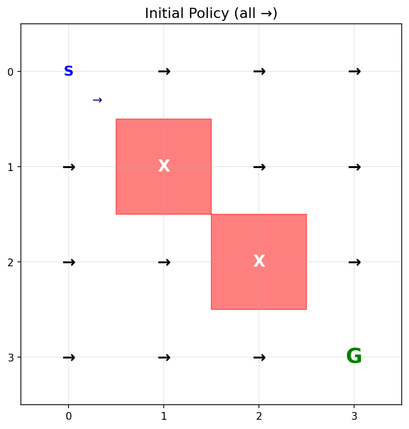
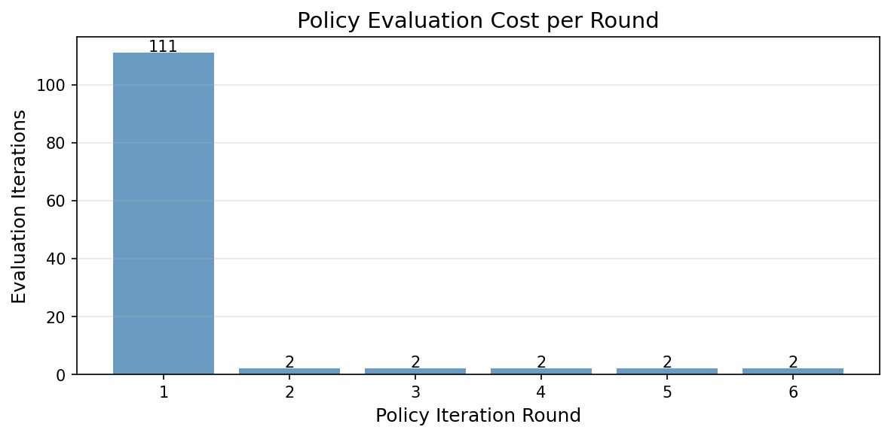
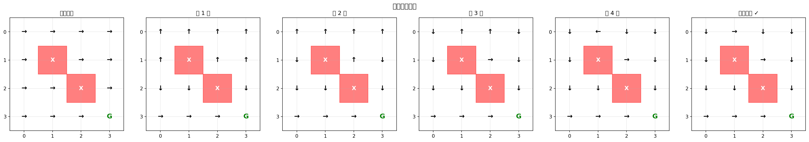
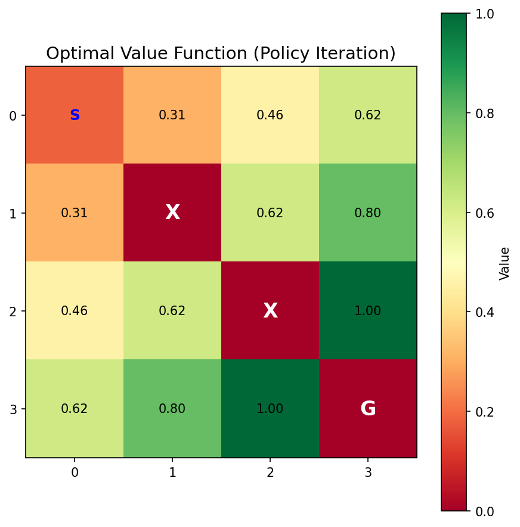
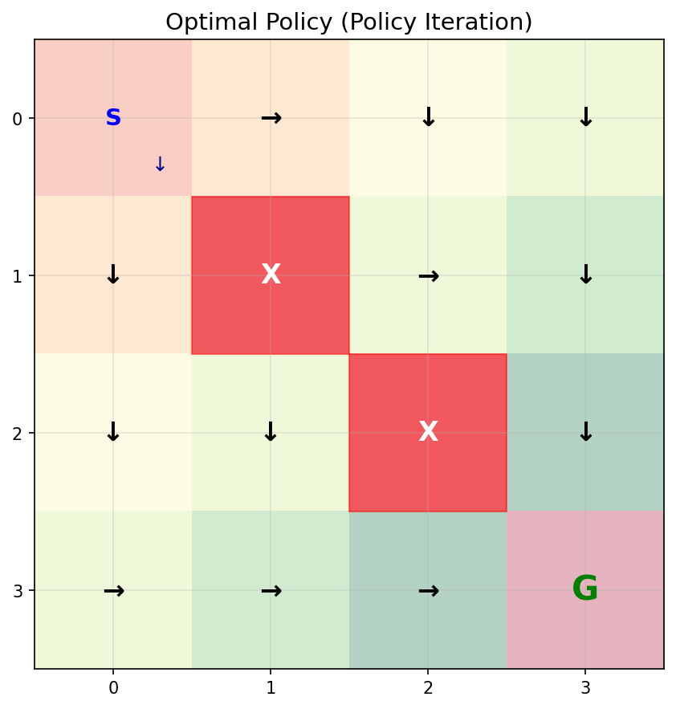
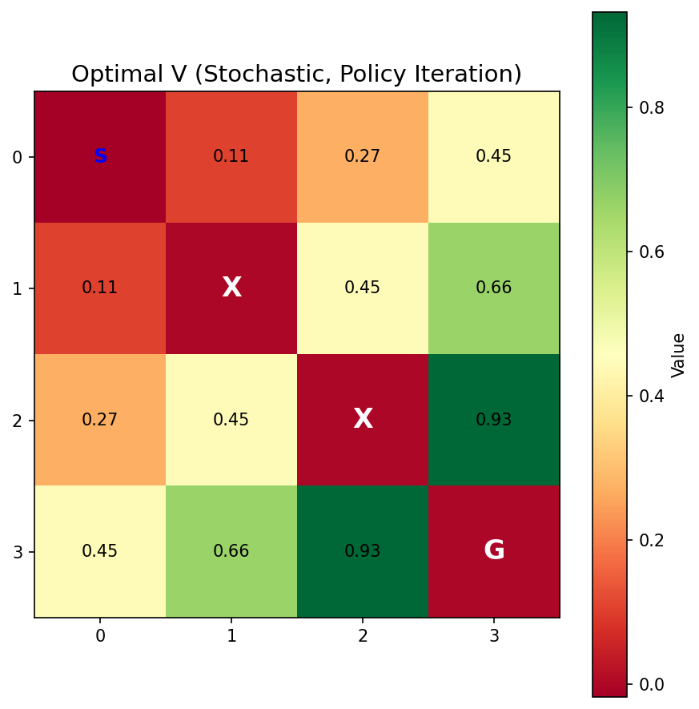
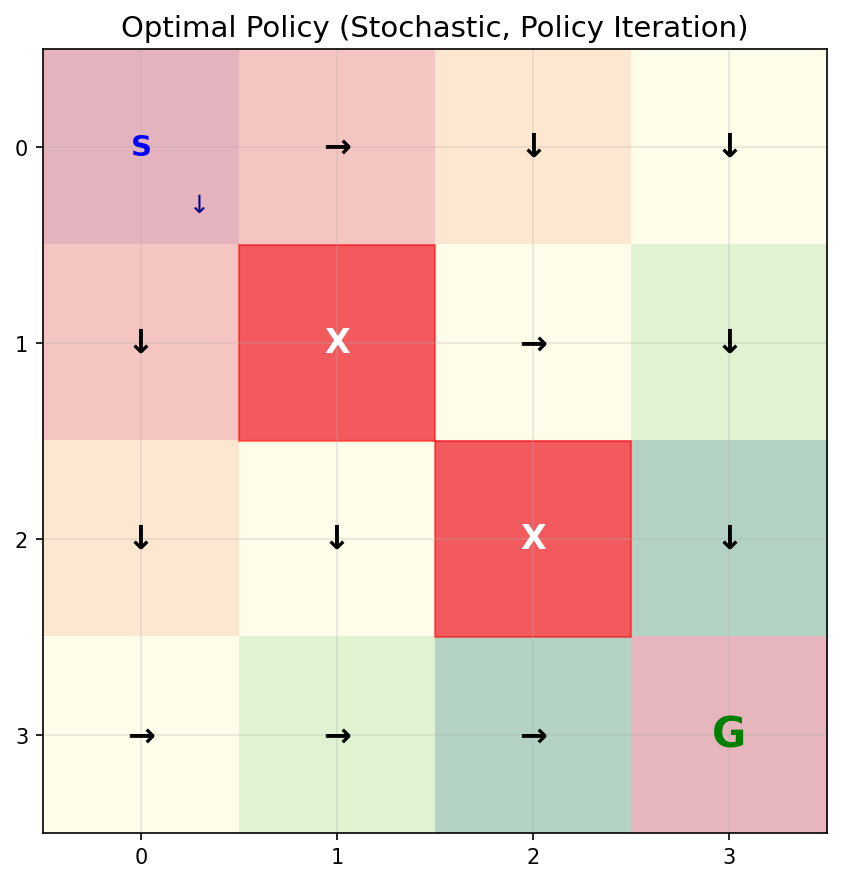

# 策略迭代 (Policy Iteration) 学习笔记

## 目录
1. [核心思想](#核心思想)
2. [算法拆解：评估 + 改进](#算法拆解评估--改进)
3. [与值迭代的深度对比](#与值迭代的深度对比)
4. [收敛性分析](#收敛性分析)
5. [对后续架构演进的作用](#对后续架构演进的作用)
6. [对实际生产系统的参考价值](#对实际生产系统的参考价值)

---

## 核心思想

策略迭代同样是一种**动态规划**方法，同样要求**已知 MDP 完整模型**（P 和 R）。与值迭代的区别在于：它将"求解最优策略"这件事拆成两个交替执行的步骤。

```
值迭代：评估和改进混在一起，每步都取 max
  V(s) ← max_a Q(s, a)

策略迭代：评估和改进分开，交替执行
  步骤 1 - 策略评估：给定 π，求 V^π（没有 max！）
    V^π(s) ← Q(s, π(s))

  步骤 2 - 策略改进：根据 V^π 贪心更新 π
    π'(s) = argmax_a Q(s, a)

  重复，直到策略不再变化
```

**一句话理解**：先把当前策略"吃透"（评估），再根据评估结果做出改进，如此循环。

### 初始策略

策略迭代从一个任意的初始策略开始（本例中初始化为全部向右 →）：



---

## 算法拆解：评估 + 改进

### 步骤 1：策略评估（Policy Evaluation）

给定固定策略 π，求解其对应的价值函数 V^π：

$$V^{\pi}(s) = \sum_{s'} P(s'|s, \pi(s)) \left[ R(s, \pi(s), s') + \gamma V^{\pi}(s') \right]$$

**关键点**：这里没有 max，因为策略已经固定了。每个状态只有一个动作 π(s)，直接用它计算期望价值。

```python
# 策略评估：用固定策略的动作，而不是 max
action = self.policy[state_idx]
self.V[state_idx] = self.compute_q_value(state_idx, action)
```

策略评估本身也是一个迭代过程，需要反复执行直到 V^π 收敛（变化量 < θ）。

### 步骤 2：策略改进（Policy Improvement）

根据当前 V^π，贪心地更新策略：

$$\pi'(s) = \arg\max_a \sum_{s'} P(s'|s,a) \left[ R(s,a,s') + \gamma V^{\pi}(s') \right]$$

```python
# 策略改进：选择使 Q 值最大的动作
q_values = [self.compute_q_value(state_idx, a) for a in range(self.env.n_actions)]
self.policy[state_idx] = np.argmax(q_values)
```

**策略改进定理**：如果 π' ≠ π，则 V^{π'}(s) ≥ V^π(s) 对所有状态成立。即每次改进都保证策略不会变差。

### 实验结果

在 4×4 确定性网格世界中（γ=0.9）：

```
第 1 轮：策略评估用了 111 次迭代 → 策略改进，10 个状态的动作发生变化
第 2 轮：策略评估用了   2 次迭代 → 策略改进，2 个状态的动作发生变化
第 3 轮：策略评估用了   2 次迭代 → 策略改进，3 个状态的动作发生变化
第 4 轮：策略评估用了   2 次迭代 → 策略改进，2 个状态的动作发生变化
第 5 轮：策略评估用了   2 次迭代 → 策略改进，1 个状态的动作发生变化
第 6 轮：策略评估用了   2 次迭代 → 策略已稳定，收敛！
```

**观察**：第 1 轮评估代价高（初始策略很差，V^π 需要很多次迭代才能收敛），后续每轮策略变化小，评估很快收敛。

下图展示了每轮策略评估所需的迭代次数，可以清楚看到第 1 轮的代价远高于后续轮次：



### 策略演化过程

下图展示了策略从初始（全部向右）到最终收敛的演化过程，可以直观看到箭头方向逐步调整：



### 最终结果

**最优价值函数 V\***：与值迭代收敛到完全相同的结果：



**最优策略 π\***：所有箭头指向终点方向，与值迭代得到的策略一致：



---

## 与值迭代的深度对比

### 算法结构对比

| 维度 | 值迭代 | 策略迭代 |
|------|--------|---------|
| **更新公式** | V(s) ← **max_a** Q(s,a) | V(s) ← Q(s, **π(s)**) |
| **每步操作** | 评估 + 改进混合 | 评估和改进分开 |
| **外层迭代** | 通常较多（本例 7 次） | 通常很少（本例 6 轮） |
| **内层代价** | 无（每步一次遍历） | 高（每轮需完整评估） |
| **总评估次数** | 7 次 | 121 次（6 轮累计） |
| **收敛结果** | 相同的 V* 和 π* | 相同的 V* 和 π* |

### 搜索方式的直觉类比

**值迭代 ≈ 广度优先搜索（BFS）**：
- 每次迭代，所有状态同时更新一点
- 价值信息从终点像水波一样向外扩散，逐层传播
- "广撒网"：每步推进一层，稳健但需要多次迭代

**策略迭代 ≈ 深度优先搜索（DFS）**：
- 先固定一个策略，深入评估到完全收敛
- 再回溯改进策略，然后重新深入评估
- "一条路走到底"：每轮代价高，但外层迭代少

这个类比揭示了两种算法的本质差异：值迭代在**价值函数空间**中广度推进，策略迭代在**策略空间**中深度探索。

### 总计算量分析

两种方法的单步复杂度相同，均为 O(|S|²|A|)。总计算量取决于各自的迭代次数：

- **值迭代**：迭代次数 ≈ 价值信息从终点传播到最远状态所需的步数
- **策略迭代**：外层迭代次数 ≈ 策略空间的"改进路径"长度（通常极短）

在实践中，两者总计算量相当，但策略迭代在策略空间较小时更有优势。

### 随机环境下的对比

在 20% 滑倒概率的随机环境中，策略迭代仅 2 轮就收敛，价值函数整体偏低，策略更加保守：





---

## 收敛性分析

### 为什么策略迭代一定收敛？

1. **策略空间有限**：共有 |A|^|S| 种确定性策略，数量有限
2. **单调改进**：策略改进定理保证每次改进都不会变差
3. **严格改进或停止**：如果策略没有变化，说明已经是最优策略

因此，策略迭代在有限步内必然收敛到最优策略 π*。

### 策略评估的收敛性

策略评估本身是一个线性方程组的迭代求解。给定固定策略 π，Bellman 评估算子是一个 γ-压缩映射，保证 V^π 的迭代收敛。

**实践中的截断评估**：不必等到 V^π 完全收敛，只做 k 步评估就改进策略，这称为**截断策略迭代（Truncated Policy Iteration）**。当 k=1 时，退化为值迭代。

---

## 对后续架构演进的作用

策略迭代将"评估"和"改进"解耦，这个设计思想贯穿了现代强化学习的整个发展脉络。

### 1. 直接启发：Actor-Critic 架构

策略迭代的两个步骤，直接对应 Actor-Critic 的两个组件：

```
策略迭代                          Actor-Critic
─────────────────────────────────────────────────────
策略评估：计算 V^π(s)    →    Critic：学习价值函数 V^π 或 Q^π
策略改进：更新 π(s)      →    Actor：根据 Critic 反馈更新策略 π
```

Actor-Critic 就是策略迭代的深度学习版本：
- **Critic** 用神经网络近似价值函数，替代表格式的策略评估
- **Actor** 用策略梯度替代贪心的策略改进（因为连续动作空间无法直接取 argmax）

### 2. 策略改进 → 策略梯度

策略迭代中的改进步骤是离散的贪心更新：
```
π'(s) = argmax_a Q(s, a)
```

当策略参数化为 π_θ（如神经网络）时，argmax 不可行，于是演变为梯度上升：
```
∇_θ J(π_θ) = E[∇_θ log π_θ(a|s) · Q^π(s,a)]
```

这就是 REINFORCE 和策略梯度方法的核心公式，Q^π(s,a) 正是策略评估的结果。

> 📖 **延伸阅读**：关于策略梯度的更深入讨论--包括"对谁求梯度"的关键区分、确定性策略（DDPG）的陷阱与随机策略（SAC）的回归、以及三种策略改进方式的完整对比--参见 [`notes/policy_gradient_intuition.md`](policy_gradient_intuition.md)。

### 3. 现代算法的继承关系

```
策略迭代（表格，已知模型）
    │
    ├── 截断策略迭代（k 步评估）
    │       │
    │       └── 值迭代（k=1，评估改进混合）
    │
    └── Actor-Critic（神经网络近似，无模型）
            │
            ├── A3C / A2C（并行采样，异步更新）
            │
            ├── PPO（信任区域约束策略改进，Clip 限制更新幅度）
            │
            ├── TRPO（KL 散度约束，严格信任区域）
            │
            └── SAC（最大熵框架，自动平衡探索与利用）
```

| 现代算法 | 继承的策略迭代思想 |
|---------|-----------------|
| **PPO** | 策略评估（Critic）+ 策略改进（Actor），用 Clip 限制每次改进幅度，防止策略突变 |
| **TRPO** | 在信任区域内做策略改进，保证单调改进的同时控制步长 |
| **SAC** | 最大熵框架下的评估+改进，Critic 评估软价值函数，Actor 优化含熵奖励的策略 |
| **A3C** | 多个 Actor 并行采样（相当于并行策略评估），异步更新共享 Critic |

### 4. 在线学习的关键支撑

策略迭代的"评估 → 改进"循环，天然支持在线学习：

- **每次真实交互**都是一次新的策略评估数据
- **评估结果**立刻反馈给策略改进
- **策略更新**后，下一次交互又产生新的评估数据

这形成了一个持续进化的闭环，是现代 RL 系统能够在生产环境中持续学习的理论基础。

---

## 对实际生产系统的参考价值

策略迭代的"评估 + 改进"解耦思想，在工程实践中有直接的参考价值。

### 1. 推荐系统：策略评估 = A/B 测试

```
策略迭代                          推荐系统
─────────────────────────────────────────────────────
策略评估：计算当前策略的 V^π  →  A/B 测试：评估当前推荐策略的效果
策略改进：根据 V^π 更新策略   →  模型迭代：根据 A/B 结果更新推荐模型
```

**关键洞察**：不要在评估未完成时就急于改进策略（类似于 A/B 测试未跑满就下结论）。策略迭代告诉我们，充分评估当前策略是做出正确改进的前提。

### 2. 广告竞价：分离出价策略与效果评估

广告系统中，出价策略（π）和效果评估（V^π）通常由不同团队维护：
- **效果评估团队**：负责准确衡量当前策略的 ROI、CVR 等指标（策略评估）
- **策略优化团队**：根据评估结果调整出价模型（策略改进）

策略迭代的理论告诉我们：**评估必须先于改进，且评估要足够准确**，否则基于错误评估的策略改进会导致系统退化。

### 3. 大模型 RLHF：策略迭代的直接应用

RLHF（人类反馈强化学习）的训练流程几乎就是策略迭代的工程实现：

```
步骤 1 - 策略评估（训练 Reward Model）：
  收集人类对当前模型输出的偏好数据
  训练奖励模型 R(s, a) ≈ 人类偏好

步骤 2 - 策略改进（PPO 优化）：
  用 PPO 最大化奖励模型的评分
  更新语言模型参数 θ

重复，直到模型对齐人类偏好
```

**工程启示**：奖励模型（Critic）和语言模型（Actor）的分离训练，正是策略迭代"评估与改进解耦"的体现。

### 4. 系统设计原则：评估与优化解耦

从策略迭代中提炼的工程原则：

| 原则 | 策略迭代的对应 | 工程实践 |
|------|--------------|---------|
| **先评估，再改进** | 策略评估收敛后才做策略改进 | 指标稳定后再上线新策略 |
| **改进幅度可控** | 每轮只改进一次，不跳步 | 灰度发布，逐步放量 |
| **单调改进保证** | 策略改进定理 | 新策略必须在评估指标上优于旧策略才上线 |
| **评估与优化分离** | 两个独立步骤 | 效果评估系统与策略优化系统独立部署 |

### 5. 强化学习在生产中的落地模式

```
离线评估（策略评估）
  ↓ 评估指标达标
小流量实验（策略改进验证）
  ↓ 实验结果显著
全量上线（策略部署）
  ↓ 持续监控
回到离线评估（下一轮迭代）
```

这个工程流程，本质上就是策略迭代在生产系统中的展开形式。

---

## 关键洞察

### 1. "分离"是工程的核心价值

策略迭代最重要的贡献不是算法本身，而是将"评估"和"改进"分离的思想。这种分离带来了：
- **可调试性**：可以单独验证评估是否准确，改进是否有效
- **可扩展性**：评估和改进可以用不同的方法实现（表格、神经网络、蒙特卡洛...）
- **稳定性**：先评估再改进，避免在错误信息上盲目优化

### 2. 策略空间比价值空间小得多

值迭代在价值函数空间中迭代（连续空间，收敛慢），策略迭代在策略空间中迭代（有限空间，收敛快）。这解释了为什么策略迭代的外层迭代次数极少--策略空间的"改进路径"很短。

### 3. 两种方法的统一视角

截断策略迭代（每轮只做 k 步评估）统一了两种方法：
- k = 1：退化为值迭代
- k = ∞：完整的策略迭代

现代算法（如 PPO）通常选择中间值：收集一批数据做有限步评估，然后改进策略，在计算效率和收敛稳定性之间取得平衡。

---

- **最后更新**：2026-03-30
- **关联代码**：`phase2_mdp/policy_iteration.py`、`phase2_mdp/value_iteration.py`
- **前置知识**：`notes/value_iteration.md`
- **难度等级**：⭐⭐⭐ (中等)

