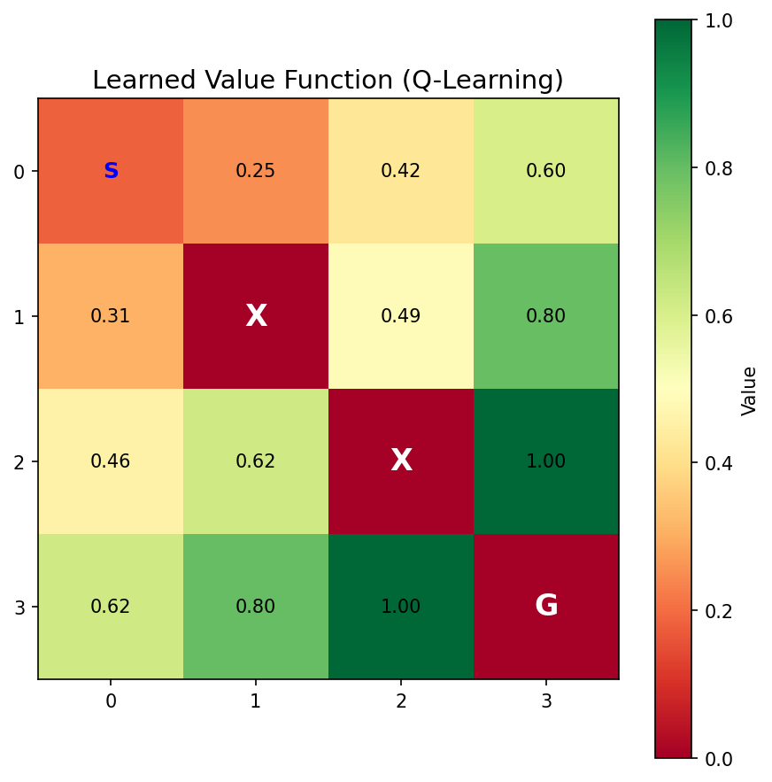
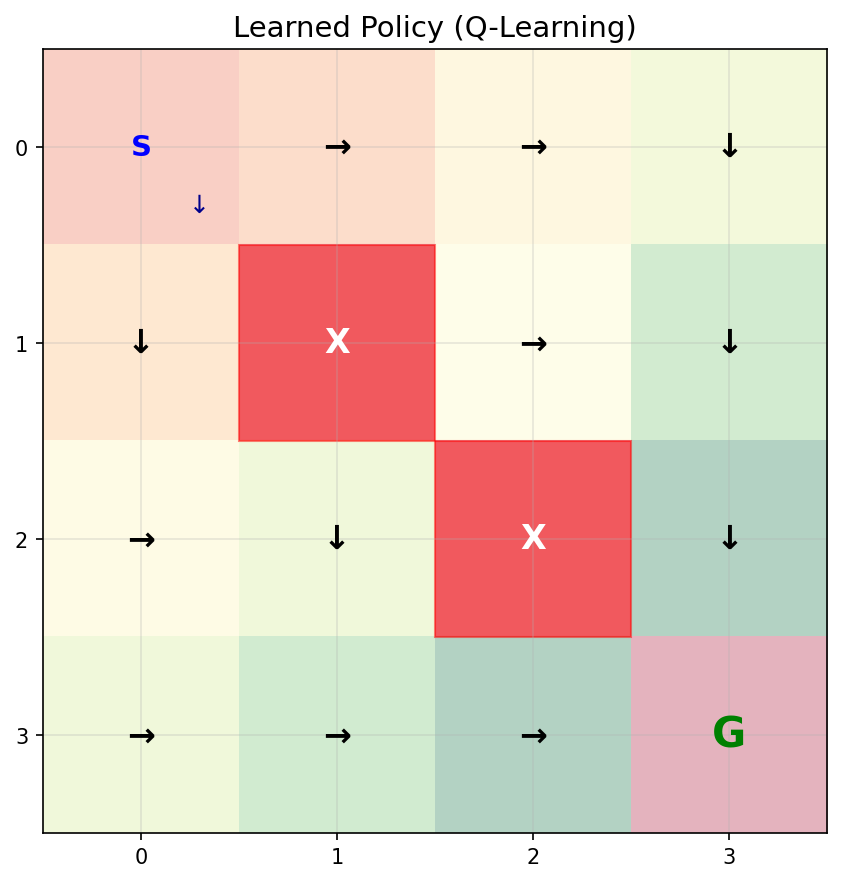
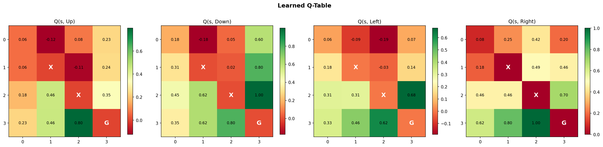
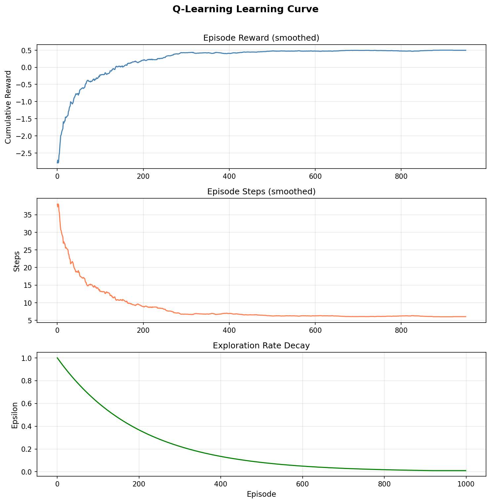
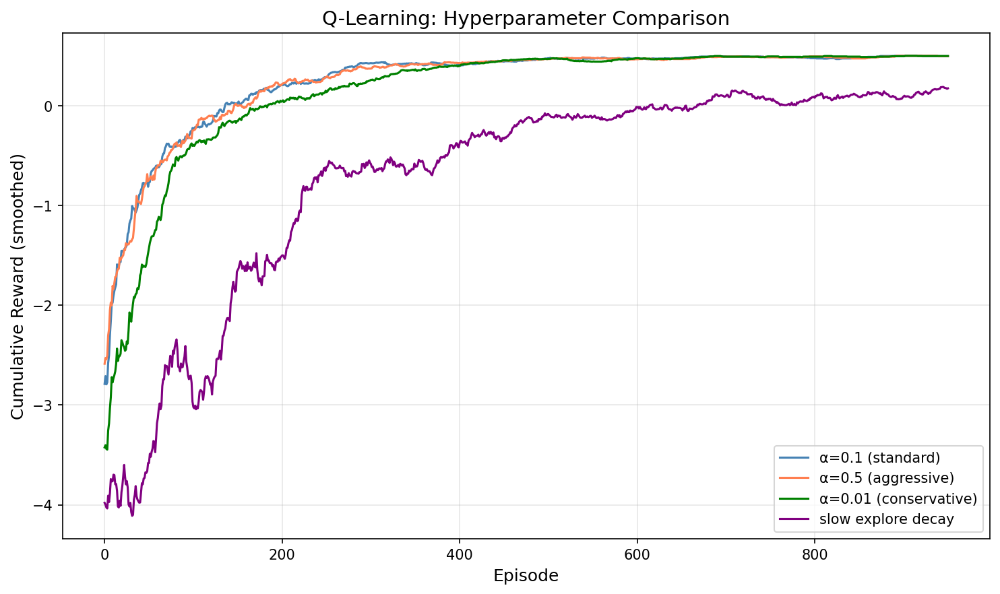
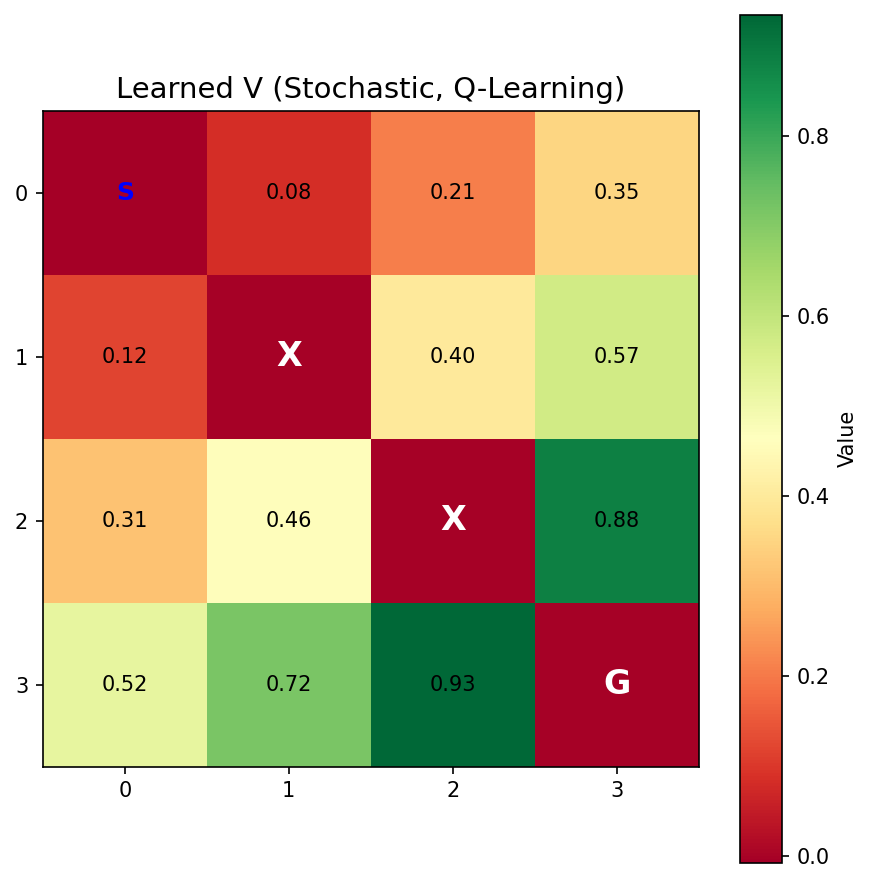
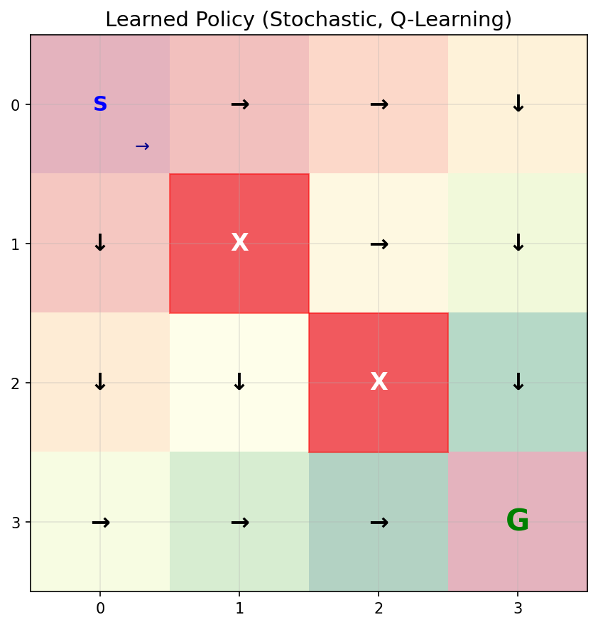

# Q-Learning 学习笔记

## 目录
1. [核心思想：从规划到学习](#核心思想从规划到学习)
2. [三个关键概念](#三个关键概念)
3. [算法拆解](#算法拆解)
4. [与值迭代的深度对比](#与值迭代的深度对比)
5. [Off-policy：Q-Learning 的隐藏超能力](#off-policyq-learning-的隐藏超能力)
6. [收敛性分析](#收敛性分析)
7. [实验结果分析](#实验结果分析)
8. [对后续架构演进的作用](#对后续架构演进的作用)
9. [关键洞察](#关键洞察)

---

## 核心思想：从规划到学习

Q-Learning 是整个学习路线中**最关键的转折点**。之前的值迭代和策略迭代都是"规划"——已知完整的 MDP 模型（P 和 R），通过计算得到最优策略。Q-Learning 则是"学习"——不知道 P 和 R，通过与环境交互来发现最优策略。

```
值迭代（规划）：
  "我知道地图上每条路的长度和方向，坐在家里就能算出最短路径"
  V(s) ← max_a Σ P(s'|s,a) [R + γV(s')]
         ────── 需要 P ──────

Q-Learning（学习）：
  "我不知道地图，但我可以亲自走，每走一步就更新一下我的认知"
  Q(s,a) ← Q(s,a) + α [r + γ max_a' Q(s',a') - Q(s,a)]
                        ──── 只需要一个采样 (s,a,r,s') ────
```

**一句话理解**：Q-Learning 就是"不知道规则的情况下，通过反复试错来学会最优策略"。

### Q-Learning 是"无模型的值迭代"，而非策略迭代

上一课学的策略迭代将"评估"和"改进"显式分离：先固定策略评估 V^π，再贪心改进 π。但 Q-Learning 的更新公式中直接取了 max：

```
值迭代：    V(s) ← max_a Q(s, a)           ← 评估+改进混在一起
Q-Learning：Q(s,a) ← Q + α [r + γ max Q(s',·) - Q]  ← 也是评估+改进混在一起
```

两者都是**每步取 max**，没有显式的"策略评估 → 策略改进"分离。所以 Q-Learning 在算法结构上更像**无模型版的值迭代**：

| 维度 | 值迭代 | 策略迭代 | Q-Learning |
|------|--------|---------|-----------|
| **评估与改进** | 混合（每步 max） | 分离（交替执行） | 混合（每步 max） |
| **更新目标** | V(s) | V^π(s) → π(s) | Q(s, a) |
| **模型依赖** | 需要 P, R | 需要 P, R | 不需要 |

值迭代迭代的是 V，Q-Learning 迭代的是 Q——之所以需要从 V 切换到 Q，正是因为无模型时需要 Q 来直接选动作（下一节详述）。

---

## 三个关键概念

### 1. 从 V(s) 到 Q(s, a)：为什么需要 Q 函数

值迭代维护 V(s)——每个状态的价值。但选择动作时需要：

$$\pi^*(s) = \arg\max_a \sum_{s'} P(s'|s,a) [R + \gamma V(s')]$$

**问题**：这个公式需要 P(s'|s,a)！如果不知道 P，就无法从 V(s) 推导出策略。

**解决方案**：直接维护 Q(s, a)——每个"状态-动作对"的价值：

$$\pi^*(s) = \arg\max_a Q(s, a)$$

选择动作时只需要比较 Q 值，**完全不需要 P**。这就是 Q-Learning 用 Q 表替代 V 表的根本原因。

```
V 表：16 个值（每个状态一个）
  V(s0), V(s1), ..., V(s15)

Q 表：64 个值（每个状态 × 每个动作）
  Q(s0, ↑), Q(s0, ↓), Q(s0, ←), Q(s0, →)
  Q(s1, ↑), Q(s1, ↓), Q(s1, ←), Q(s1, →)
  ...
```

**代价**：存储量从 |S| 增加到 |S|×|A|。但换来了**不需要知道 P** 的能力。

### 2. 时序差分（TD）：不等回合结束就更新

蒙特卡洛方法需要等一个完整回合结束后，用实际累计奖励来更新。TD 方法则**每走一步就更新**：

$$Q(s,a) \leftarrow Q(s,a) + \alpha \underbrace{[r + \gamma \max_{a'} Q(s',a') - Q(s,a)]}_{\text{TD error（惊喜信号）}}$$

- **TD target**：\( r + \gamma \max_{a'} Q(s',a') \)——"我实际拿到的奖励 + 我对未来的最佳估计"
- **TD error**：TD target - Q(s,a)——"现实比我预期的好多少"
- **学习率 α**：控制每次更新的幅度，向 TD target 方向迈一小步

**直觉类比**：
- 蒙特卡洛 ≈ 期末考试后才知道成绩，一次性调整学习方法
- TD ≈ 每次小测验后就调整，持续改进

### 3. ε-greedy 探索：老朋友回来了

Q-Learning 中的 ε-greedy 与 bandit 中的完全相同：

```python
if random() < ε:
    action = random_action()    # 探索：尝试新动作
else:
    action = argmax_a Q(s, a)   # 利用：选择当前最优
```

**关键区别**：在 bandit 中，探索是为了发现哪个臂最好；在 Q-Learning 中，探索是为了**访问更多的 (s, a) 对**，让 Q 表更完整。

**ε 衰减策略**：随着学习进行，逐渐减少探索：

$$\epsilon \leftarrow \max(\epsilon_{\min}, \epsilon \times \text{decay})$$

早期多探索（ε 大），后期多利用（ε 小）。

---

## 算法拆解

### 完整算法流程

```
初始化 Q(s, a) = 0，∀s, a

for each episode:
    s = env.reset()
    
    while not done:
        a = ε-greedy(Q, s)           # 选择动作
        s', r, done = env.step(a)     # 与环境交互
        
        # Q-Learning 更新（核心！）
        Q(s, a) ← Q(s, a) + α [r + γ max_a' Q(s', a') - Q(s, a)]
        
        s = s'
    
    ε ← ε × decay                    # 衰减探索率
```

### 更新规则的代码实现

```python
def update(self, state, action, reward, next_state, done):
    state_idx = self._state_to_idx(state)
    next_state_idx = self._state_to_idx(next_state)

    # TD target：r + γ max_a' Q(s', a')
    if done:
        td_target = reward
    else:
        td_target = reward + self.gamma * np.max(self.Q[next_state_idx])

    # TD error：TD target - 当前估计
    td_error = td_target - self.Q[state_idx, action]

    # 更新 Q 值：向 TD target 方向迈一小步
    self.Q[state_idx, action] += self.alpha * td_error
```

**对比值迭代的更新**：

| 维度 | 值迭代 | Q-Learning |
|------|--------|-----------|
| **更新什么** | V(s) | Q(s, a) |
| **数据来源** | 遍历所有 s'，用 P 加权 | 一个采样 (s, a, r, s') |
| **更新方式** | 直接赋值 V(s) = max Q | 渐进更新 Q += α × error |
| **终止状态** | V(goal) = 0 | Q 更新时 td_target = r |

---

## 与值迭代的深度对比

### 公式层面的对应关系

```
值迭代：
  V(s) ← max_a  Σ   P(s'|s,a) [R(s,a,s') + γ V(s')]
          ─────  ─── ─────────  ──────────   ────────
          贪心   期望  转移概率    即时奖励    未来价值

Q-Learning：
  Q(s,a) ←  Q(s,a) + α [r + γ max_a' Q(s',a') - Q(s,a)]
                         ─   ─ ──────            ──────
                        采样  γ  贪心             当前估计
```

**逐项对应**：

| 值迭代中的 | Q-Learning 中的 | 变化 |
|-----------|----------------|------|
| Σ P(s'\|s,a) [...] | 单个采样 (r, s') | 期望 → 采样 |
| R(s,a,s') | r | 查表 → 实际观测 |
| γ V(s') | γ max_a' Q(s',a') | V → Q（不需要 P） |
| 直接赋值 | α × (target - current) | 精确 → 渐进 |

### Q 值是如何逐渐贴近真实值的？

一个常见的误解是"Q-Learning 在一轮迭代中尝试多个 action 来更新 Q"。实际上，Q-Learning **每一步只采样一个 action**：

```
在状态 s，选一个 action a → 得到 (r, s') → 只更新 Q(s, a) 这一个条目
然后到了 s'，再选一个 action → 只更新 Q(s', a') 这一个条目
...
```

Q 表之所以能逐渐贴近真实值，是因为**同一个 (s, a) 对在多个回合中被反复访问**。每次访问都提供了一个新的采样 (r, s')，渐进更新使 Q(s, a) 逐步收敛到真实期望值。

这和值迭代的"信息传播"类似，但传播方式不同：

```
值迭代：每次迭代遍历所有状态，信息像水波一样均匀扩散
Q-Learning：沿着轨迹走，信息沿轨迹传播，哪里走得多哪里就学得快
```

### 为什么 Q-Learning 用"渐进更新"而不是"直接赋值"？

值迭代可以直接赋值，因为它用 P 计算了**精确的期望**。Q-Learning 只有**一个采样**，这个采样有噪声。如果直接赋值：

```
Q(s,a) = r + γ max Q(s',a')  ← 这一个采样可能不具代表性！
```

用学习率 α 做渐进更新，相当于对多次采样取**指数移动平均**，平滑了噪声：

```
Q_new = (1-α) × Q_old + α × sample
      = Q_old + α × (sample - Q_old)
```

**α 的作用**：
- α = 1：完全信任最新采样（不稳定）
- α = 0：完全不学习（没用）
- α = 0.1：每次只更新 10%，稳定但需要更多采样

---

## Off-policy：Q-Learning 的隐藏超能力

### 两个策略的分离

Q-Learning 同时使用两个不同的策略：

```
行为策略（behavior policy）：ε-greedy
  → 用于与环境交互，收集数据
  → 需要探索，所以有随机性

目标策略（target policy）：greedy
  → 用于更新 Q 值：max_a' Q(s', a')
  → 学习的是纯贪心策略
```

**关键洞察**：Q-Learning 用 ε-greedy 收集数据，但学习的是 greedy 策略。这就是 **off-policy**——行为策略和目标策略不同。

### 为什么 off-policy 重要？

1. **可以从任何数据中学习**：不管数据是怎么收集的（随机策略、人类操作、其他智能体），Q-Learning 都能从中学习最优策略

2. **经验回放的基础**：DQN 的经验回放缓冲区存储了旧策略收集的数据，off-policy 保证这些旧数据仍然有用

3. **更高的样本效率**：同一份数据可以被反复使用，不需要每次策略更新后重新收集

### 与 SARSA（on-policy）的对比预告

```
Q-Learning (off-policy)：
  Q(s,a) ← Q + α [r + γ max_a' Q(s',a') - Q]
                       ─────── 用 max（贪心）

SARSA (on-policy)：
  Q(s,a) ← Q + α [r + γ Q(s', a') - Q]
                       ────── 用实际选的 a'（可能是随机的）
```

唯一的区别：Q-Learning 用 max（假设未来最优），SARSA 用实际动作（反映真实行为）。这个小区别导致了截然不同的学习行为——下一节 SARSA 会详细讨论。

---

## 收敛性分析

### Q-Learning 的收敛条件

Q-Learning 在以下条件下保证收敛到 Q*：

1. **所有 (s, a) 对被无限次访问**：每个状态-动作对都要被充分探索
2. **学习率满足 Robbins-Monro 条件**：
   - $\sum_t \alpha_t = \infty$（总学习量无限大）
   - $\sum_t \alpha_t^2 < \infty$（学习率逐渐衰减）
3. **固定学习率也能工作**：实践中常用固定 α（如 0.1），虽然理论上只保证收敛到 Q* 附近

### 为什么需要"所有 (s, a) 对被无限次访问"？

Q-Learning 用采样替代了期望。根据大数定律，采样均值收敛到期望值，但前提是采样次数足够多。如果某个 (s, a) 对从未被访问，它的 Q 值就永远是初始值 0，无法学到正确的价值。

**这就是 ε-greedy 探索的必要性**：保证每个 (s, a) 对都有非零概率被访问。

### 收敛速度

在 4×4 确定性网格世界中的实验结果：

```
Episode  100 | Avg Reward: -1.78 | Success: 96%  | ε: 0.606
Episode  200 | Avg Reward: -0.10 | Success: 100% | ε: 0.367
Episode  500 | Avg Reward:  0.42 | Success: 100% | ε: 0.082
Episode 1000 | Avg Reward:  0.50 | Success: 100% | ε: 0.010
```

**观察**：
- 前 100 回合：快速学会基本路径（成功率 96%）
- 100-500 回合：优化路径效率（奖励从 -1.78 提升到 0.42）
- 500-1000 回合：精细调优（奖励从 0.42 提升到 0.50）

---

## 实验结果分析

### 学到的价值函数

Q-Learning 学到的 V(s) = max_a Q(s, a)：

```
 0.181  0.251  0.424  0.605
 0.312  0.000  0.487  0.796
 0.458  0.620  0.000  0.999
 0.620  0.800  1.000  0.000
```

与值迭代的精确解对比，最大差异仅 0.13，平均差异 0.02。



### 学到的策略



策略与值迭代的一致率为 84.6%（11/13 个有效状态）。不一致的状态通常是那些多个动作的 Q 值非常接近的状态——在这些状态上，选择哪个动作对最终结果影响很小。

### Q 表可视化

Q 表展示了每个状态下各动作的价值，比 V 表信息更丰富：



**观察**：在每个状态中，指向终点方向的动作 Q 值最高（颜色最绿），远离终点的动作 Q 值最低。

### 学习曲线



三条曲线分别展示：
- **奖励曲线**：从负值逐渐上升到正值，说明策略在持续改善
- **步数曲线**：从 30+ 步下降到 6 步，学会了高效路径
- **探索率**：从 1.0 指数衰减到 0.01，从探索转向利用

### 超参数影响



| 超参数 | 效果 |
|--------|------|
| **α=0.1（标准）** | 稳定学习，收敛到好的策略 |
| **α=0.5（激进）** | 学习快但不稳定，Q 值震荡 |
| **α=0.01（保守）** | 非常稳定但学习太慢 |
| **ε 衰减慢** | 探索过多，迟迟不能利用已学到的知识 |

### 随机环境

在 20% 滑倒概率的随机环境中，Q-Learning 同样有效：





**关键优势**：Q-Learning 不需要知道滑倒概率是 20%！它通过多次经历自动学习到了环境的随机性。这正是"无模型"的核心价值——值迭代需要精确的 P(s'|s,a)，Q-Learning 只需要与环境交互。

---

## 对后续架构演进的作用

### 1. Q-Learning → DQN：从表格到神经网络

Q-Learning 的 Q 表有 |S|×|A| 个条目。当状态空间很大时（如 Atari 游戏的像素输入），Q 表不可行。DQN 用神经网络替代 Q 表：

```
Q-Learning（表格）：
  Q[state_idx][action_idx] → 一个数值
  存储：|S| × |A| 个数

DQN（神经网络）：
  Q_θ(s) → [Q(s,a0), Q(s,a1), ..., Q(s,an)]
  存储：神经网络参数 θ
```

**更新规则几乎不变**：

```
Q-Learning：Q(s,a) ← Q(s,a) + α [r + γ max Q(s',·) - Q(s,a)]
DQN：       θ ← θ - α ∇_θ [r + γ max Q_θ(s',·) - Q_θ(s,a)]²
```

Q-Learning 直接更新表格条目，DQN 通过梯度下降更新网络参数——本质上是同一个目标的不同实现。

### 2. TD error → 经验回放的优先级

Q-Learning 中的 TD error 衡量了"这个经验有多出乎意料"。DQN 的改进版本（Prioritized Experience Replay）利用 TD error 来决定哪些经验更值得重复学习：

```
TD error 大 → 这个经验很"惊喜" → 优先回放
TD error 小 → 这个经验已经学会了 → 降低优先级
```

### 3. Off-policy → 经验回放缓冲区

Q-Learning 的 off-policy 特性是 DQN 经验回放的理论基础：

```
Q-Learning 的 off-policy 保证：
  "不管数据是什么策略收集的，我都能从中学到最优策略"
      ↓
DQN 的经验回放：
  把过去的 (s, a, r, s') 存起来，随机抽取训练
  这些数据来自旧策略，但 off-policy 保证仍然有效
```

### 4. 演进路线图

```
Q-Learning（表格，off-policy）
    │
    ├── SARSA（表格，on-policy）
    │     └── Expected SARSA（介于两者之间）
    │
    └── DQN（神经网络近似 Q 函数）
          │
          ├── + Experience Replay（经验回放，利用 off-policy）
          │
          ├── + Target Network（目标网络，稳定 TD target）
          │
          ├── + Double DQN（解决 max 导致的过估计）
          │
          └── + Dueling DQN（分离状态价值和动作优势）
```

---

## 关键洞察

### 1. "采样替代期望"是核心创新

值迭代用 Σ P(s'|s,a)[...] 计算精确期望，Q-Learning 用单个采样 (r, s') 替代。这看似粗糙，但大数定律保证了多次采样后的平均效果等价于期望。

**这个思想贯穿整个 RL**：
- 策略梯度用采样轨迹估计梯度
- Actor-Critic 用采样更新 Critic
- PPO 用采样数据做多步优化

### 2. Q 函数是"无模型决策"的关键

有了 Q(s, a)，选择动作只需要 argmax，不需要任何关于环境的知识。这使得 Q-Learning 及其后续方法（DQN 等）可以应用于任何环境，只要能与之交互。

### 3. 探索-利用困境再次出现

在 bandit 中，探索是为了发现最好的臂。在 Q-Learning 中，探索是为了访问更多的 (s, a) 对。问题的本质相同，但维度从 |A| 扩展到了 |S|×|A|。

ε-greedy 是最简单的解决方案，但不是最好的。后续的方法包括：
- **Boltzmann 探索**：根据 Q 值的相对大小分配探索概率
- **UCB 探索**：类似 bandit 中的 UCB，考虑访问次数
- **内在奖励**：给"新奇"的状态额外奖励，鼓励探索

### 4. 从"已知"到"未知"的代价

Q-Learning 不需要知道 P 和 R，但代价是：
- **需要大量交互**：值迭代 7 次迭代就收敛，Q-Learning 需要 1000+ 回合
- **结果是近似的**：值迭代得到精确的 V*，Q-Learning 得到近似的 Q*
- **需要调超参数**：α、ε、decay 等都需要调优

这是一个根本性的权衡：**模型知识 ↔ 交互数据**。知道的越少，需要的数据越多。

### 5. 能否用采样数据反推 P，再用值迭代？

一个自然的问题：Q-Learning 在多个回合中积累了大量 (s, a, r, s') 数据，能否用这些数据统计出 P̂(s'|s,a)，然后直接用值迭代求解？

答案是**完全可以**，这正是 **Model-Based RL** 的核心思路。而 **Dyna-Q** 算法更进一步，将 Model-Free（Q-Learning）和 Model-Based（学模型+规划）结合在一起，用少量真实交互建模，再用模型"脑补"大量虚拟经验来加速学习。

> 📖 **延伸阅读**：关于 Model-Free vs Model-Based 的完整对比——包括从采样数据反推模型的具体方法、Dyna-Q 的算法细节、Model-Based 的优势与风险、以及 RL 两大流派的完整版图——参见 [`notes/model_free_vs_model_based.md`](model_free_vs_model_based.md)。

### 6. 表格方法的天花板

Q-Learning 的 Q 表需要 |S|×|A| 的存储空间。对于：
- 4×4 网格：16×4 = 64 个条目 ✅
- 围棋：~10^170 × ~300 ≈ 10^172 个条目 ❌
- Atari 像素：256^(210×160×3) × 18 ≈ ∞ ❌

**这就是为什么需要 DQN**：用神经网络近似 Q 函数，将存储从 O(|S|×|A|) 降到 O(参数量)，同时获得泛化能力——相似的状态会有相似的 Q 值。

---

- **最后更新**：2026-04-16
- **关联代码**：`phase2_mdp/q_learning.py`
- **前置知识**：`notes/value_iteration.md`、`notes/policy_iteration.md`
- **延伸阅读**：`notes/model_free_vs_model_based.md`（Model-Free vs Model-Based、Dyna-Q）
- **后续内容**：SARSA（on-policy 对比）、DQN（函数近似）
- **难度等级**：⭐⭐⭐ (中等)
