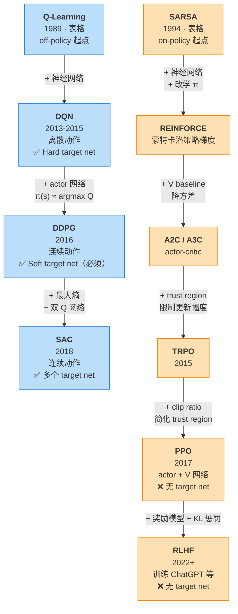
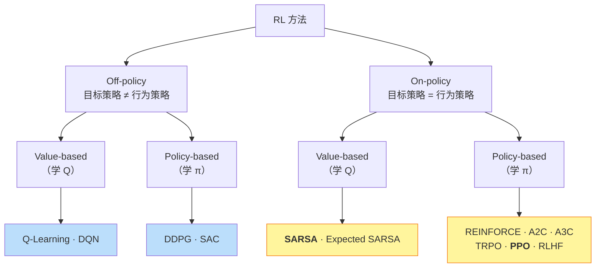

# 强化学习算法家族图谱：从 SARSA/Q-Learning 到现代深度 RL

> 本笔记源自学习 DQN v3（目标网络）时的延伸讨论，从「为什么 DDPG/SAC 必须用 soft update，而 PPO/RLHF 完全不需要目标网络」「SARSA 和 PPO 是什么关系」这两个问题切入，串起了从经典表格方法（SARSA / Q-Learning）到现代深度 RL（DQN / DDPG / SAC / PPO / RLHF）的整张家族图谱。
>
> **核心洞察**：目标网络是 **off-policy + 自举 Q** 算法专属的稳定性工具——是不是需要它，本质上由算法的"基本架构"决定，不是工程选项。整个深度 RL 的演进，本质是从两个表格祖先（SARSA on-policy、Q-Learning off-policy）出发的两条平行进化链。

## 目录

1. [家族总览](#家族总览)
2. [Off-policy 蓝色族：Q-Learning → DQN → DDPG → SAC](#off-policy-蓝色族q-learning--dqn--ddpg--sac)
3. [On-policy 橙色族：SARSA → PPO → RLHF](#on-policy-橙色族sarsa--ppo--rlhf)
4. [为什么 DDPG/SAC 必须用 soft update](#为什么-ddpgsac-必须用-soft-update)
5. [为什么 PPO/RLHF 完全不需要目标网络](#为什么-pporlhf-完全不需要目标网络)
6. [总览表](#总览表)
7. [关键洞察](#关键洞察)

---

## 家族总览

整个家族从两个表格祖先出发，分别演化出蓝色族（off-policy）和橙色族（on-policy）两条进化链：



**纯文本版**（用于无 mermaid 渲染环境）：

```
Off-policy 蓝色族（学 Q，可用经验回放）
═════════════════════════════════════════
  Q-Learning  [1989, 表格] ← 起点
       │ + 神经网络
       ▼
  DQN         [2013-2015, 离散动作]      ✅ Hard target net
       │ + actor 网络（π ≈ argmax Q）
       ▼
  DDPG        [2016, 连续动作]           ✅ Soft target net (必须)
       │ + 最大熵 + 双 Q 网络
       ▼
  SAC         [2018]                    ✅ 多个 target net


On-policy 橙色族（学 π，数据用完即弃）
═════════════════════════════════════════
  SARSA       [1994, 表格] ← 起点
       │ + 神经网络 + 改学 π
       ▼
  REINFORCE   [1992, 蒙特卡洛策略梯度]   ❌ 无 target net
       │ + V baseline 降方差
       ▼
  A2C / A3C   [actor-critic]            ❌
       │ + trust region 限制更新幅度
       ▼
  TRPO        [2015]                    ❌
       │ + clip ratio 简化 trust region
       ▼
  PPO         [2017]                    ❌ 用 clip ratio 替代
       │ + 奖励模型 + KL 惩罚
       ▼
  RLHF        [2022+, 训练 ChatGPT 等]   ❌
```

**关键观察**：

- 两条链的"进化压力"完全不同——蓝色族追求**样本效率**（off-policy，可复用数据），橙色族追求**训练稳定性**（on-policy，分布天然匹配）
- 我们之前学的 [SARSA](sarsa.md) 和 [Q-Learning](q_learning.md) 不是过时的"前置知识"——它们是两整条进化链的源头
- 现代算法只是在祖先的基础上叠加了"神经网络 + actor 网络 + 各种稳定性 trick"

**两大分水岭**：

| 维度 | 蓝色族（DQN/DDPG/SAC）| 橙色族（PPO/RLHF）|
|------|-----------------|------------------|
| 是否 off-policy | ✅ | ❌（on-policy）|
| 是否自举 Q（用 Q 估 Q）| ✅ | ❌（用 GAE / V）|
| 是否需要目标网络 | ✅ | ❌ |
| 稳定性机制 | 延迟 target | Clip ratio + KL |

---

## Off-policy 蓝色族：Q-Learning → DQN → DDPG → SAC

### 起点：Q-Learning（表格祖先）

整条蓝色链的"基因"来自 Q-Learning：

```
Q-Learning 的核心：
  Q(s,a) ← Q(s,a) + α[r + γ max_a' Q(s',a') − Q(s,a)]
                              ^^^^^^^^^^^^^^^^
                              用 max → 学的是【最优策略下的 Q】
                              不依赖"是谁选的下一动作"
                              → off-policy 基因
```

加上神经网络，就是 DQN（详见 [dqn_v1.md](dqn_v1.md)）。后面所有蓝色族成员都继承这条 off-policy + 自举 Q 的基因。

### DQN 的"argmax 困境"

DQN 选动作时要算 `argmax_a Q(s, a)`：

```
离散动作（CartPole 的 [左, 右]）：
  → 比较 2 个 Q 值，秒选大的 ✅

连续动作（机器人关节扭矩 ∈ [-10, 10]）：
  → "在所有可能扭矩里找最大 Q 值"
  → 这是个连续优化问题
  → 每次选动作都要解一遍？不现实 ❌
```

### DDPG：训一个网络专门做 argmax

> **DDPG = Deep Deterministic Policy Gradient（2016）**

```
新增一个 actor 网络 π_φ(s) → 直接输出"最优动作"
       它的工作就是近似 argmax_a Q_θ(s, a)

Critic 网络 Q_θ(s, a) → 评估 (s, a) 的价值
       完全沿用 DQN 的 TD 学习
```

**两个网络的分工**：

| 网络 | 目标 | 学习方式 |
|------|------|---------|
| Critic Q_θ | 估值 | 最小化 TD loss（同 DQN）|
| Actor π_φ | 策略 | 最大化 Q_θ(s, π_φ(s))（链式法则）|

**为什么 DDPG 需要两个目标网络**：

```
TD target（在 DDPG 里）:
  target = r + γ Q_θ⁻(s', π_φ⁻(s'))
                         ^^^^^^^^^
                         actor 也参与了 bootstrap！

→ 如果 π_φ 在变 → "下一个动作"在变 → target 不稳
→ 所以不仅 Q 需要 Q⁻，π 也需要 π⁻
```

DDPG 一开始就用 **soft update（τ=0.001）**——后面会解释为什么必须如此。

### SAC：在 DDPG 上叠三个改进

> **SAC = Soft Actor-Critic（2018）**

```
改进 1：随机策略
  π_φ(s) 输出动作【分布】（高斯），不是确定值
  → 自带探索，不再需要外部噪声

改进 2：最大熵正则
  loss 里加入 -α·H(π) 项，鼓励策略保持多样性
  → 防止过早收敛到次优解
  → "学得快不如学得稳"

改进 3：双 Q 网络（Twin Q，类似 Double DQN）
  训两个独立的 Q 网络，TD target 取较小值：
    target = r + γ min(Q_θ1⁻, Q_θ2⁻)(s', a')
  → 缓解 max 操作的过估计偏差
```

**SAC 仍然是 DQN 的"亲戚"**——核心架构没变（bootstrap Q + 目标网络），只是 actor、熵、双 Q 这些花活儿叠上来。

### 蓝色族为什么都需要目标网络

回到 [TD target 深度讨论](td_target_deep_dive.md)的核心论点：

```
只要算法满足：
  ① 用网络自身估的 Q 来算 TD target（自举）
  ② 数据来自非当前策略（off-policy）
  ③ 用神经网络逼近（函数逼近）

→ 触发"致命三要素"（Sutton & Barto）→ 训练易发散
→ 目标网络是【缓解】这一矛盾的工程必需品
```

DQN、DDPG、SAC **三个条件都满足**——这就是它们都需要目标网络的根本原因。

---

## On-policy 橙色族：SARSA → PPO → RLHF

### 起点：SARSA（表格祖先）

整条橙色链的"基因"来自 SARSA：

```
SARSA 的核心：
  Q(s,a) ← Q(s,a) + α[r + γ Q(s',a') − Q(s,a)]
                              ^^^^^^^^^
                              a' 是【当前策略】采的下一动作
                              → 学的是【当前策略下的 Q】
                              → on-policy 基因
```

详见 [sarsa.md](sarsa.md)。SARSA 是"on-policy 最简形态"——评估的就是行为策略本身。

### 从 SARSA 到 REINFORCE：换条赛道

SARSA 学**值函数 Q**，再通过 ε-greedy 间接得出策略。但还有更直接的思路——**直接学策略本身**：

```
SARSA：学 Q(s, a) → 间接策略 ε-greedy(Q)
                               ↓ 换思路
REINFORCE（1992）：直接学 π(a|s)，参数化策略，用回报加权梯度上升
```

REINFORCE 是策略梯度（policy gradient）方法的起点。它和 SARSA 共享 **on-policy 基因**——每次更新都用当前策略产生的轨迹，更新后旧轨迹作废。

### REINFORCE → A2C → TRPO → PPO：稳定性的层层加固

```
REINFORCE：
  ✅ 简单
  ❌ 方差极大（蒙特卡洛回报噪声大）

  ↓ 加 V baseline 降方差
A2C / A3C（2016）：
  策略梯度 ∇log π · (R − V(s))
  ✅ 方差显著降低
  ❌ 单步更新可能跨度过大

  ↓ 加 trust region 限制更新幅度
TRPO（2015）：
  约束 KL(π_new || π_old) ≤ δ
  ✅ 理论上更稳
  ❌ 二阶优化复杂、计算昂贵

  ↓ 简化为一阶 clip
PPO（2017）：
  clip(π_θ / π_old, 1−ε, 1+ε) · A
  ✅ 稳定 + 简单 + 高效
  → 成为 on-policy 工业标准
```

每一步都在解决前一代的痛点，但 **on-policy 基因始终不变**。

### PPO 的核心思想

> **PPO = Proximal Policy Optimization（2017）**

PPO 是 actor + V 网络的架构，但训练方式和蓝色族**完全不同**：

```
不自举 Q：
  优势函数 A(s, a) 用 GAE（Generalized Advantage Estimation）
  → 基于真实多步回报 + V 网络的偏差校正
  → 不依赖"用 Q 估 Q"

不延迟 target：
  V 网络直接拟合多步回报，没有移动目标问题

策略更新的稳定性来自【裁剪比率】：
```

$$L^{\text{CLIP}}(\theta) = \mathbb{E}\left[\min\left(\frac{\pi_\theta(a|s)}{\pi_{\theta_\text{old}}(a|s)} A,\; \text{clip}\left(\frac{\pi_\theta}{\pi_{\theta_\text{old}}}, 1-\epsilon, 1+\epsilon\right) A\right)\right]$$

```
精神：
  "新策略相对老策略的概率比，必须在 [1-ε, 1+ε] 范围内"
  "再大的优势 A，单次更新也不能让某个动作的概率变化超过 ~20%"
  → 强制策略小步走 → 不会一次跨太大
```

### π_θ_old 不是目标网络！

很多人会误以为 PPO 的 π_θ_old 类似 DQN 的 θ⁻，**其实角色完全不同**：

| 网络 | 在算法里干嘛 | 解决什么问题 |
|------|------------|-------------|
| **DQN 的 θ⁻** | 给 bootstrap 提供稳定 target | 移动目标 / 致命三要素 |
| **PPO 的 π_θ_old** | 衡量"我变化了多少"的参照点 | 单次更新跨度过大 |

两者都是"延迟版本的网络"，但解决的问题完全不同——一个是**值函数估计的稳定性**，一个是**策略更新的步长控制**。

### RLHF：PPO 在大语言模型上的应用

**ChatGPT 等模型的对齐训练**简略流程：

```
阶段 1（监督微调，SFT）：
  用人工标注数据微调 LLM，让它学会"回答问题"

阶段 2（奖励模型）：
  收集人类对模型回答的偏好数据（"A 比 B 好"）
  训练 R(prompt, response) 学到"什么样的回答更好"

阶段 3（PPO 优化）：
  reward = R(s, a) - β · KL(π_θ || π_base)
                     ^^^^^^^^^^^^^^^^^^^^
                     KL 惩罚，防止偏离原始模型太远
  全程是 on-policy
  ❌ 不需要目标网络
```

为什么 RLHF 不用 DQN/DDPG/SAC？

```
LLM 的动作空间 = token（高维离散，词表 ~50k 或更大）
状态-动作分布偏移敏感（off-policy 重要性采样会爆方差）
策略梯度 + on-policy 在这种场景下经验上更稳

→ PPO 是更合适的选择
```

---

## 为什么 DDPG/SAC 必须用 soft update

这是个**值得单独成节**的关键点。问题：DQN 用 hard update 没事，为什么 DDPG/SAC 一定要 soft？

### DQN 容忍 hard update 的原因

```
DQN 只有 Q 网络：
  hard update 时 Q⁻ ← Q
  → TD target 突变 → loss 跳一下
  → 但策略 argmax 通常不会突变（离散动作下 argmax 很鲁棒）
  → 还能撑住
```

离散动作 argmax 有个隐藏的"鲁棒性"：Q 值小幅扰动通常不改变 argmax 的结果（除非两个动作的 Q 值非常接近）。

### DDPG/SAC 不能用 hard update 的原因

```
DDPG/SAC 有 actor + critic：

如果 hard update（突变）：
  actor⁻ 突然换了一组参数
  → 它在【新位置】选的动作 a' = π⁻(s') 完全变了
  → critic 在【从未训练过的 (s, a')】上算 Q
  → 这些 Q 值是垃圾（神经网络在 OOD 输入上的输出无意义）
  → TD target = r + γ Q⁻(s', a') 是垃圾
  → critic 学崩 → actor 学崩 → 全链条崩溃
```

**类比**：

| | DQN | DDPG/SAC |
|---|-----|----------|
| 比喻 | 单人考试 | 双人接力赛 |
| Hard update | 老师每月换次题目难度，学生还能适应 | 跑到一半突然换队友，节奏全乱 |
| Soft update | 题目缓慢加难，学生平滑过渡 | 队友慢慢替换体力，节奏始终连贯 |

所以 DDPG 论文（2016）一开始就用 soft update（τ=0.001），SAC 沿用了这一选择。**这不是品味，是数学/工程上的必须**。

---

## 为什么 PPO/RLHF 完全不需要目标网络

回到 [TD target 深度讨论](td_target_deep_dive.md)的"致命三要素"分析：

```
DQN/DDPG/SAC 为什么需要目标网络？
  ① TD target 用网络自身算 → 移动目标问题
  ② Off-policy + 自举 + 函数逼近 → 致命三要素
```

PPO 在这两个理由上**都做了缓解**（但不是完全消除）：

### 理由 ①：V 也在 bootstrap，但程度很轻

很多人会以为 "PPO 的 V 网络只拟合真实回报，没有移动目标问题"。**这不完全准确**——PPO 的 V 也在 bootstrap：

```
GAE（PPO 的标配）:
  A_t = δ_t + (γλ)·δ_{t+1} + (γλ)²·δ_{t+2} + ...
  其中 δ_t = r_t + γ V(s_{t+1}) − V(s_t)
                       ^^^^^^^^^
                       V 估 V，这就是 bootstrap

V 的训练目标 V_target = A_t + V(s_t)（含 bootstrap 项）
```

但 PPO 的 moving target 问题**比 DQN 轻得多**，原因有三：

```
① GAE 用【多步真实奖励】(r_t + r_{t+1} + ...) 主导 V_target
   → bootstrap 项的权重被压低（λ 越大越接近 Monte Carlo）
   → 大头是真实回报，小头是 V 估的

② V 是【标量函数】（每个状态一个值），没有 max 操作
   → 没有 DQN "max 操作放大噪声 → 过估计" 的链式爆炸

③ V 的不稳定【不会反噬到策略】
   → DQN 里 Q 抖动 = 策略 argmax 抖动 = 系统抖动
   → PPO 里 V 抖动 = advantage 估计抖动 = 梯度噪声大
     ↑ 但 clip ratio 限制了策略变化幅度
     ↑ 再大的梯度噪声也不会让策略一次跨太大
```

所以更精确的说法：**PPO 的 V 也有 moving target，但已经被 clip ratio 兜底了**——不需要额外的目标网络来稳。

### 理由 ②：On-policy 让数据分布天然匹配

```
PPO 是 on-policy
  → 每次训练前必须用【当前策略】重新跑一批轨迹
  → 这批数据的状态分布 ≈ 当前策略的状态分布
  → 没有分布偏移 → 不需要重要性采样修正
```

**注意一个常见的因果链误区**：

```
错误的因果：V 网络独立进化 → 数据分布一致 → 不需要回放
正确的因果：算法是 on-policy → 数据分布一致 → 不需要回放
            └── 跟 V 网络如何进化没关系
```

V 网络的进化方式 → 决定 V 的 moving target 程度；
算法是不是 on-policy → 决定数据分布是否匹配。**这是两件独立的事**，不能混在一起。

### 区分"数据相关性" vs "分布偏移"

PPO 不需要经验回放，但仍然面对**数据相关性**问题——这两个概念容易混淆：

```
数据相关性（v2 的经验回放解决）：
  连续样本来自同一条轨迹，梯度方向偏
  → PPO 也有这个问题！
  → PPO 的解决方式：【并行多环境 + mini-batch】
    一次 rollout 收集 N 条独立轨迹，打乱后分 mini-batch 训练

分布偏移（off-policy 才有）：
  历史数据来自旧策略，跟当前策略分布不同
  → PPO 没有这个问题（因为 on-policy）
  → 这才是 PPO 不需要回放的真正原因
```

所以更准确的说法：

> **PPO 不需要回放，是因为它没有【分布偏移】问题；
> PPO 仍然需要应对【数据相关性】，办法是并行环境 + mini-batch，不是回放。**

### 理由 ③：历史数据"用不了"不是因为差，是因为违反数学前提

另一个常见误区："历史策略一定比当前差，所以历史数据没参考意义"。**这站不住**：

```
事实 1：历史策略不一定更差
  RL 训练曲线经常震荡甚至崩溃
  有时"过去的我"反而比"现在的我"好

事实 2：即便更差，历史数据也可能有用
  DQN 的经验回放用的就是历史数据，效果非常好
  说明"差不差"不是历史数据能不能用的关键
```

**真正不能用历史数据的原因是数学**：

```
PPO 的策略梯度公式：
  ∇J(θ) = E_{s,a ~ π_θ}[∇log π_θ(a|s) · A(s,a)]
                    ^^^^^^^^^^^^^^
                    期望对【当前策略 π_θ】的分布求

  历史数据来自 π_θ_old ≠ π_θ
  → 公式数学上不再成立
  → 即便历史数据"质量很高"，也违反了算法的数学前提
```

要硬用历史数据，需要重要性采样比 `π_θ / π_θ_old`，**会方差爆炸**——这才是 on-policy 不能用回放的根本数学原因。

---

## 总览表

| 算法 | Policy | 动作空间 | 学的对象 | Bootstrap? | Target Net? | 稳定性机制 |
|------|--------|---------|---------|-----------|------------|-----------|
| **Q-Learning** | off | 离散 | Q 表 | ✅（max Q）| —（表格无需）| α 学习率 |
| **SARSA** | **on** | 离散 | Q 表 | ✅（同步 Q）| —（表格无需）| α 学习率 |
| **DQN** | off | 离散 | Q 网络 | ✅ | ✅ Hard | 延迟 target + 经验回放 |
| **DDPG** | off | 连续 | actor + critic | ✅ | ✅ Soft（必须）| 延迟 + 平滑漂移 |
| **SAC** | off | 连续 | actor + 双 critic | ✅ | ✅ Soft（多个）| 延迟 + 平滑 + 双 Q + 熵 |
| **REINFORCE** | **on** | 离散/连续 | π 网络 | ❌（蒙特卡洛）| ❌ | （无） |
| **A2C/A3C** | **on** | 离散/连续 | actor + V | 轻度 | ❌ | V baseline 降方差 |
| **TRPO** | **on** | 离散/连续 | actor + V | 轻度 | ❌ | KL trust region |
| **PPO** | **on** | 离散/连续 | actor + V | 轻度（GAE）| ❌ | Clip ratio |
| **RLHF** | **on** | 离散（token）| LLM + V | 轻度 | ❌ | Clip ratio + KL 惩罚 |

**横向看**：每行能看出一个算法的"DNA 全貌"
**纵向看**：on/off-policy 列把家族切成两半；Target Net 列把"需要稳定 target"的算法挑出来

---

## 关键洞察

### 1. 目标网络不是"可选优化"，是"架构必需"

是不是需要目标网络，**不取决于工程师的偏好**，而是由算法的基本架构决定：

```
满足"自举 Q + off-policy + 神经网络逼近" → 必需
缺任意一个条件 → 不需要
```

DQN/DDPG/SAC 三条都满足 → 都需要；PPO 缺 ①② → 不需要。

### 2. Hard vs Soft 也不是品味问题

```
DQN（只有 Q）→ Hard update 够用
  → argmax 在小扰动下鲁棒，能容忍突变

DDPG/SAC（actor + critic）→ Soft update 必须
  → actor 一旦突变，critic 在 OOD 输入上失效，全链条崩溃
```

### 3. 蓝色族和橙色族的本质分歧

| 蓝色族（DQN 系）| 橙色族（PPO 系）|
|----------------|----------------|
| 学的是**值函数 Q**（间接优化策略）| 学的是**策略 π**（直接优化）|
| Off-policy（数据复用率高）| On-policy（数据用一次就丢）|
| 样本效率高，但训练不稳，trick 多 | 训练稳，但样本效率低 |
| 离散动作的舒适区 | 连续/高维动作 + 大模型的舒适区 |

### 4. SARSA 和 PPO：on-policy 阵营的祖孙关系

容易被忽略的事实：我们项目从一开始学的 [SARSA](sarsa.md) 和 [Q-Learning](q_learning.md)，**就是两条进化链的源头**——不是过时的"前置知识"，而是整个家族的"创始物种"。

#### 4.1 RL 方法的 2×2 分类

把所有方法按两个维度切开：**学习目标 vs 行为策略的关系**（on/off-policy）和 **学的对象**（Q 值 vs 策略）：

```
                  ┌───────────────────────────┬───────────────────────────┐
                  │  Off-policy（理想派）      │  On-policy（现实派）       │
                  │  目标策略 ≠ 行为策略       │  目标策略 = 行为策略       │
┌─────────────────┼───────────────────────────┼───────────────────────────┤
│ Value-based     │  Q-Learning · DQN         │  SARSA · Expected SARSA   │
│（学 Q 值）        │  → 学"理想最优 Q"          │  → 学"我自己当前的 Q"      │
├─────────────────┼───────────────────────────┼───────────────────────────┤
│ Policy-based    │  DDPG · SAC               │  REINFORCE · A2C · A3C    │
│（学 π 策略）      │  （off-policy 的少数派，   │  TRPO · PPO · RLHF        │
│                 │    重要性采样困难）        │  → 直接学策略本身          │
└─────────────────┴───────────────────────────┴───────────────────────────┘
```



**SARSA 在左下，PPO 在右下**——它们在同一行（on-policy），但在不同列（一个学 Q，一个学 π）。这就是"远房表兄弟"的精确含义。

#### 4.2 共通的"on-policy 基因"

SARSA 和 PPO 共享 on-policy 阵营的全部"体质"：

| 特征 | SARSA | PPO |
|------|:-----:|:---:|
| 数据用一次就丢 | ✅ | ✅ |
| 不能用经验回放 | ✅ | ✅ |
| 学的是"现在的我能做到的最优" | ✅ | ✅ |
| 评估时考虑自己的探索噪声 | ✅ | ✅ |
| 没有（严重的）移动目标问题 | ✅ | ✅ |
| 训练相对稳定，理论保证强 | ✅ | ✅ |
| 样本效率低（数据用完就丢）| ✅ | ✅ |

回忆 [on/off-policy 深度讨论](on_off_policy_deep_dive.md)的"现实派 vs 理想派"对比——**SARSA 和 PPO 都是现实派**。

#### 4.3 不同的"技术路线"

| | SARSA（值函数路线） | PPO（策略梯度路线） |
| --- |------------------ |------------------ |
| 学的对象 | Q(s, a)：状态-动作的价值 | π(a\|s)：动作的概率分布 |
| 怎么得到策略 | 间接：ε-greedy(Q) | 直接：策略就是输出 |
| V 网络的角色 | 不存在 | 降方差的 baseline（不是策略本身） |
| 更新方式 | TD 加法：Q ← Q + α·δ | 策略梯度上升：clip(π/π_old) · A |
| 动作空间 | 离散（argmax 才好用） | 离散 + 连续都行 |
| 函数逼近 | 一般是表格 / 简单线性 | 一定是神经网络 |
| 探索机制 | ε-greedy（外加噪声） | 策略本身就是随机的 |

#### 4.4 "祖孙关系"的精确含义

把 SARSA 想成"PPO 的祖父辈"：

```
表格 SARSA
  ↓ 加函数逼近 (神经网络)
神经网络 SARSA
  ↓ 改成直接学策略而非 Q
REINFORCE (蒙特卡洛策略梯度)
  ↓ 加 V 网络作为 baseline，降低方差
A2C / A3C
  ↓ 加 trust region (限制单步更新幅度)
TRPO
  ↓ 简化 trust region 为 clip ratio
PPO
  ↓ 加奖励模型 + KL 惩罚
RLHF
```

这条演进链贯穿了 **on-policy 的整个发展史**：

- SARSA 是这条链的起点（"on-policy 最简形态"——表格 + 学 Q）
- PPO 是这条链的当前主流终点（"on-policy 工业形态"——神经网络 + 学 π + clip ratio）
- 中间的 REINFORCE / A2C / TRPO 是过渡形态

**学完 SARSA 和 Q-Learning，你已经站在两条进化链的起点上**——后面所有改进都是在祖先 DNA 上叠加新装备。这也是为什么 PPO 论文虽然出现在 2017 年，但其精神内核能直接追溯到 1994 年的 SARSA：**on-policy 的现实主义哲学**始终未变。

### 5. 为什么 RLHF 选 PPO 而非 DQN

```
LLM 的 token 动作空间太大、分布偏移太敏感
→ off-policy 的重要性采样会方差爆炸
→ on-policy 的"用就用，不复用"反而更稳

加上 LLM 训练成本极高
→ 不允许训练发散（"不稳定"=直接报废）
→ PPO 的 clip ratio 提供了硬性的稳定性保证
```

这是为什么 OpenAI 的 GPT、Anthropic 的 Claude、Meta 的 Llama 等都用 PPO（或 PPO 的变体如 DPO）做对齐——**不是 PPO 在所有任务上最好，而是在 LLM 这个具体场景里最稳**。

### 6. 一句话连接到 on/off-policy 笔记

> **目标网络是 off-policy + 自举 Q 算法专属的稳定性工具。
> DQN 是它的最简形态（hard update 够用）；
> DDPG/SAC 因为加了 actor，必须升级到 soft update；
> PPO/RLHF 走的是另一条路（on-policy + clip ratio），完全绕开了这个问题。**

这正好和 [on/off-policy 深度讨论](on_off_policy_deep_dive.md)里的"现代 RL 两派并行"对上：

- 蓝色族（off-policy + Q 自举）→ 目标网络是必备
- 橙色族（on-policy + 策略梯度）→ 完全不需要

---

- **最后更新**：2026-05-15
- **关联代码**：`phase3_dqn/dqn_v1.py` ~ `dqn_v3_target_network.py`（DQN 系列实现）
- **前置知识**：`notes/sarsa.md`、`notes/q_learning.md`（两条进化链的源头）、`notes/dqn_v3.md`（目标网络）、`notes/td_target_deep_dive.md`（自举与 detach）、`notes/on_off_policy_deep_dive.md`
- **后续内容**：DDPG / SAC / PPO 的具体实现（不在本项目当前阶段）
- **难度等级**：⭐⭐⭐⭐ (中高)
