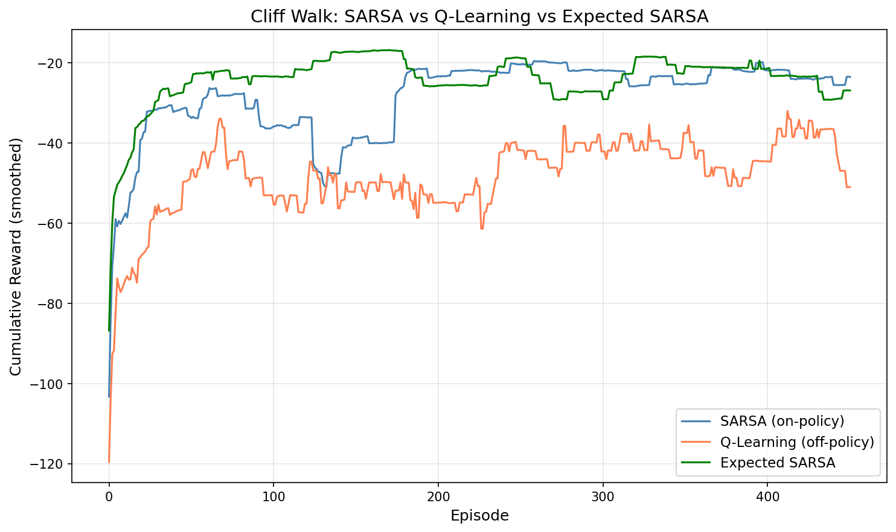
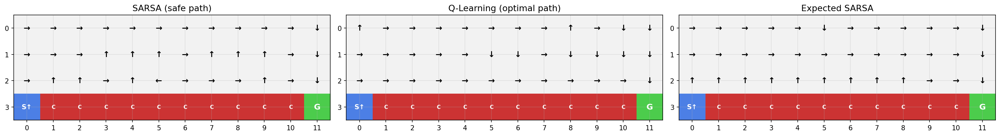
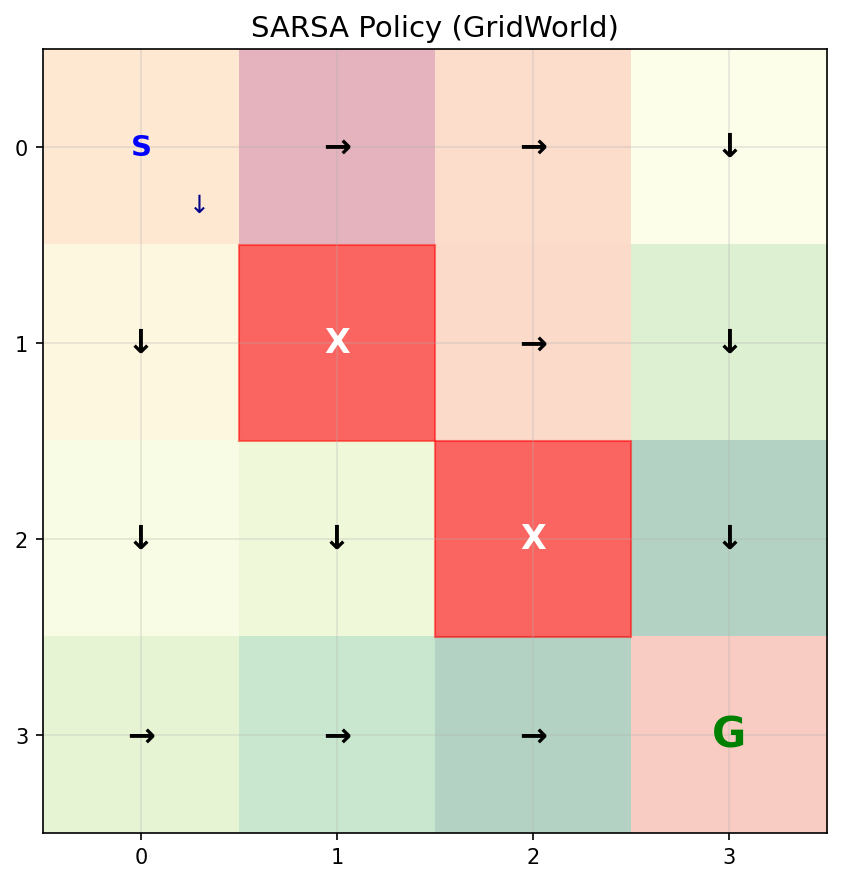

# SARSA 学习笔记

## 目录
1. [核心思想：一个字母的区别](#核心思想一个字母的区别)
2. [On-policy vs Off-policy](#on-policy-vs-off-policy)
3. [算法拆解](#算法拆解)
4. [悬崖行走：经典对比实验](#悬崖行走经典对比实验)
5. [Expected SARSA：两者的折中](#expected-sarsa两者的折中)
6. [收敛性分析](#收敛性分析)
7. [实验结果分析](#实验结果分析)
8. [对后续架构演进的作用](#对后续架构演进的作用)
9. [关键洞察与常见误区](#关键洞察)

---

## 核心思想：一个字母的区别

SARSA 和 Q-Learning 的更新公式只有一个地方不同：

```
Q-Learning: Q(s,a) ← Q + α [r + γ max_a' Q(s',a') - Q]
                                   ─────── 用 max（贪心）

SARSA:      Q(s,a) ← Q + α [r + γ Q(s',a') - Q]
                                   ────── 用实际选的 a'
```

- **Q-Learning**：用 `max_a' Q(s',a')`——"假设我下一步会做最优选择"
- **SARSA**：用 `Q(s',a')`——"我下一步实际会选什么就用什么"

**名字的由来**：SARSA 每次更新需要五元组 **(S, A, R, S', A')**——当前状态、当前动作、奖励、下一状态、下一动作。

**一句话理解**：Q-Learning 是乐观主义者（"我以后肯定不犯错"），SARSA 是现实主义者（"我知道自己会犯错，把犯错的代价也算进去"）。

---

## On-policy vs Off-policy

这是 SARSA 引入的最核心概念。

### 两个策略的关系

每个 TD 学习算法都涉及两个策略：

| | 行为策略（behavior policy） | 目标策略（target policy） |
|---|---|---|
| **作用** | 与环境交互，收集数据 | 被评估和改进的策略 |
| **Q-Learning** | ε-greedy | greedy（max） |
| **SARSA** | ε-greedy | ε-greedy（同一个！） |

- **Off-policy（Q-Learning）**：行为策略 ≠ 目标策略。用 ε-greedy 收集数据，但学习的是 greedy 策略
- **On-policy（SARSA）**：行为策略 = 目标策略。用 ε-greedy 收集数据，学习的也是 ε-greedy 策略

### 直觉理解

```
Q-Learning（off-policy）：
  "我用探索策略收集数据，但我学的是最优策略"
  "探索时犯的错不算数，我只关心最优路线"
  → 学到的 Q 值反映的是：如果我不犯错，能拿多少分

SARSA（on-policy）：
  "我用什么策略收集数据，就学什么策略"
  "探索时犯的错也要算进去，因为我实际就是会犯错"
  → 学到的 Q 值反映的是：按我现在的水平，实际能拿多少分
```

### 为什么这个区别重要？

在安全的环境中（如 GridWorld），两者差异不大。但在**有危险的环境**中，差异巨大：

```
悬崖边的状态 s，向右走是最短路径但可能掉下悬崖：

Q-Learning 的 Q(s, →)：
  "向右走，假设我不会犯错，期望奖励很高"
  → 选择沿悬崖走

SARSA 的 Q(s, →)：
  "向右走，但我有 ε 概率随机探索，可能掉下悬崖"
  "掉下悬崖的 -100 惩罚也要算进 Q 值"
  → Q(s, →) 被拉低 → 选择远离悬崖
```

---

## 算法拆解

### SARSA 的完整算法流程

```
初始化 Q(s, a) = 0，∀s, a

for each episode:
    s = env.reset()
    a = ε-greedy(Q, s)           ← 先选好第一个动作

    while not done:
        s', r, done = env.step(a)
        a' = ε-greedy(Q, s')     ← 先选好下一步动作 a'
        Q(s,a) ← Q(s,a) + α [r + γ Q(s',a') - Q(s,a)]
        s ← s'
        a ← a'                   ← 下一步真的用 a'

    ε ← ε × decay
```

### 与 Q-Learning 训练循环的对比

```python
# Q-Learning 的训练循环
while not done:
    a = ε_greedy(Q, s)           # 选动作
    s', r, done = env.step(a)    # 执行
    Q[s,a] += α * (r + γ * max(Q[s']) - Q[s,a])  # 更新
    s = s'

# SARSA 的训练循环
a = ε_greedy(Q, s)               # 在循环外先选好第一个动作
while not done:
    s', r, done = env.step(a)    # 执行
    a' = ε_greedy(Q, s')         # 先选好下一步动作
    Q[s,a] += α * (r + γ * Q[s',a'] - Q[s,a])  # 用 a' 更新
    s = s'
    a = a'                        # 下一步真的用 a'
```

**关键区别**：SARSA 在更新 Q 之前就选好了 a'，而且下一步真的会执行 a'。这保证了"学的就是做的"。

### 更新规则的代码实现

```python
def update(self, state, action, reward, next_state, next_action, done):
    state_idx = self._state_to_idx(state)
    next_state_idx = self._state_to_idx(next_state)

    if done:
        td_target = reward
    else:
        # SARSA 的关键：用实际选的 next_action，而不是 max
        td_target = reward + self.gamma * self.Q[next_state_idx, next_action]

    td_error = td_target - self.Q[state_idx, action]
    self.Q[state_idx, action] += self.alpha * td_error
```

注意 `update` 的参数比 Q-Learning 多了一个 `next_action`——这就是 SARSA 名字中的 A'。

---

## 悬崖行走：经典对比实验

### 环境设计

悬崖行走（Cliff Walking）是 Sutton & Barto 教科书中的经典例子：

```
. . . . . . . . . . . .
. . . . . . . . . . . .
. . . . . . . . . . . .
S C C C C C C C C C C G

S = 起点，G = 终点，C = 悬崖
掉下悬崖：回到起点，奖励 -100
每步：奖励 -1
```

这个环境完美地放大了 on-policy 和 off-policy 的差异，因为悬崖边的探索代价极高。

### 两条路径

```
Q-Learning 学到的路径（最优但危险）：
  . . . . . . . . . . . .
  . . . . . . . . . . . .
  . . . . . . . . . . . .
  S → → → → → → → → → → G    ← 沿悬崖边走，13 步

SARSA 学到的路径（安全但更长）：
  ↑ → → → → → → → → → → ↓
  ↑ . . . . . . . . . . ↓
  ↑ . . . . . . . . . . ↓
  S C C C C C C C C C C G    ← 远离悬崖，17 步
```

### 为什么会这样？

**Q-Learning** 用 `max` 更新，认为"下一步我会做最优选择"。所以悬崖边的 Q 值很高——如果不犯错，沿悬崖走确实是最短路径。

**SARSA** 用实际的 ε-greedy 动作更新。在悬崖边，有 ε 概率随机探索，可能掉下悬崖（-100）。这个巨大的惩罚被算进了 Q 值，导致悬崖边的 Q 值很低。SARSA 因此学会了远离悬崖。

### 学习曲线



**观察**：
- **SARSA 的训练曲线更高**：因为它远离悬崖，训练期间很少掉下去
- **Q-Learning 的训练曲线更低**：虽然学到了最优策略，但训练期间 ε-greedy 探索会频繁掉下悬崖
- 关闭探索后，Q-Learning 的策略更优（13步 vs 17步）

### 策略对比



---

## Expected SARSA：两者的折中

### 动机

SARSA 用一个采样的 a' 来估计下一步的价值，这引入了方差。Expected SARSA 用**期望**替代采样：

```
Q-Learning:      r + γ max_a' Q(s', a')           ← 最大值
SARSA:           r + γ Q(s', a')                   ← 一个采样
Expected SARSA:  r + γ Σ_a' π(a'|s') Q(s', a')    ← 期望值
```

### 期望的计算

在 ε-greedy 策略下，期望 Q 值的计算：

$$E_\pi[Q(s',a')] = (1-\epsilon) \max_{a'} Q(s',a') + \frac{\epsilon}{|A|} \sum_{a'} Q(s',a')$$

```python
# Expected SARSA 的 TD target
q_next = self.Q[next_state_idx]
best_action = np.argmax(q_next)
expected_q = 0.0
for action_idx in range(self.n_actions):
    if action_idx == best_action:
        prob = (1 - self.epsilon) + self.epsilon / self.n_actions
    else:
        prob = self.epsilon / self.n_actions
    expected_q += prob * q_next[action_idx]

td_target = reward + self.gamma * expected_q
```

### 特殊情况

- **当 ε = 0 时**：Expected SARSA 退化为 Q-Learning（期望 = max）
- **当 ε = 1 时**：Expected SARSA 使用所有动作的均值

### 实验结果

在悬崖行走中，Expected SARSA 的表现介于两者之间：

| 方法 | 关闭探索后步数 | 训练期间稳定性 |
|------|-------------|-------------|
| Q-Learning | 13 步（最优） | 低（频繁掉崖） |
| SARSA | 17 步 | 高（远离悬崖） |
| Expected SARSA | 15 步 | 中等 |

Expected SARSA 消除了 SARSA 的采样方差，通常比 SARSA 更稳定，同时比 Q-Learning 更安全。

### Expected SARSA 需要模型吗？

**不需要。** 这是一个容易陷入的理解误区。

Expected SARSA 计算的期望 `Σ_a' π(a'|s') Q(s',a')` 涉及两样东西：**策略概率 π(a'|s')** 和 **Q 值 Q(s',a')**。这两样都在智能体手里，不需要从环境获取：

| 所需信息 | 来源 | 需要模型吗？ |
|---------|------|------------|
| π(a'\|s')：策略概率 | 智能体自己定义的（如 ε-greedy） | ❌ |
| Q(s',a')：Q 值 | 智能体自己维护的 Q 表 | ❌ |
| P(s'\|s,a)：转移概率 | 环境的内部机制 | ✅ 需要模型 |

关键区分：**Expected SARSA 算的是"我自己行为的期望"（策略概率 π），不是"环境行为的期望"（转移概率 P）。** 自己的策略当然自己知道：

```python
# ε-greedy 的概率分布完全由智能体决定：
best_action = argmax(Q[s'])
for a in actions:
    if a == best_action:
        prob = (1 - epsilon) + epsilon / n_actions   # 自己设的 ε
    else:
        prob = epsilon / n_actions                    # 自己设的 ε
    expected_q += prob * Q[s', a]                     # 自己的 Q 表
```

需要模型的是值迭代/策略迭代——它们要算 `Σ_s' P(s'|s,a) [R + γV(s')]`，其中 P(s'|s,a) 是环境的转移概率，这才是"环境的秘密"。

---

## 收敛性分析

### SARSA 收敛到什么？

| 方法 | 收敛目标 |
|------|---------|
| Q-Learning | Q*（最优策略的 Q 函数） |
| SARSA | Q^π（当前策略 π 的 Q 函数） |

**关键区别**：Q-Learning 收敛到最优 Q*，与行为策略无关。SARSA 收敛到当前 ε-greedy 策略的 Q^π——如果 ε 不衰减到 0，SARSA 学到的不是最优策略，而是"在 ε 概率犯错的情况下的最优策略"。

### SARSA 的收敛条件

SARSA 在以下条件下收敛：
1. 所有 (s, a) 对被无限次访问
2. 学习率满足 Robbins-Monro 条件
3. 策略逐渐趋向贪心（ε → 0）

当 ε → 0 时，SARSA 也收敛到 Q*，与 Q-Learning 相同。

### 为什么 SARSA 不能用经验回放？

#### 先澄清：旧策略的数据"内化到 Q 中"是正常的

在标准 SARSA 训练中，**根本没有经验回放**——每条 (s, a, r, s', a') 用完就丢。旧策略的影响是通过 Q 表间接保留的：

```
第 10 轮：Q(s, →) 从 0 更新到 -5    ← 旧策略的 a' 参与了这次更新
第 50 轮：Q(s, →) 从 -5 更新到 -3   ← 新策略的 a' 参与了这次更新
第 200 轮：Q(s, →) 从 -3 更新到 -2  ← 更新策略的 a' 参与了这次更新
```

每次更新都是在上一次 Q 值基础上做增量修正（`Q ← Q + α[...]`），旧策略的影响"沉淀"在 Q 值里。这没有问题——学习率 α 会让旧影响逐渐被新数据覆盖，Q 值慢慢收敛到当前策略的真实价值。**这就是 on-policy 学习的正常工作方式。**

#### 真正的问题：把旧数据拿出来重新用一遍

经验回放（Replay Buffer）存储的是每一条具体的交互记录。问题在于：**如果从回放池中抽到旧数据，用过时的 a' 做了一次新的更新**。

用悬崖行走的例子说明：

```
第 10 轮（ε=0.5，经常乱走），智能体到达悬崖边上方的 s'：
  旧策略选了 a' = ↓（掉悬崖），存入回放池：(s, →, -1, s', ↓)

第 500 轮（ε=0.01，几乎不乱走），从回放池抽到这条旧数据：
  SARSA 用 Q(s', ↓) 更新 → Q(s', ↓) ≈ -100（掉悬崖）
  → Q(s, →) 被大幅拉低："向右走很危险"

但当前策略（ε=0.01）在 s' 几乎一定会选 a' = →（向右，安全走）！
正确的更新应该用 Q(s', →) ≈ -5（正常走几步到终点）
```

**问题本质**：旧数据中的 `a' = ↓` 是第 10 轮时 ε=0.5 的策略选的"历史快照"，不代表当前策略的行为。用过时的 a' 去估计当前策略的未来收益，导致 Q 值偏离。

#### Q-Learning 为什么没这个问题？

```
Q-Learning: Q(s,a) ← Q + α [r + γ max_a' Q(s',a') - Q]
                                   ^^^ 不管旧策略选了什么 a'，只看 max
```

Q-Learning 用 `max`，**完全不关心旧策略在 s' 选了什么动作**。经验回放中存的 a' 对 Q-Learning 的更新没有任何影响——它只看 Q(s', →) 和 Q(s', ↓) 中哪个大。所以旧数据对 Q-Learning 完全没问题。

#### 类比

```
正常 SARSA（无回放）：像一个人每天记日记，今天的感悟建立在昨天的基础上
  → 虽然昨天的判断可能有偏差，但今天的新经历会逐步修正 → 正常学习 ✅

SARSA + 经验回放：像翻出 5 年前的日记，把当时的行为模式当作今天的决策依据
  → 5 年前的你和现在的你做事方式完全不同 → 得出错误结论 ❌
```

这是 SARSA 相比 Q-Learning 的一个重要劣势，也是为什么 DQN（基于 Q-Learning）能用经验回放，而 on-policy 方法（如 PPO）不能。

---

## 实验结果分析

### 悬崖行走实验

**策略评估（关闭探索）**：

| 方法 | 成功率 | 平均奖励 | 平均步数 |
|------|--------|---------|---------|
| Q-Learning | 100% | -13.0 | 13.0 |
| SARSA | 100% | -17.0 | 17.0 |
| Expected SARSA | 100% | -15.0 | 15.0 |

关闭探索后，Q-Learning 的策略最优。但训练过程中，SARSA 的平均奖励更高（因为少掉悬崖）。

### GridWorld 实验

在没有危险区域的 GridWorld 中：



- 策略一致率：92.3%（12/13 个有效状态）
- 两者学到了几乎相同的策略
- 没有悬崖/危险区域时，on-policy 和 off-policy 的差异不明显

**结论**：SARSA 和 Q-Learning 的差异只在**有危险的环境**中才显著。

---

## 对后续架构演进的作用

### 1. On-policy vs Off-policy 的分野

SARSA 和 Q-Learning 的对比确立了 RL 中最重要的分类维度之一：

```
Off-policy 路线：                On-policy 路线：
  Q-Learning                      SARSA
      ↓                               ↓
  DQN（+ 经验回放）              Actor-Critic
      ↓                               ↓
  Double DQN                      A3C / A2C
  Dueling DQN                         ↓
      ↓                           PPO / TRPO
  SAC（连续动作）
```

### 2. 经验回放的理论基础

Q-Learning 的 off-policy 特性使得经验回放成为可能——这是 DQN 成功的关键。SARSA 的 on-policy 特性则解释了为什么 PPO 等方法不能用经验回放，而是用"收集一批数据 → 训练几步 → 丢弃数据 → 重新收集"的模式。

### 3. 安全强化学习的启示

SARSA 的保守行为启发了**安全强化学习（Safe RL）** 的研究：

- 在自动驾驶、医疗等安全关键场景中，"最优但危险"不如"次优但安全"
- SARSA 的思想被扩展为 Constrained MDP、Risk-sensitive RL 等方向
- 核心理念：**把探索/犯错的代价纳入决策**

### 4. Expected SARSA → DQN 的桥梁

Expected SARSA 在 ε → 0 时退化为 Q-Learning。这提供了一个从 on-policy 到 off-policy 的平滑过渡，也是理解 DQN 中 target network 作用的一个视角。

---

## 关键洞察

### 1. "学的就是做的" vs "学的是理想的"

这是 on-policy 和 off-policy 最本质的区别：

- **SARSA（on-policy）**：Q 值反映的是"按我当前的水平（包括犯错），实际能拿多少分"
- **Q-Learning（off-policy）**：Q 值反映的是"如果我不犯错，理论上能拿多少分"

在训练早期（ε 大，经常犯错），两者的 Q 值差异巨大。在训练后期（ε → 0），两者趋于一致。

### 2. 保守性来自于"把犯错的代价算进去"

SARSA 的保守性不是刻意设计的，而是 on-policy 更新的自然结果。当 ε-greedy 有概率选到危险动作时，这个危险动作的 Q 值会被算进 TD target，拉低附近状态的价值。

### 3. 没有绝对的好坏，只有场景的适配

| 场景 | 推荐方法 | 原因 |
|------|---------|------|
| 模拟环境，追求最优 | Q-Learning | 犯错没有真实代价 |
| 真实环境，安全关键 | SARSA | 把犯错代价纳入决策 |
| 需要经验回放 | Q-Learning | SARSA 不支持 |
| 训练期间也要表现好 | SARSA | 训练期间更稳定 |

### 4. 表格方法的完整图景

到 SARSA 为止，表格方法的核心内容已经完整：

```
已知模型（规划）：
  值迭代：V(s) ← max_a Σ P [R + γV]
  策略迭代：评估 V^π → 改进 π → 重复

未知模型（学习）：
  Q-Learning（off-policy）：Q ← Q + α [r + γ max Q - Q]
  SARSA（on-policy）：Q ← Q + α [r + γ Q(s',a') - Q]
  Expected SARSA（折中）：Q ← Q + α [r + γ E[Q] - Q]
```

下一步的挑战是：**当状态空间太大，Q 表装不下时怎么办？** → DQN：用神经网络替代 Q 表。

### 5. SARSA 的名字本身就是算法

SARSA 是少数"名字就是算法"的方法：(S, A, R, S', A') 五元组完整描述了每次更新所需的全部信息。相比之下，Q-Learning 的名字只告诉你"学 Q 值"，没有揭示算法细节。

### 6. 常见理解误区

#### 误区一："旧策略的数据不能用"意味着 SARSA 不利用历史

**澄清**：SARSA 当然利用历史——旧策略的影响已经"内化"到 Q 表中了。`Q ← Q + α[...]` 的增量更新意味着每次更新都站在之前所有更新的基础上。"不能用旧数据"特指**经验回放**——把旧的 (s,a,r,s',a') 元组拿出来重新喂一遍。问题出在 a' 这一项：旧数据中的 a' 是当时的策略选的，不代表当前策略在 s' 会做什么选择。

#### 误区二：Expected SARSA 需要环境模型

**澄清**：Expected SARSA 需要的是 π(a'|s')（策略概率），不是 P(s'|s,a)（转移概率）。策略是智能体自己定义的（如 ε-greedy），转移概率才是环境的秘密。"知道自己会怎么选动作"不等于"知道环境会怎么转移"。

#### 误区三：SARSA 和 Q-Learning 差异很大

**澄清**：在没有"危险区域"的环境中（如普通 GridWorld），两者学到的策略几乎一致（实验中 92.3% 策略一致率）。差异只在有高惩罚/危险区域时才显著——SARSA 把探索犯错的代价算进 Q 值，Q-Learning 假设未来不犯错。

---

- **最后更新**：2026-04-22
- **关联代码**：`phase2_mdp/sarsa.py`
- **前置知识**：`notes/q_learning.md`
- **后续内容**：DQN（从表格到神经网络）
- **难度等级**：⭐⭐⭐ (中等)
